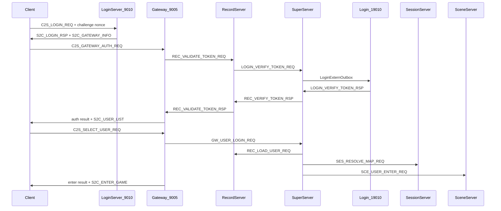

# 登录架构复盘与全面优化计划

## 现状结论（复盘摘要）

当前登录为 **两阶段、Super 代理** 设计，整体合理且与架构红线兼容：



**已验证的主要问题**（按优先级）：

| 类别 | 问题 | 影响 |
|------|------|------|
| P0 耦合 | [`GatewayServer::reportGatewayToSuper()`](GatewayServer/GatewayServer.cpp) 强制 `isRecordReady()`，Login 侧网关表为空 → 登录成功但「无可用网关」 | 运维/启动顺序敏感 |
| P0 协议 | `S2C_LOGIN_RSP`（sub=0x02）被 Login 账号登录、Gateway 鉴权、进世界三处复用 | 客户端须靠连接阶段+状态机区分，易错 |
| P1 文档 | 多处写 **6 字节头**、Gateway **19005**、「仅 Record 连 MySQL」、进程数 **9 vs 10** | 新人/onboarding 误导 |
| P1 运维 | [`.gitignore`](.gitignore) 写错 `LoggerServer/extern_login.xml`；已跟踪的本地配置仍出现在 `git status` | 本地配置泄漏到 diff |
| P2 遗留 | Login 区列表仍接受 1 字节 legacy `gameType`；Record `onExternForwardRsp` 票据分支已废弃；`ensureRecordReady()` 未使用 | 与 Gateway Protobuf-only 不一致 |
| P2 注释 | [`NetDefine.h`](sdk/net/NetDefine.h) 注释写 6 字节，`sizeof(MsgHeader)==4` | 源码与文档双重漂移 |

---

## 阶段 A：协议语义拆分（P0）

**目标**：`S2CLoginRsp` 仅用于 **LoginServer 9010 账号登录**；Gateway 阶段使用独立回包。

### A1. 扩展 Protobuf

在 [`Common/LoginCommon.proto`](Common/LoginCommon.proto) / [`Common/LoginMsg.proto`](Common/LoginMsg.proto) 新增：

| sub | 消息 | 用途 |
|-----|------|------|
| `0x11` | `S2C_GATEWAY_AUTH_RSP` | Gateway 票据鉴权成功/失败（`code`, `msg`, `accid`） |
| `0x12` | `S2C_ENTER_WORLD_RSP` | 选角进世界结果（`code`, `msg`, `user_id`）；成功时仍发 `S2C_ENTER_GAME` 携带场景快照 |

保留 `S2C_LOGIN_RSP` 仅在 [`LoginAuthService.cpp`](LoginServer/LoginAuthService.cpp) 使用。

### A2. 服务端改动

- [`GatewayServer/GatewayServer.cpp`](GatewayServer/GatewayServer.cpp)：`onGatewayAuth` / `onValidateTokenRsp` / 进世界 `onUserLoginRsp` 全部改发新 sub；成功进世界时 **不再** 重复发 `S2C_LOGIN_RSP`，仅 `S2C_ENTER_WORLD_RSP` + `S2C_ENTER_GAME`。
- [`GatewayServer/ClientMsgValidator.h`](GatewayServer/ClientMsgValidator.h)：白名单无需改（均为 S→C）。
- 运行 `./Build.sh` 或 `./scripts/gen_proto.sh` 再生 `Protobuf/`。

### A3. 客户端与测试

- 更新 [`scripts/test_login_gateway_e2e.py`](scripts/test_login_gateway_e2e.py) 期望 sub。
- 文档明确 Unity 须订阅新消息：[`docs/UNITY_LOGIN_CLIENT.md`](docs/UNITY_LOGIN_CLIENT.md)、[`docs/LOGIN_CHAR_FLOW.md`](docs/LOGIN_CHAR_FLOW.md)、[`docs/PROTOCOL.md`](docs/PROTOCOL.md) §2.2 消息表。

> **Breaking change**：Unity 客户端需同步改 handler（用户侧已独立维护）。旧客户端仍会在 Gateway 收到未知 sub，需在文档标注迁移窗口。

---

## 阶段 B：Gateway 注册与 Record 解耦（P0）

**原则**：网关注册 Login **不依赖** Record；鉴权/拉角色列表 **仍依赖** Record。

改动 [`GatewayServer/GatewayServer.cpp`](GatewayServer/GatewayServer.cpp)：

```cpp
// reportGatewayToSuper() — 移除 isRecordReady() 前置 return
// sendLoginGatewayHeartbeat() — 注册/心跳仅要求 m_superClient.canSend()
// onGatewayAuth() — 保持 isRecordReady() 检查，返回明确「上游未就绪」
```

- **删除** 未使用的 [`ensureRecordReady()`](GatewayServer/GatewayServer.cpp) 声明与实现（违反单线程非阻塞，且无调用方）。
- 保留 `m_upstreamReady` + `upstreamHealthCheck()` 用于 **客户端消息转发** 与 **鉴权**。

预期效果：Login 先起、Record 慢起时，玩家仍能拿到 `S2C_GATEWAY_INFO`；连 9005 时若 Record 未就绪，收到 `S2C_GATEWAY_AUTH_RSP code=-1` 而非 Login 侧「无网关」。

---

## 阶段 C：移除登录链路遗留路径（P2）

1. **Login 区列表 Protobuf-only**  
   - [`LoginAuthService::onClientZoneList()`](LoginServer/LoginAuthService.cpp) 删除 `len>=1` 首字节 fallback；非 Protobuf 回 `S2C_ERROR` 或空列表 + 日志。

2. **Record 废弃票据转发 handler**  
   - 删除 [`RecordServer::onExternForwardRsp()`](RecordServer/RecordServer.cpp) 及 [`RecordInternMsgRegister.cpp`](RecordServer/RecordInternMsgRegister.cpp) 中 `SS_EXTERN_FWD_RSP` 注册（该 handler 仅处理 `LOGIN_VERIFY_TOKEN`，主路径已是 `REC_VERIFY_TOKEN_RSP` → `onLoginVerifyTokenRsp`）。
   - [`InternalMsg.h`](protocal/InternalMsg.h) 保留 `REC_LOGIN_VERIFY_*` 枚举但注释「已移除 handler，勿发送」。

---

## 阶段 D：文档与运维对齐（P1，随 A–C 同步）

### D1. 协议/架构文档统一（4 字节头）

批量修正以下文件中的「6 字节头」「19005」「仅 Record 连 MySQL」：

- [`README.md`](README.md)、[`docs/ARCHITECTURE.md`](docs/ARCHITECTURE.md)、[`docs/PROJECT.md`](docs/PROJECT.md)、[`docs/PROTOCOL.md`](docs/PROTOCOL.md)、[`docs/SERVERS.md`](docs/SERVERS.md)、[`docs/INDEX.md`](docs/INDEX.md)、[`docs/SDK.md`](docs/SDK.md)、[`docs/TLS.md`](docs/TLS.md)、[`docs/3D_DESIGN.md`](docs/3D_DESIGN.md)
- [`sdk/net/NetDefine.h`](sdk/net/NetDefine.h) 注释改为 **4 字节**
- [`.cursor/rules/project.mdc`](.cursor/rules/project.mdc)、[`AGENTS.md`](AGENTS.md)：**10 进程**（6 区内 + 4 外联）

[`docs/ARCHITECTURE.md`](docs/ARCHITECTURE.md) 补充：
- 登录序列含 `S2C_LOGIN_CHALLENGE` + SHA-256 digest
- 三库职责表（Super/Session/Login/Global 亦连 MySQL）
- 端口来自 `rpg_game.ServerList`，非 `config.xml` 静态 port
- Login 启动前 DB 检查清单（含 [`tables/migrate_login_session_unique.sql`](tables/migrate_login_session_unique.sql)）

[`docs/EXTERNAL.md`](docs/EXTERNAL.md)：`LOGIN_CONN_WARMUP_MS` 改为 **2500ms**（与 [`LoginFlowTimeouts.h`](sdk/util/LoginFlowTimeouts.h) 一致）。

[`docs/DEVELOPMENT.md`](docs/DEVELOPMENT.md) / [`docs/PROJECT.md`](docs/PROJECT.md) §环境：指向 [`tables/setup_database.sh`](tables/setup_database.sh) 三库 + 迁移脚本。

### D2. 本地配置 bootstrap

修正 [`.gitignore`](.gitignore)：

```diff
- LoggerServer/extern_login.xml
+ LoginServer/extern_login.xml
```

执行（不删工作区文件）：

```bash
git rm --cached LoginServer/serverlist.xml LoginServer/extern_login.xml loginserverlist.xml config/server_info.xml
```

在 [`README.md`](README.md) 与 [`config/README.md`](config/README.md) 增加 **首次克隆** 步骤：

```bash
cp LoginServer/serverlist.xml.example LoginServer/serverlist.xml
cp LoginServer/extern_login.xml.example LoginServer/extern_login.xml
cp loginserverlist.xml.example loginserverlist.xml
cp config/server_info.xml.example config/server_info.xml
```

### D3. 登录排障文档

更新 [`docs/LOGIN_CHAR_FLOW.md`](docs/LOGIN_CHAR_FLOW.md) §6：
- 新 sub 对照表（鉴权 / 进世界）
- `uk_accid_zone` 迁移命令（已踩坑）
- Gateway 注册失败 `code=-1` ↔ Login 未起 / 19010 未通

---

## 阶段 E：验证

```bash
./Build.sh LoginServer GatewayServer RecordServer
./RunServer.sh          # 6 区内
./RunServer.sh login
TLS_INSECURE=1 python3 scripts/test_login_gateway_e2e.py <account> <password>
grep -E '登录服数据表校验|网关注册成功|登录网关注册回包成功|\[登录链路\]' logs/*.log
```

**场景回归**（手动或脚本扩展）：
1. Record 晚于 Gateway 启动 → Login 仍能分配网关
2. Record 未就绪时 Gateway 鉴权 → `S2C_GATEWAY_AUTH_RSP` 明确失败
3. Protobuf 区列表 / legacy 1 字节 → 后者被拒绝
4. `git status` 不再显示本地 XML 修改

---

## 风险与边界

- **Unity 客户端**：阶段 A 为 breaking change，需在 `UNITY_LOGIN_CLIENT.md` 写清 sub 迁移表；若需过渡期，可短期在 Gateway **双发**（新 sub + 旧 `S2C_LOGIN_RSP`）——默认计划为 **不双发**，一次性切换。
- **不改动**：Super `LoginExternOutbox` 串行策略、LoginSession 一次性 token、`S2C_ENTER_GAME` 字段布局、服间 wire struct（`InternalMsg.h`）保持现状。
- **不纳入本次**：ZoneServer 跨区骨架、Social module 路由争议（PROJECT vs PROTOCOL）、Logger/Global 外联细节。

---

## 建议实施顺序

1. **B**（解耦注册，立刻改善运维）→ **C**（清理遗留）→ **A**（proto 拆分 + 客户端文档）→ **D**（文档 sweep）→ **E**（构建与 E2E）

每完成一阶段提交独立 commit，便于 review 与 Unity 侧对齐 proto 变更。
