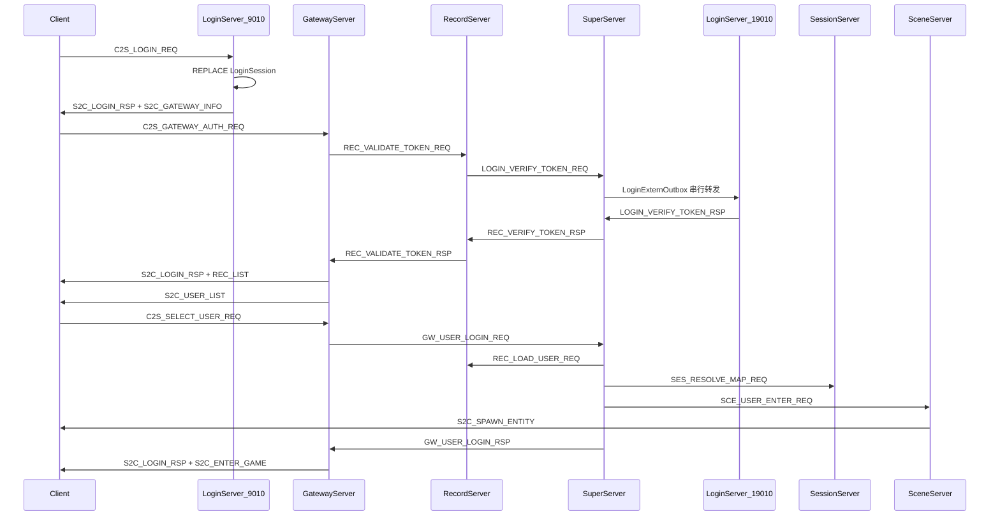

# 客户端登录到进游戏 — 全链路代码审计

## 结论摘要

| 阶段 | 判定 | 说明 |
|------|------|------|
| A. 账号登录 (Login 9010) | **基本正确** | 挑战、密码摘要、LoginSession 发 token、下发网关信息逻辑完整 |
| B. 网关鉴权 (Gateway 9005) | **架构正确，运行不稳** | Record→Super→Login 路径接线正确；Super 外联 TLS 闪断是 hcg11 失败的直接原因 |
| C. 角色列表/创角 | **基本正确** | 服务端推送列表、Record 写 CharBase 正常 |
| D. 选角进世界 | **基本正确** | Super 编排 LOAD→RESOLVE_MAP→ENTER 完整 |
| E. 进游戏下行 | **基本正确** | `S2C_ENTER_GAME` + AOI `S2C_SPAWN_ENTITY`；客户端需容忍包序 |

**总体**：协议分层、三库分工、Gateway 状态机、Super 事务编排与文档 [`docs/LOGIN_CHAR_FLOW.md`](docs/LOGIN_CHAR_FLOW.md) 大方向一致；**不是“整条链路设计错了”**，而是 **Phase B 外联可靠性** + **少量实现/文档偏差** 导致间歇性失败。

---

## 全链路时序（当前实现）



关键文件索引：

- 账号登录：[`LoginServer/LoginAuthService.cpp`](LoginServer/LoginAuthService.cpp)、[`LoginServer/LoginGameZoneAuthMsg.cpp`](LoginServer/LoginGameZoneAuthMsg.cpp)
- 网关鉴权：[`GatewayServer/GatewayServer.cpp`](GatewayServer/GatewayServer.cpp) `onGatewayAuth` / `onValidateTokenRsp`
- 票据中继：[`RecordServer/RecordServer.cpp`](RecordServer/RecordServer.cpp) `onValidateTokenReq`、`onLoginVerifyTokenRsp`
- Super 外联：[`SuperServer/LoginExternOutbox.cpp`](SuperServer/LoginExternOutbox.cpp)、[`SuperServer/SuperLoginMsg.cpp`](SuperServer/SuperLoginMsg.cpp)
- 进世界：[`SuperServer/SuperServer.cpp`](SuperServer/SuperServer.cpp) `onUserLoginReq`→`onUserEnterRsp`
- 场景出生：[`SceneServer/SceneServer.cpp`](SceneServer/SceneServer.cpp) `onUserEnter`

---

## 分阶段审计

### Phase A — 账号登录 (LoginServer 9010)

**正确逻辑**

- 连接即下发 `S2C_LOGIN_CHALLENGE`（16 字节 nonce），见 [`LoginServer.cpp`](LoginServer/LoginServer.cpp) `sendLoginChallenge`
- 密码约定：`password_digest` = **SHA-256(明文密码) 32 字节**；nonce 仅放 `login_nonce` 字段，不参与 bcrypt 输入（[`PasswordDigestUtil.h`](sdk/util/PasswordDigestUtil.h)）
- 成功路径：`REPLACE INTO LoginSession` → `S2C_LOGIN_RSP` → `sendGatewayInfo` → `S2C_GATEWAY_INFO`
- 网关选择：`LoginGatewayRegistry::pickByZone` 按在线数负载均衡

**问题**

| 严重度 | 问题 | 位置 |
|--------|------|------|
| P2 | `C2S_LOGIN_REQ` Protobuf 解析失败**静默丢弃**，无 `S2C_LOGIN_RSP` | `LoginAuthService::onClientLogin` L108 |
| P2 | 失败登录仍发 `S2C_GATEWAY_INFO code=-1`，客户端需以 `S2C_LOGIN_RSP.code` 为准 | `sendGatewayInfo` 调用链 |
| P2 | 同 `(accid, zone_id)` 再次登录会 `REPLACE` 覆盖旧 token，未进 Gateway 的旧 token 失效 | `uk_accid_zone` + `REPLACE` |
| P2 | 网关心跳 30s 才 prune，10s 定时器内可能选到已死网关 | `LoginGatewayRegistry` + `pruneGatewayTable` |

---

### Phase B — 网关鉴权（当前故障核心）

**正确逻辑**

- Validator 仅 `CONNECTED` 允许 `C2S_GATEWAY_AUTH_REQ`（[`ClientMsgValidator.h`](GatewayServer/ClientMsgValidator.h)）
- `onGatewayAuth`：校验 zone/gameType → `AUTHING` → `REC_VALIDATE_TOKEN_REQ`（[`GatewayServer.cpp`](GatewayServer/GatewayServer.cpp) L485–545）
- Record 裸发 `LOGIN_VERIFY_TOKEN_REQ` 给 Super（**非** EXT_GAMEZONE），见 [`RecordServer.cpp`](RecordServer/RecordServer.cpp) L439
- Super 经 `LoginExternOutbox` 串行写出；Login 端 `onVerifyTokenReq` 事务 `SELECT FOR UPDATE` + `DELETE` 一次性消费 token（[`LoginGameZoneAuthMsg.cpp`](LoginServer/LoginGameZoneAuthMsg.cpp)）
- 回包链：`LOGIN_VERIFY_TOKEN_RSP` → Super `REC_VERIFY_TOKEN_RSP` → Record `REC_VALIDATE_TOKEN_RSP` → Gateway

**已做缓解（需确认 Super 已重启到新二进制）**

- 外联断开时 **重排队** 而非立即 `failAllPendingVerify`（[`LoginExternOutbox.cpp`](SuperServer/LoginExternOutbox.cpp) `requeueInFlightVerifyOnDisconnect`）
- 校验 `push_front` 优先；`LOGIN_CONN_WARMUP_MS=1500` 重连预热
- `Run()` 顺序：`externHub.poll` → `m_server.Poll` → `onExternTick`

**仍存在的 P0 风险**

| 现象 | 根因方向 |
|------|----------|
| Super 打「已转发」但 Login **无**「登录服收到票据校验」 | Super→Login **19010 mTLS** 在写出 `LOGIN_VERIFY_TOKEN_REQ` 后连接闪断（你提供的 hcg11 日志即此模式） |
| 重连后 1.5s 内再次闪断 | 客户端仍见「票据无效」；需观察 super 是否出现「外联断开，票据校验重排队」 |

**P1 逻辑缺口**

| 问题 | 位置 |
|------|------|
| `onValidateTokenRsp` **未校验** `clientState == AUTHING`，迟到的 rsp 可能污染状态 | `GatewayServer.cpp` L771 |
| `account` 字段必填但**不与 token/accid 比对** | `onGatewayAuth` |
| `protocol_version` 未校验 | proto 有字段，Gateway 忽略 |
| Super 出站队列满（256）时 **丢弃 verify**，Record 要等 15s 超时 | `LoginExternOutbox::enqueueVerifyToken` |
| 一次性 token：Super 重发成功 rsp 丢失后再 verify 必失败，客户端须回 Login 重新拿 token | Login `DELETE` 语义 + 设计如此 |
| `checkTimeout` 每 **30s** 轮询，实际踢线 = 阈值 + 最多 30s | `GatewayServer.cpp` L1042，`GATEWAY_AUTH_*` in [`LoginFlowTimeouts.h`](sdk/util/LoginFlowTimeouts.h) |
| `authWarnSent` 成员从未使用 | `GatewayUser.h` |

**环境/客户端易错点（非代码 bug，但常表现为“逻辑不对”）**

- 客户端密码须 `SHA-256(password)`，**不是** `SHA-256(nonce||password)`（login 日志有明确 WARN）
- Gateway 地址来自 `S2C_GATEWAY_INFO`（如 `192.168.45.128:9005`），TLS 证书 SAN 须匹配或客户端 `TLS_INSECURE`
- Super `loginserverlist.xml` 须指向 Login **19010** 且 `reconnect=1`
- Gateway 须先经 Super 完成 `LOGIN_GATEWAY_REGISTER`，否则 Phase A 成功但 `gateway code=-1`

---

### Phase C — 角色列表与创角

**正确逻辑**

- 鉴权成功后 Gateway **主动** `REC_LIST_CHARACTERS_REQ`，无 `C2S_USER_LIST_REQ`（与文档 §2 一致）
- `onListCharactersRsp` 填充 `ownedRoleIds` 并 `setRoleListReady(true)`
- 创角：`C2S_CREATE_USER_REQ` → Record `CharBase` → `S2C_CREATE_USER_RSP` → 刷新列表

**确认的文档/代码不一致（P1 Bug）**

文档 [`LOGIN_CHAR_FLOW.md`](docs/LOGIN_CHAR_FLOW.md) §2 写明：创角后 `roleListReady=false` 时，若 `ownedRoleIds` 含新 `user_id` 仍可选角。

实现 [`onSelectUser`](GatewayServer/GatewayServer.cpp) L564–569 **硬要求** `isRoleListReady()`，**未**实现 `ownedRoleIds` 兜底：

```564:569:GatewayServer/GatewayServer.cpp
    if (!user->isRoleListReady())
    {
        sendClientError(connID, ValidateResult::BAD_STATE);
        ...
        return;
    }
```

而 [`onCreateCharacterRsp`](GatewayServer/GatewayServer.cpp) L931–937 注释声称可以凭 `ownedRoleIds` 选角——**与代码矛盾**。影响：客户端在 `S2C_CREATE_USER_RSP` 后立刻 `C2S_SELECT_USER_REQ` 可能被拒，需等 `S2C_USER_LIST`。

---

### Phase D — 选角进世界

**正确逻辑**

- `onSelectUser`：`ownsRole` 归属校验 → `ENTERING` → `GW_USER_LOGIN_REQ`（含 `loginTxnId` 幂等）
- Super `onUserLoginReq`：踢重复会话 → `m_pendingLogins` → `REC_LOAD_USER_REQ`
- `onLoadUserRsp` → `SES_RESOLVE_MAP_REQ` → `onResolveMapRsp` 选 Scene → `SCE_USER_ENTER_REQ`
- 事务超时 `LOGIN_TXN_LOCK_TIMEOUT_MS`（60s）回滚；重复进世界有 txn 幂等重试

**问题**

| 严重度 | 问题 |
|--------|------|
| P2 | Gateway `ENTERING` 态无独立超时，依赖 Super 60s 事务超时 |
| P2 | `SceneUser::load()` 等为 stub，进世界不预加载背包/技能等（功能未完成，非链路断裂） |

---

### Phase E — 进游戏下行

**正确逻辑**

- `onUserLoginRsp`：`IN_WORLD` + `S2C_LOGIN_RSP` + `S2C_ENTER_GAME`（[`GatewayServer.cpp`](GatewayServer/GatewayServer.cpp) L963–994）
- Scene `onUserEnter`：通知同图玩家 + AOI 注册 + `SCE_USER_ENTER_RSP`
- 场景消息经 `ClientMsgRouter` 在 `IN_WORLD` 转发至 Scene

**问题**

| 严重度 | 问题 |
|--------|------|
| P2 | `S2C_SPAWN_ENTITY`（邻居/NPC）可能在 `S2C_ENTER_GAME` **之前**到达，客户端须缓冲或容忍乱序 |
| P3 | BATTLE/BAG/SKILL 等模块 Router 为 DROP，尚未接入 |

---

## 问题优先级与建议修复

### P0 — 必须先解决（对应你当前的 hcg11 失败）

1. **验证 Super 新二进制已部署**  
   失败日志应出现「外联断开，票据校验重排队」而非「票据校验在途时登录外联断开」。若仍是后者，说明未跑到新代码。

2. **深挖 Super→Login 19010 TLS 闪断根因**（重排队是缓解，不是根治）  
   建议排查方向：
   - Login 注册口 `wireTlsServer(m_registerServer, true)` 与 Super `wireTlsClient` 证书/CA 配置是否一致（[`config/tls`](config/tls)、[`loginserverlist.xml`](loginserverlist.xml)）
   - 同一 TLS 连接上 zone status / gateway heartbeat 与 verify 的并发写（`isVerifyTransportBusy` 已挡非 verify，但闪断仍发生说明可能是 TLS 层或 Login 读侧问题）
   - 在 Login `RegisterPortBridge::OnDisconnect` 与 TLS read 错误路径补充 **OpenSSL 错误码** 日志，定位是 peer close 还是 decode fail

3. **可选根治方案**：将 verify 改为 `EXT_GAMEZONE_FWD` 信封（与 recharge/GM 同路径），或 Record 直连 Login 19010（绕 Super 单点）——需架构评审。

### P1 — 应尽快修复的逻辑缺口

1. **修复 `onSelectUser` 与文档一致**：`!roleListReady` 时若 `ownsRole(user_id)` 则放行（[`GatewayServer.cpp`](GatewayServer/GatewayServer.cpp)）
2. **`onValidateTokenRsp` 增加 `AUTHING` 态守卫**
3. **`onClientLogin` 解析失败时回 `S2C_LOGIN_RSP code=1`**
4. **Super 队列满时向 Record 主动 fail**（而非静默 drop）
5. **Gateway `checkTimeout` 改为 1s 或与 `GATEWAY_AUTH_*` 同量级轮询**

### P2 — 体验/健壮性

- Gateway 鉴权成功后可选校验 `account` 与 Login 侧账号（需 Record 回传 account 或在 token 中编码）
- 清理 `RecordServer::onExternForwardRsp` 废弃路径或明确仅测试用
- 文档补充：重登会使旧 token 失效；`S2C_SPAWN_ENTITY` 包序

---

## 相关联代码与文档同步更新

实施 P0/P1 修复时，**同一 PR/批次**内同步更新下列文件，避免文档与实现再次偏离。

### 代码（除修复点外的注释/常量/测试）

| 文件 | 更新内容 |
|------|----------|
| [`GatewayServer/GatewayServer.cpp`](GatewayServer/GatewayServer.cpp) | `onSelectUser` 兜底逻辑；`onValidateTokenRsp` AUTHING 守卫；`checkTimeout` 轮询间隔；`Init` 定时器注册 |
| [`GatewayServer/GatewayUser.h`](GatewayServer/GatewayUser.h) | `roleListReady` / `ownedRoleIds` 语义注释（创角后可凭 owned 选角）；移除或启用 `authWarnSent` |
| [`LoginServer/LoginAuthService.cpp`](LoginServer/LoginAuthService.cpp) | 解析失败回包；失败路径 `sendGatewayInfo` 行为注释 |
| [`LoginServer/LoginServer.cpp`](LoginServer/LoginServer.cpp) | 注册口断开/TLS 读失败时输出 OpenSSL 错误（与 P0 配套） |
| [`SuperServer/LoginExternOutbox.cpp`](SuperServer/LoginExternOutbox.h) | 队列满 fail 回调；`requeueInFlightVerifyOnDisconnect` 文件头 `@brief` |
| [`sdk/util/LoginFlowTimeouts.h`](sdk/util/LoginFlowTimeouts.h) | 若新增 Gateway 鉴权轮询常量则在此集中定义 |
| [`sdk/net/TcpConnection.cpp`](sdk/net/TcpConnection.cpp) 或 TLS 读路径 | TLS 关闭/握手失败时 `ERR_get_error` 中文日志（Login 注册口排障） |
| [`RecordServer/RecordServer.cpp`](RecordServer/RecordServer.cpp) | `onExternForwardRsp` 标 `@deprecated` 或注释「主路径为 REC_VERIFY_TOKEN_RSP」 |
| [`protocal/InternalMsg.h`](protocal/InternalMsg.h) | `REC_VERIFY_TOKEN_RSP` / `REC_VALIDATE_TOKEN_RSP` 方向、重试语义一行注释 |
| [`scripts/test_login_gateway_e2e.py`](scripts/test_login_gateway_e2e.py) | 创角成功后**不等待** `S2C_USER_LIST` 即发 `C2S_SELECT_USER_REQ` 的回归用例 |

### 文档

| 文件 | 更新内容 |
|------|----------|
| [`docs/LOGIN_CHAR_FLOW.md`](docs/LOGIN_CHAR_FLOW.md) | §2 与实现对齐（ownedRoleIds 兜底）；§3 时序注明外联断开重排队；§6 排障表：`票据校验重排队` / 旧文案「在途时断开即 fail」改为重试说明；§4 补充 `S2C_SPAWN_ENTITY` 可能早于 `S2C_ENTER_GAME`；补充同账号重登覆盖 token |
| [`docs/TLS.md`](docs/TLS.md) | §7.1 外联闪断：重排队 + 预热 + 成功/失败日志链；OpenSSL 错误日志字段说明 |
| [`docs/EXTERNAL.md`](docs/EXTERNAL.md) | LoginExternOutbox：断开重排队、校验优先 `push_front`、队列满行为；与裸 `LOGIN_VERIFY_TOKEN_REQ` 路径一致 |
| [`docs/ARCHITECTURE.md`](docs/ARCHITECTURE.md) | 登录序列图/文字与 Record→Super 裸转发一致；Gateway 鉴权超时轮询粒度（若改 1s） |
| [`docs/PROTOCOL.md`](docs/PROTOCOL.md) | §4.2 登录链路：Gateway 鉴权超时实际生效时间（阈值 + 轮询周期） |
| [`docs/SERVERS.md`](docs/SERVERS.md) | Gateway 状态机与 `ACCOUNT_OK` 选角条件一句说明 |
| [`AGENTS.md`](AGENTS.md) | 提交前自检：新增 grep `票据校验重排队`；创角后立即选角 E2E |

### 文档原则

- **以代码为准修文档**：`LOGIN_CHAR_FLOW.md` §2 已描述 ownedRoleIds 兜底，优先**改代码对齐文档**，而非删文档描述。
- **排障表双向更新**：旧日志「票据校验在途时登录外联断开」若仍可能出现，注明「旧 Super 二进制」；新二进制应见「外联断开，票据校验重排队」。
- **不手改** `Common/*.proto` 除非协议字段变更；`protocol_version` 若暂不校验，在 PROTOCOL.md 标明「预留未用」。

### 实施顺序（含文档）


1. P0：确认 Super 二进制 + TLS 错误日志  
2. P1：Gateway/Login/Outbox 代码修复  
3. **文档 + .h 注释**（与代码同批提交）  
4. E2E 脚本扩展 + `grep` 自检通过

---

## 自检命令（与你环境对齐）

```bash
# 完整 phase 链
grep '\[登录链路\]' logs/{login,gateway,super,record}.log

# Phase B 成功标志
grep -E '登录服收到票据校验|鉴权成功|Record校验token成功' logs/{login,gateway,record}.log

# Phase B 重试路径（新 Super）
grep -E '票据校验重排队|已转发票据校验' logs/super.log

# E2E（需 DB 有 autotest_e2e 或传 hcg11 密码）
TLS_INSECURE=1 python3 scripts/test_login_gateway_e2e.py <账号> <密码>
```

---

## 审计判定（回答「逻辑对不对」）

- **设计层面**：对 — 分阶段、消息 ID、状态机、Super 编排与项目架构红线一致。
- **实现层面**：**大体对，但有 1 处确认 bug（创角后立即选角）+ Phase B 外联可靠性未根治**，这是你「账号能登、Gateway 报票据无效」的直接原因。
- **客户端配合**：密码摘要格式、TLS、登录后尽快连 Gateway（避免 token 被二次登录覆盖）、容忍 spawn/enter 包序。

若你确认要继续修，建议顺序：**P0 TLS 根因日志 + 验证重排队生效 → P1 代码修复 → 相关联文档/注释/E2E 同批更新**。
