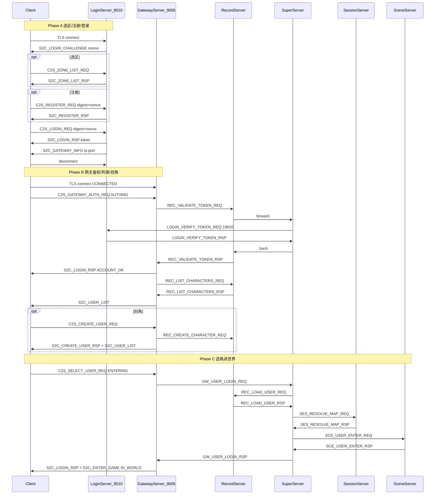

# RPG Server 登录链路全量审计与改进建议

## 1. 端到端流程（当前实现）



**关键真源文件**

| 阶段 | 核心实现 |
|------|----------|
| 选区 | [`LoginServer/LoginAuthService.cpp`](LoginServer/LoginAuthService.cpp) `onClientZoneList` |
| 注册 | [`LoginServer/LoginRegisterService.cpp`](LoginServer/LoginRegisterService.cpp) |
| 登录+挑战 | [`LoginServer/LoginAuthService.cpp`](LoginServer/LoginAuthService.cpp) + [`LoginServer/LoginServer.cpp`](LoginServer/LoginServer.cpp) 挑战 nonce |
| 网关分配 | [`LoginServer/LoginGatewayRegistry.h`](LoginServer/LoginGatewayRegistry.h) + [`LoginServer/LoginAuthService.cpp`](LoginServer/LoginAuthService.cpp) `sendGatewayInfo` |
| 票据校验 | [`GatewayServer/GatewayServer.cpp`](GatewayServer/GatewayServer.cpp) → [`RecordServer/RecordServer.cpp`](RecordServer/RecordServer.cpp) → [`SuperServer/LoginExternOutbox.cpp`](SuperServer/LoginExternOutbox.cpp) → [`LoginServer/LoginGameZoneAuthMsg.cpp`](LoginServer/LoginGameZoneAuthMsg.cpp) |
| 角色列表/创角 | [`RecordServer/RecordCharService.cpp`](RecordServer/RecordCharService.cpp) + [`GatewayServer/GatewayServer.cpp`](GatewayServer/GatewayServer.cpp) |
| 进世界 | [`SuperServer/SuperServer.cpp`](SuperServer/SuperServer.cpp) `onUserLoginReq` 状态机 |
| 超时预算 | [`sdk/util/LoginFlowTimeouts.h`](sdk/util/LoginFlowTimeouts.h) |
| 客户端契约 | [`Common/LoginMsg.proto`](Common/LoginMsg.proto) + [`GatewayServer/ClientMsgValidator.h`](GatewayServer/ClientMsgValidator.h) |

---

## 2. 当前运行状态（结合你近期日志）

| 环节 | 状态 | 说明 |
|------|------|------|
| 账号登录 (hcg11) | 已通过 | `password_digest = SHA256(密码)` 格式正确后成功 |
| Super→Login 外联 | 不稳定但可恢复 | 闪断后 `LoginExternOutbox` 重排队，约 1–2s 后校验成功 |
| Gateway 鉴权 | 已通过 | `鉴权成功 accid=10` |
| CharBase 迁移 | 已修复 | 曾缺 `accid` 列导致 `Unknown column 'accid'`；需确保所有环境执行 [`tables/alter_login_flow.sql`](tables/alter_login_flow.sql) |
| 角色列表 | 已通过 | 空列表 `count=0` 或已有角色 `count=1` 均正常下发 |
| 创角 | 部分成功 | 库中已有 `user_id=1 name=我的游戏`；重复创角报 `code=1 角色名已存在` 符合设计 |
| **Unity 客户端** | **主要问题** | 收到 `S2C_USER_LIST` / `S2C_CREATE_USER_RSP` 失败后**主动断开 Gateway**（`state=2 ACCOUNT_OK`），无法选角/重试 |

**结论**：服务端登录到「列表/创角」逻辑基本正确；当前阻塞进游戏的主因是**客户端未保持 Gateway 连接、未处理空列表与创角错误**；选角进世界阶段尚有 ENTERING 竞态等未验证风险。

---

## 3. 问题清单（按优先级）

### P0 — 阻塞或数据/安全

| # | 问题 | 位置 | 影响 |
|---|------|------|------|
| P0-1 | **Record 票据超时清理 15s + 5s 轮询 vs Gateway AUTHING 17s** | [`RecordServer.cpp:72`](RecordServer/RecordServer.cpp), [`LoginFlowTimeouts.h`](sdk/util/LoginFlowTimeouts.h) | 最坏 ~20s 才失败，Gateway 17s 已踢线；慢链路偶发「鉴权超时」 |
| P0-2 | **ENTERING 断线不通知 Scene** | [`GatewayServer.cpp`](GatewayServer/GatewayServer.cpp) `leaveWorldSession`（`sceneServerId==0` 时不发 leave）+ [`SuperServer.cpp`](SuperServer/SuperServer.cpp) `onUserLeaveReq` | 选角进世界中途客户端断开 → Scene 可能残留幽灵用户 |
| P0-3 | **DB 迁移未自动化** | [`tables/alter_login_flow.sql`](tables/alter_login_flow.sql) vs [`tables/init.sql`](tables/init.sql) | 存量库缺 `CharBase.accid` 时列表/创角全失败（你已遇到） |
| P0-4 | **登录挑战 nonce 失败不消费** | [`LoginAuthService.cpp:125`](LoginServer/LoginAuthService.cpp), [`LoginRegisterService.cpp`](LoginServer/LoginRegisterService.cpp) | 同连接可无限次密码/注册尝试 |

### P1 — 可靠性 / 体验

| # | 问题 | 位置 | 影响 |
|---|------|------|------|
| P1-1 | **Super→Login 外联 TLS 闪断** | 日志模式：转发后 `conn` 断开 → 重排队 | 鉴权延迟 1–2s；旧二进制曾立即 fail |
| P1-2 | **Record 与 Super 断线策略不对称** | Record: 立即 fail pending；Super: requeue | 运维排障困惑；Gateway 侧表现不一致 |
| P1-3 | **角色列表无 Gateway 侧超时** | [`GatewayServer.cpp`](GatewayServer/GatewayServer.cpp) `sendUserListToClient` | Record 无响应时客户端长期 `roleListReady=false` |
| P1-4 | **ENTERING 无专用超时** | [`GatewayServer.cpp`](GatewayServer/GatewayServer.cpp) `checkTimeout` 仅 CONNECTED/AUTHING | 进世界卡住依赖 60s 心跳踢线 |
| P1-5 | **列表/创角 handler 静默失败** | `onSelectUser`/`onCreateUser` parse 失败无回包；列表包长异常静默 drop | 客户端无反馈 |
| P1-6 | **`SES_LOAD_USER_REQ` 与进世界解耦** | [`SessionServer/SessionServer.cpp`](SessionServer/SessionServer.cpp) | 进世界不加载 Session 社交数据；重复请求静默丢弃 |
| P1-7 | **全局唯一角色名** | [`tables/init.sql`](tables/init.sql) `CharBase.name UNIQUE` | 跨账号同名创角失败，错误码易误解为「本账号已有」 |

### P2 — 文档 / 运维 / 扩展

| # | 问题 | 说明 |
|---|------|------|
| P2-1 | 文档写 6 字节帧头，实际 4 字节 | [`docs/PROTOCOL.md`](docs/PROTOCOL.md) vs [`sdk/net/NetDefine.h`](sdk/net/NetDefine.h) |
| P2-2 | `S2C_LOGIN_CHALLENGE` 未入 PROTOCOL 表 | 客户端易漏实现 |
| P2-3 | `CreateCharacterResultCode` proto 与 C++ 枚举不一致 | [`Common/LoginCommon.proto`](Common/LoginCommon.proto) vs [`LoginEnterErrorCode.h`](sdk/util/LoginEnterErrorCode.h) |
| P2-4 | `外联服 6 未连接` | Logger 外联未部署，日志噪音 |
| P2-5 | Gateway 心跳导致 Super↔Gateway TLS 周期性闪断 | 18:07/18:15 日志中 `shutdown while in init` 后重连 |

---

## 4. 客户端契约（Unity 必须遵守）

依据 [`scripts/test_login_gateway_e2e.py`](scripts/test_login_gateway_e2e.py) 与 [`docs/LOGIN_CHAR_FLOW.md`](docs/LOGIN_CHAR_FLOW.md)：

1. **9010**：收 `S2C_LOGIN_CHALLENGE` → `password_digest=SHA256(密码)`，`login_nonce` 单独回显 → 收 token 后**断开 9010**
2. **9005**：鉴权后**保持连接**；异步收 `S2C_USER_LIST`（`count=0` 是正常，显示创角 UI）
3. **创角失败**（`code=1` 名已存在）：提示换名，**不要 Disconnect**
4. **创角成功或列表已有角色**：发 `C2S_SELECT_USER_REQ`（`user_id=1` 对 hcg11 当前数据）
5. **鉴权等待**：Super 外联重试时最多等 **17s**（`GATEWAY_AUTHING_TIMEOUT_MS`）
6. **进世界**：可能先收 `S2C_SPAWN_ENTITY` 再收 `S2C_ENTER_GAME`，需缓冲

你当前 Unity 在步骤 2–3 违反「保持连接」与「空列表/创角错误处理」，这与服务端日志完全吻合。

---

## 5. 分阶段改进建议

### 阶段 A：立即止血（1–3 天）

- **客户端（Unity）**：修复 `LoginSession` / `CharacterSelectPanel`——`S2C_USER_LIST count=0` 进创角；`S2C_CREATE_USER_RSP code!=0` 仅提示；鉴权后勿断 Gateway
- **运维**：所有环境执行 [`tables/alter_login_flow.sql`](tables/alter_login_flow.sql) + [`tables/migrate_login_session_unique.sql`](tables/migrate_login_session_unique.sql)；纳入 [`tables/setup_database.sh`](tables/setup_database.sh) 检查
- **服务端**：对齐 Record 票据清理与 Gateway AUTHING——将 `CleanupPendingVerifyTokenTimeout` 轮询改为 **1s**，或 `GATEWAY_AUTHING_TIMEOUT_MS = VERIFY_TOKEN_TIMEOUT_MS + 5000`
- **验证**：`TLS_INSECURE=1 python3 scripts/test_login_gateway_e2e.py hcg11 <密码>` 应走完创角+进世界

### 阶段 B：进世界可靠性（1–2 周）

- **ENTERING 清理**：Gateway `leaveWorldSession` 在 `ENTERING` 时通知 Super（扩展 `GW_USER_LEAVE` 或 Super 查 pending）；Super 对 `ENTER_SCENE` 阶段断线发 `SCE_USER_LEAVE`
- **Scene 防重入**：[`SceneUserManager::addUser`](SceneServer/SceneUserManager.cpp) 同 `userID` 先 leave 再 enter
- **Gateway 错误闭环**：列表解析失败发 `S2C_USER_LIST code=-1`；`onCreateUser` 检查 `SendMsg` 返回值
- **ENTERING 超时**：`checkTimeout` 增加 `ENTERING` 分支（建议 30–60s，对齐 `LOGIN_TXN_LOCK_TIMEOUT_MS`）

### 阶段 C：安全与观测（2–4 周）

- 登录/注册失败**消费或轮换** challenge nonce；可选 nonce TTL
- 登录链路 SLI 已有 [`ServiceHealthMetrics`](sdk/util/ServiceHealthMetrics.h)——补充 pending 深度、外联重排队次数告警
- 排查 Super→Login **19010 mTLS 闪断根因**（证书、连接复用、`LOGIN_CONN_WARMUP_MS` 是否足够）
- 文档对齐：PROTOCOL 补 `S2C_LOGIN_CHALLENGE`、帧头 4 字节、鉴权时序图、创角错误码表

### 阶段 D：中长期（与三维度计划衔接）

- Record `loadUserFromDb` / 创角写库：已有异步队列基础，继续避免 handler 内同步 MySQL 长阻塞
- Session `SES_LOAD_USER_REQ`：超时/重复请求必须回包；若玩法需要，在进世界前触发关系加载
- Super 多 Record/多 Scene 选服与 failover
- InternalMsg 版本化与 CharBase 垂直拆分

---

## 6. 验收标准

| 场景 | 期望日志关键字 |
|------|----------------|
| 新账号全流程 | `phase=账号登录 code=0` → `鉴权成功` → `phase=角色列表 count=0` → `phase=创角 code=0` → `选角进世界` → `进入游戏成功` |
| 已有角色 | `phase=角色列表 count=1` → 直接选角，无重复创角 |
| 外联闪断 | `票据校验重排队` → `登录服票据校验成功`（无 Gateway 17s 超时） |
| 选角中断 | 无 Scene 残留用户（grep `用户进入场景` 与 `用户离开场景` 成对） |

```bash
grep -E '登录链路|鉴权成功|角色列表|创角|选角|进入游戏' logs/{login,gateway,record,super,scene}.log
TLS_INSECURE=1 python3 scripts/test_login_gateway_e2e.py hcg11 <密码>
```

---

## 7. 对你当前账号的建议

`hcg11`（accid=10）库中已有角色 **「我的游戏」**（user_id=1）。请：

1. 重新登录，等待 `S2C_USER_LIST count=1`
2. **直接选角**，不要再用「我的游戏」创角
3. 若 Unity 仍显示空列表或断开，优先修客户端 `S2C_USER_LIST` 处理，而非再改服务端登录逻辑
