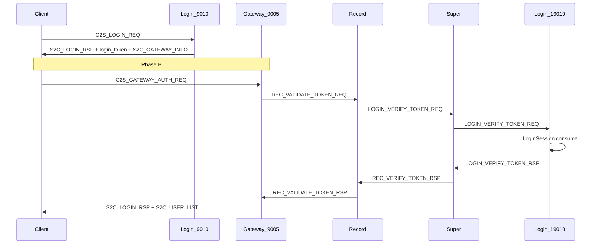

# 客户端登录流程审计与修复计划

## 审计结论概览

账号登录（9010）与网关鉴权（9005）是**两阶段**流程；`userId=0` / 日志 `accid=0` 在选角前属正常。近期客户端「票据无效或已过期」并非账号密码错误，而是 **Phase B 网关鉴权** 在 `Record → Super → Login` 链路上失败。



**与文档不一致处**：[`docs/LOGIN_CHAR_FLOW.md`](docs/LOGIN_CHAR_FLOW.md) §3 仍画 `EXT_GAMEZONE` 路径；实际代码为 Record 经 Super **裸转发** `LOGIN_VERIFY_TOKEN_REQ`（见 [`RecordServer/RecordServer.cpp`](RecordServer/RecordServer.cpp) L399、`SuperServer/SuperLoginMsg.cpp`）。

---

## 问题分级

### P0 — 导致当前无法进选角（必须先修）

| ID | 问题 | 位置 | 影响 |
|----|------|------|------|
| **P0-1** | Super→Login 外联在**同帧**内「心跳 + 校验 + 二次 poll」导致 TLS 断连；Login 收不到 `LOGIN_VERIFY_TOKEN_REQ` | [`SuperServer/SuperLoginMsg.cpp`](SuperServer/SuperLoginMsg.cpp)、[`SuperServer/SuperServer.cpp`](SuperServer/SuperServer.cpp) | 10:57:18 日志：`已转发` → 立刻 `网关注册连接断开` → `票据校验在途时登录外联断开` |
| **P0-2** | `LoginSession` 校验非原子：`SELECT` 成功但 `DELETE` 失败仍返回 `code=0` | [`LoginServer/LoginGameZoneAuthMsg.cpp`](LoginServer/LoginGameZoneAuthMsg.cpp) L82–91 | 票据可重复使用至过期，违背「一次性」语义 |
| **P0-3** | Gateway `onGatewayAuth` 不检查 `SendMsg` 返回值；`AUTHING` 无超时踢线 | [`GatewayServer/GatewayServer.cpp`](GatewayServer/GatewayServer.cpp) L511–519、L1020–1033 | 丢包后客户端永久卡在鉴权中（有心跳则 60s 才踢） |
| **P0-4** | `ensureRecordReady()` 在消息 handler 内**阻塞 poll 最多 3s** | [`GatewayServer/GatewayServer.cpp`](GatewayServer/GatewayServer.cpp) L260–282、L488 | 违反单线程非阻塞红线，拖死全网关 |

### P1 — 可靠性 / 运维风险

| ID | 问题 | 位置 |
|----|------|------|
| **P1-1** | Record **无 Super 断线重连**（Gateway 有 `tryReconnectSuper`，Record 无） | [`RecordServer/RecordServer.cpp`](RecordServer/RecordServer.cpp) L61、L89–92、L122–125 |
| **P1-2** | `LoginSession` 仅 `idx_accid_zone`，同账号多 token 并存；旧 token 清理失败仅 WARN | [`tables/migrate_login_session.sql`](tables/migrate_login_session.sql)、[`LoginServer/LoginAuthService.cpp`](LoginServer/LoginAuthService.cpp) L232–238 |
| **P1-3** | 外联重连判断用 `isConnected()` 而非 `canSend()`，TLS 半开连接不重连 | [`sdk/util/ExternalServerHub.cpp`](sdk/util/ExternalServerHub.cpp) |
| **P1-4** | 超时链分散：Record 15s / Super defer 12s / Gateway 10s 仅 WARN / 心跳 60s | 多文件 |
| **P1-5** | 遗留 `SS_EXTERN_FWD_RSP` + `LOGIN_VERIFY_TOKEN` 路径仍注册，与主路径并存 | [`RecordServer/RecordServer.cpp`](RecordServer/RecordServer.cpp) L440–485 |

### P2 — 安全加固与可观测性

| ID | 问题 | 建议 |
|----|------|------|
| **P2-1** | Gateway 未校验 `zone_id`/`game_type` 与进程配置一致 | [`GatewayServer/GatewayServer.cpp`](GatewayServer/GatewayServer.cpp) `onGatewayAuth` |
| **P2-2** | `account` 字段未与 token 绑定校验 | 鉴权成功后可选比对 `GameUser` 账号名 |
| **P2-3** | 登录挑战 nonce 失败不消耗，可同连接暴力试密 | [`LoginServer/LoginAuthService.cpp`](LoginServer/LoginAuthService.cpp) L115 |
| **P2-4** | 日志鉴权阶段长期 `accid=0`，难串联链路 | [`sdk/util/LoginFlowLog.h`](sdk/util/LoginFlowLog.h) 各调用点 |
| **P2-5** | 过期 `LoginSession` 无定期清理 | LoginServer 定时任务 |
| **P2-6** | 文档与 [`docs/ARCHITECTURE.md`](docs/ARCHITECTURE.md) L406 仍画 `REC→LS` 直连 | 文档更新 |

### 非 Bug（澄清）

- `REC_VERIFY_TOKEN_RSP`（Super→Record）与 `REC_VALIDATE_TOKEN_RSP`（Record→Gateway）是**两跳不同消息**，当前 handler 接线正确。
- 创角后 `roleListReady=false` 直到列表刷新，但 `ownedRoleIds` 已写入，**允许凭 `CREATE_USER_RSP.user_id` 选角**（[`GatewayServer.cpp`](GatewayServer/GatewayServer.cpp) L909–915 注释）；需修正文档 §2「列表到达前可选角」的表述与实现一致。

---

## 修复方案（按实施顺序）

### 阶段 1：根治 Super→Login 外联（P0-1）

**目标**：所有发往 Login 注册口（19010）的出站消息**串行化**，且每帧只 `poll` 一次。

1. 新增 [`SuperServer/LoginExternOutbox.h/.cpp`](SuperServer/LoginExternOutbox.h)（或扩展现有 `SuperLoginMsg.cpp`）：
   - 统一队列：`LOGIN_VERIFY_TOKEN_REQ`、`LOGIN_GATEWAY_HEARTBEAT`、`LOGIN_GATEWAY_REGISTER_REQ`、`LOGIN_UPDATE_LAST_USER_REQ`
   - 每主循环：`poll` → `flushOutbox`（至多 N 条/帧，默认 1 条校验优先）→ `m_server.Poll`
   - 连接预热：`LOGIN_CONN_WARMUP_MS`（1.5s）内只发心跳/注册，不发校验
   - 在途校验断开 → 立即 `failAllPending` + 允许 `tickReconnect`

2. 精简 [`SuperServer/SuperServer.cpp`](SuperServer/SuperServer.cpp) `Run()`：
   - 保持：`externHub.poll()` → `superLoginOnExternTick()` → `m_server.Poll()` → `tickReconnect()`（**不再** `tickGameZoneExtern` 二次 poll）

3. [`LoginServer/LoginServer.cpp`](LoginServer/LoginServer.cpp)：注册口 `OnMessage` 入口保留 INFO 级 `登录服收到区内消息 mod/sub`（仅 0x19xx）便于确认送达。

4. 验证日志关键字：
   - `登录外联: 票据校验入队` → `已转发` → `登录服收到票据校验` → `登录服票据校验成功`

### 阶段 2：票据消费原子化（P0-2 + P1-2）

1. [`LoginServer/LoginGameZoneAuthMsg.cpp`](LoginServer/LoginGameZoneAuthMsg.cpp)：
   - 改为单条 `DELETE ... WHERE token=? AND zone_id=? AND game_type=? AND expire_time>NOW()`，`mysql_affected_rows==1` 才成功
   - 用事务：`START TRANSACTION` → `SELECT accid ... FOR UPDATE` → `DELETE` → `COMMIT`（或 MySQL 8 `DELETE RETURNING`）
   - `DELETE` 失败必须 `rsp.code=1` 并打 ERR 日志

2. 新增迁移 [`tables/migrate_login_session_unique.sql`](tables/migrate_login_session_unique.sql)：
   - `UNIQUE KEY uk_accid_zone (accid, zone_id)`
   - 登录发 token 改 `REPLACE INTO` 或事务内 delete+insert；清理失败则**登录失败**

3. 更新 [`LoginServer/LoginServer.cpp`](LoginServer/LoginServer.cpp) `verifyLoginSchema()` 检查唯一索引。

### 阶段 3：Gateway 鉴权健壮性（P0-3 + P0-4 + P1-4）

1. [`GatewayServer/GatewayUser.h`](GatewayServer/GatewayUser.h)：增加 `authStartedAtMs`。

2. [`GatewayServer/GatewayServer.cpp`](GatewayServer/GatewayServer.cpp)：
   - `onGatewayAuth`：`SendMsg` 失败 → 回 `CONNECTED` + `S2C_LOGIN_RSP code=1`
   - 删除 handler 内 `ensureRecordReady` 阻塞；改为 `!isRecordReady()` 立即返回「上游未就绪」
   - `checkTimeout()`：对 `AUTHING` 超过 `VERIFY_TOKEN_TIMEOUT_MS + 2000`（≈17s）Kick；`CONNECTED` 超 10s 未鉴权也 Kick（不只 WARN）
   - 校验 `protoReq.zone_id() == m_zoneId` 与 `game_type`

3. 新增 [`sdk/util/LoginFlowTimeouts.h`](sdk/util/LoginFlowTimeouts.h) 集中常量，Gateway/Record/Super 引用。

### 阶段 4：Record Super 重连（P1-1）

参照 [`GatewayServer::tryReconnectSuper`](GatewayServer/GatewayServer.cpp)：

- `RecordServer::OnDisconnect` 标记上游断开
- 定时器（5–10s）`tryReconnectSuper()`：`Disconnect` + `Connect` + `RegisterToSuper`
- 重连时清空/失败 `m_pendingVerifyToken` 并回 `REC_VALIDATE_TOKEN_RSP code=1`

### 阶段 5：外联与遗留路径清理（P1-3 + P1-5）

- [`ExternalServerConnector::tickReconnect`](sdk/util/ExternalServerConnector.cpp)：连续 `!canSend()` 超过阈值强制 `Disconnect`
- [`RecordServer/RecordServer.cpp`](RecordServer/RecordServer.cpp)：为 `onExternForwardRsp` 的 `LOGIN_VERIFY_TOKEN` 分支加 `@deprecated` 注释；若确认无部署使用，移除注册（最小 diff 可先仅注释+日志）

### 阶段 6：文档与协议注释（P2-6 + 全链路）

| 文件 | 更新内容 |
|------|----------|
| [`docs/LOGIN_CHAR_FLOW.md`](docs/LOGIN_CHAR_FLOW.md) | §3 时序改为 Record→Super→Login 裸转发；§6 排障表补充 Super 外联日志；§2 澄清创角后选角条件 |
| [`docs/ARCHITECTURE.md`](docs/ARCHITECTURE.md) | §登录流程图补 Super 中转；REC_VERIFY vs REC_VALIDATE 说明 |
| [`docs/TLS.md`](docs/TLS.md) 或 [`docs/EXTERNAL.md`](docs/EXTERNAL.md) | Super↔Login 单连接串行写、预热、禁止同帧双 poll |
| [`protocal/InternalMsg.h`](protocal/InternalMsg.h) | `REC_VERIFY_TOKEN_RSP` / `REC_VALIDATE_TOKEN_RSP` 方向与触发时机注释 |
| [`AGENTS.md`](AGENTS.md) | 登录排障日志关键字速查 |

### 阶段 7：验证

```bash
./build.sh SuperServer LoginServer GatewayServer RecordServer
./RunServer.sh && ./RunServer.sh login
python3 scripts/test_login_gateway_e2e.py autotest_e2e test1234
grep -E '登录链路|票据校验|登录服收到' logs/{login,super,gateway,record}.log
```

手工检查：连续登录 3 次、Super 重启后无需重启 Record 即可鉴权、并发双开同 token 仅一次成功。

---

## 建议实施范围

| 批次 | 内容 | 预估改动 |
|------|------|----------|
| **PR-1（阻断）** | 阶段 1 + 3（Gateway 非阻塞 + AUTHING 超时） | Super/Gateway 为主 |
| **PR-2（安全）** | 阶段 2 | Login + SQL 迁移 |
| **PR-3（韧性）** | 阶段 4 + 5 | Record + sdk |
| **PR-4（文档）** | 阶段 6 + P2 日志/zone 校验 | docs + 小改 |

---

## 风险与回滚

- `UNIQUE(accid, zone_id)` 迁移前需确认库内无重复行（可加迁移前 `SELECT accid, zone_id, COUNT(*) ... HAVING cnt>1`）。
- Login 外联 Outbox 改动集中在 Super，回滚只需还原 `SuperLoginMsg` + `SuperServer::Run`。
- Gateway 去掉阻塞 `ensureRecordReady` 后，启动瞬间可能返回「上游未就绪」——符合非阻塞设计，客户端应重试。
