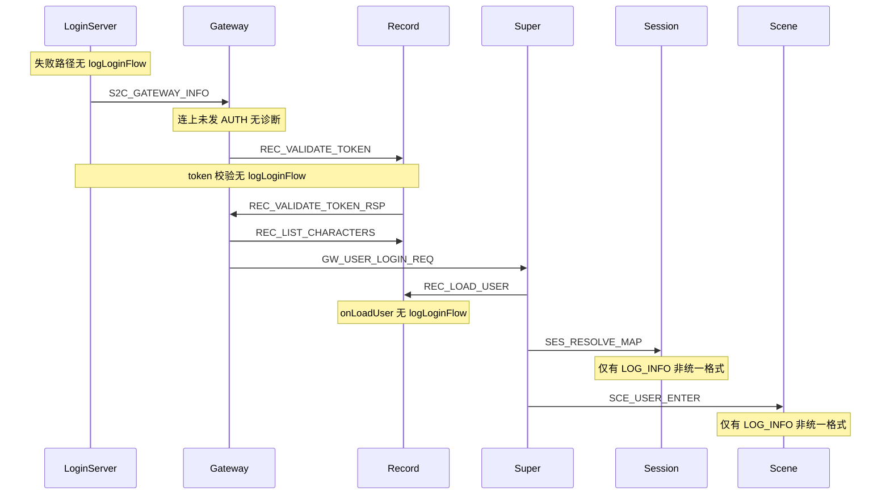

# 角色登录全链路服务器日志补齐

## 现状

项目已有统一日志工具 [`sdk/util/LoginFlowLog.h`](sdk/util/LoginFlowLog.h)：

```
[登录链路] phase=<阶段> accid=<u> userId=<u> conn=<u> txn=<u> code=<d> <detail>
```

**已覆盖较好：**

| 进程 | 已有 phase |
|------|-----------|
| LoginServer | `ACCOUNT_LOGIN`（仅成功） |
| GatewayServer | `GATEWAY_AUTH` / `CHAR_LIST` / `CHAR_CREATE` / `CHAR_SELECT` / `CHAR_LEAVE` / `LOGOUT` |
| RecordServer | `CHAR_LIST` / `CHAR_CREATE`（[`RecordCharService.cpp`](RecordServer/RecordCharService.cpp)） |
| SuperServer | `SUPER_ENTER` / `SCENE_ENTER`（部分节点） |

**明显缺口（对照 [`docs/LOGIN_CHAR_FLOW.md`](docs/LOGIN_CHAR_FLOW.md) 时序）：**



你当前「卡在角色列表」的症状：`gateway.log` 只有 `客户端连接建立`、无 `Gateway 票据鉴权` — 需要在 Gateway 增加 **CONNECTED 超时未鉴权** 告警。

---

## 设计原则

1. **复用现有 `LoginFlowPhase` 枚举**，不新增 phase（用 `detail` 区分子步骤，避免大范围改 grep/文档）。
2. **成功 `LOG_INFO` / 失败 `LOG_WARN`** — 沿用 `logLoginFlow()` 现有行为（`code==0` → INFO，否则 WARN）。
3. **conn 字段语义**：客户端相关用 Gateway `clientConn`；服间 RPC 无客户端 conn 时用 `gatewayConnID` 或 `0`（与现有 Gateway/Record 写法一致）。
4. **最小 diff**：只改登录链路 handler，不顺手重构存量 `LOG_INFO`。

### phase 与 detail 约定（新增日志）

| phase | 进程 | detail 示例 |
|-------|------|-------------|
| `ACCOUNT_LOGIN` | Login | `登录失败:<msg>` / `下发网关 ip:port` |
| `GATEWAY_AUTH` | Gateway/Record/Login | `Record转发Login校验` / `Login校验成功` / `连接后未鉴权超时` |
| `CHAR_LIST` | Gateway | `下发 count=N`（成功时补 count） |
| `SUPER_ENTER` | Super/Record/Session | `加载角色` / `地图解析 map=X scene=Y` / `下发Scene入场` |
| `SCENE_ENTER` | Scene | `入场成功 map=X` / `地图不存在` |

---

## 分服改动

### 1. LoginServer — 账号登录与网关信息

**文件：** [`LoginServer/LoginAuthService.cpp`](LoginServer/LoginAuthService.cpp)

- `#include "../sdk/util/LoginFlowLog.h"`
- [`onClientLogin()`](LoginServer/LoginAuthService.cpp)：在 `sendClientWire(loginRsp)` 后，对 **`code != 0`** 各早退/失败分支补 `logLoginFlow(ACCOUNT_LOGIN, 0, 0, connID, code, msg)`（密码错误、区服维护、token 写入失败等）。
- [`sendGatewayInfo()`](LoginServer/LoginAuthService.cpp)：在现有 `LOG_INFO("已下发网关信息...")` 旁补一条 `logLoginFlow`：
  - 成功：`detail="gateway=ip:port"`
  - 失败：`code=info.code`，`detail=info.msg`

**文件：** [`LoginServer/LoginGameZoneAuthMsg.cpp`](LoginServer/LoginGameZoneAuthMsg.cpp)

- 在 `onVerifyTokenReq()` 成功/失败处，除现有 `LOG_INFO/WARN` 外补 `logLoginFlow(GATEWAY_AUTH, rsp.accid, 0, 0, rsp.code, "Login校验token")`（`conn=0`，服间无客户端 conn）。

---

### 2. RecordServer — Token 校验与角色加载

**文件：** [`RecordServer/RecordServer.cpp`](RecordServer/RecordServer.cpp)

- `#include "../sdk/util/LoginFlowLog.h"`
- [`onValidateTokenReq()`](RecordServer/RecordServer.cpp)：发送 `LOGIN_VERIFY_TOKEN_REQ` 前/后 log；外联发送失败时 `logLoginFlow(GATEWAY_AUTH, 0, 0, req.gatewayConnID, 1, "转发Login失败")`
- [`onLoginVerifyTokenRsp()`](RecordServer/RecordServer.cpp)：`logLoginFlow(GATEWAY_AUTH, rsp.accid, 0, gatewayConnID, rsp.code, ...)`
- [`onLoginVerifyTokenExternFail()`](RecordServer/RecordServer.cpp) / [`CleanupPendingVerifyTokenTimeout()`](RecordServer/RecordServer.cpp)：补失败/超时 logLoginFlow
- [`onLoadUser()`](RecordServer/RecordServer.cpp)：`logLoginFlow(SUPER_ENTER, 0, userID, 0, code, "Record加载角色")` 成功/失败各一条

---

### 3. GatewayServer — 鉴权诊断与列表下发

**文件：** [`GatewayServer/GatewayUser.h`](GatewayServer/GatewayUser.h) / [`GatewayUserManager`](GatewayServer/GatewayUserManager.cpp)

- 构造时记录 `connectedAtMs = TimerMgr::NowMs()`；提供 `getConnectedAtMs()`。

**文件：** [`GatewayServer/GatewayServer.cpp`](GatewayServer/GatewayServer.cpp)

- [`checkTimeout()`](GatewayServer/GatewayServer.cpp)（30s 定时器）：除心跳超时外，扫描 `ClientState::CONNECTED` 且 `now - connectedAtMs > 10000` 的连接，打：
  ```cpp
  logLoginFlow(GATEWAY_AUTH, 0, 0, connId, -1, "连接后未鉴权超时");
  ```
  （仅 WARN 一次，可加 `authWarnSent` 标志避免刷屏；**不主动 Kick**，便于客户端重试）

- [`handleClientMsg()`](GatewayServer/GatewayServer.cpp) 入口：当 `user->getClientState()==CONNECTED` 时 `LOG_INFO` 记录首条上行 `mod/sub/len`（帮助区分「完全无包」vs「包格式错」——后者已有 `客户端消息被拒绝`）。

- [`sendUserListToClient()`](GatewayServer/GatewayServer.cpp) 成功路径：现有 `logLoginFlow(CHAR_LIST, ...)` 的 `detail` 补 `count=N`（`snprintf` 小缓冲区）。

- [`onGatewayAuth()`](GatewayServer/GatewayServer.cpp) 早退（upstream/record 未就绪）：补 `logLoginFlow(GATEWAY_AUTH, ..., BAD_STATE)`。

---

### 4. SuperServer — 进世界编排中间步骤

**文件：** [`SuperServer/SuperServer.cpp`](SuperServer/SuperServer.cpp)

在已有 `SUPER_ENTER` 日志稀疏处补齐（失败分支目前多只有 `LOG_WARN`）：

- [`onLoadUserRsp()`](SuperServer/SuperServer.cpp)：DB 加载失败 / 成功发起地图解析
- [`onResolveMapRsp()`](SuperServer/SuperServer.cpp)：地图未注册 / 场景离线 / 成功进入 ENTER_SCENE
- [`sendUserEnterToScene()`](SuperServer/SuperServer.cpp)：`detail="sceneServerId=X map=Y"`

---

### 5. SessionServer — 地图解析

**文件：** [`SessionServer/SessionServer.cpp`](SessionServer/SessionServer.cpp)

- `#include "../sdk/util/LoginFlowLog.h"`
- [`onResolveMapReq()`](SessionServer/SessionServer.cpp)：在现有 `LOG_INFO("地图解析结果...")` 旁补 `logLoginFlow(SUPER_ENTER, 0, req.userID, 0, rsp.code, detail)`，`detail` 含 `map` / `sceneServerId`。

---

### 6. SceneServer — 场景入场

**文件：** [`SceneServer/SceneServer.cpp`](SceneServer/SceneServer.cpp)

- `#include "../sdk/util/LoginFlowLog.h"`
- [`onUserEnter()`](SceneServer/SceneServer.cpp) / [`sendUserEnterRsp()`](SceneServer/SceneServer.cpp)：`logLoginFlow(SCENE_ENTER, 0, userID, req.gatewayClientConnID, code, detail)`（map 不存在 vs 成功）。

---

### 7. 文档（简短）

**文件：** [`docs/LOGIN_CHAR_FLOW.md`](docs/LOGIN_CHAR_FLOW.md)

- 新增「§ 日志排查」：`grep '[登录链路]' logs/*.log`、各 phase 含义表、典型卡住场景（仅有 `客户端连接建立` 无 `GATEWAY_AUTH` → 客户端未发鉴权包）。

---

## 验证方式

1. 编译：`./Build.sh GatewayServer SessionServer LoginServer RecordServer SuperServer SceneServer`
2. 跑 E2E：`python3 scripts/test_login_gateway_e2e.py hcg6 111111`
3. grep 全链路应出现连续 phase：
   ```
   phase=账号登录 → phase=网关鉴权 → phase=角色列表 → phase=选角 → phase=超级服进世界 → phase=场景入场
   ```
4. 用 Windows 客户端复现「只连接不鉴权」时，`gateway.log` 应在 ~10s 后出现 `连接后未鉴权超时`。

---

## 不在本次范围

- 不改日志级别配置 / 不接入 LoggerServer 远程聚合
- 不新增 metrics/告警系统（`LOGIN_FLOW_ALERT_*` 常量已存在，Super pending 告警已有）
- 不修改客户端 RPG_Client（当前卡住根因在客户端未发 `C2S_GATEWAY_AUTH_REQ`）
