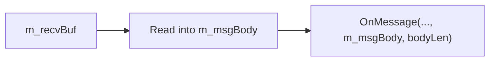
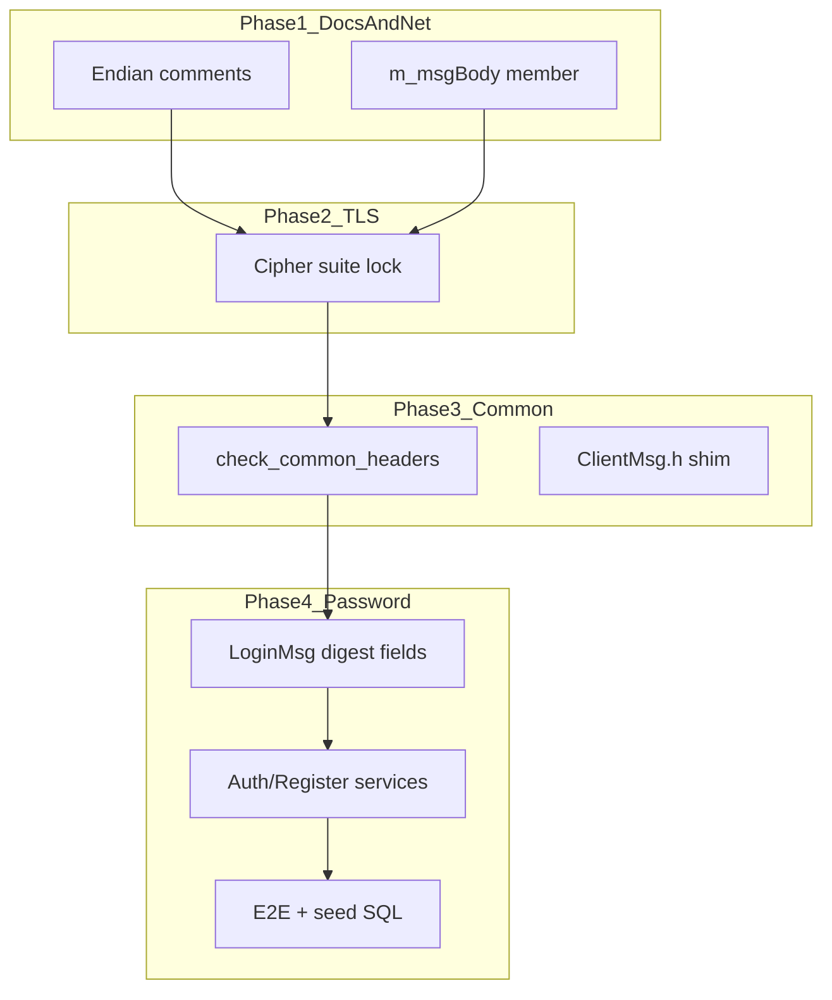

# 网络与安全五项修复计划

## 背景

| # | 问题 | 现状 |
|---|------|------|
| 1 | 字节序注释称「大端」 | 实际全栈 **host 小端** 直接 `memcpy`/`struct` 读写；[`docs/PROTOCOL.md`](docs/PROTOCOL.md) 已写 `LE`，但 [`protocal/InternalMsg.h`](protocal/InternalMsg.h) `UserBaseWire` 注释仍写「网络字节序/大端/hton」 |
| 2 | Common include 完整性 | `ClientMsg.h` 已移除，但 [`docs/INDEX.md`](docs/INDEX.md)、[`README.md`](README.md)、[`.cursor/rules/project.mdc`](.cursor/rules/project.mdc) 等仍引用；Server 源码已按域 include，缺自动化校验 |
| 3 | `processMessages()` 栈风险 | [`sdk/net/TcpConnection.cpp`](sdk/net/TcpConnection.cpp) L297：`char body[MAX_PACKET_SIZE]`（65535B/帧）在栈上 |
| 4 | TLS 密码套件未锁定 | [`sdk/net/TlsContext.cpp`](sdk/net/TlsContext.cpp) 仅 `SSL_CTX_set_min_proto_version`，未限制 cipher |
| 5 | 密码明文 on wire | [`Common/LoginMsg.h`](Common/LoginMsg.h) `Msg_C2S_LoginReq.password[32]` 明文；DB 为 `bcrypt(明文)` |

**密码方案（已选）**：**方案 1 — SHA-256 摘要**  
- wire：`passwordDigest[32]` = 32 字节 **SHA-256(UTF-8 密码)**（struct 大小不变）  
- DB：新注册/迁移后存 **`bcrypt(hex(digest))`**（64 字符 hex 作为 bcrypt 输入）  
- 不防重放（TLS 已覆盖传输层；应用层不再出现明文）

---

## 1. 字节序：文档与注释统一为小端

**原则**：游戏协议与服间定长 struct 均 **little-endian host order**，与 x86/Linux 一致；**不**引入 `htons/htons` 到 MsgHeader / wire struct（socket `sin_port` 的 `htons` 保留，属 OS API）。

**改动**：

- [`protocal/InternalMsg.h`](protocal/InternalMsg.h) — 修正 `UserBaseWire` 块注释与 `userID` 字段注释：删除「大端/hton」表述，改为「小端 host order，与 x86 一致，直接 memcpy」
- [`sdk/net/NetDefine.h`](sdk/net/NetDefine.h) — `MsgHeader.bodyLen` 补充 `@brief 小端 uint16，与 host 一致`
- [`Common/NetDefine.h`](Common/NetDefine.h) — 同上，保持与 Server 侧一致
- [`docs/PROTOCOL.md`](docs/PROTOCOL.md) — 新增 **§字节序** 小节：全协议 LE；禁止在 handler 内对 wire 字段做 ntoh（除非未来跨 BE 平台再单独立项）
- [`docs/SDK.md`](docs/SDK.md) — `UserWireUtil` / wire struct 一节注明 LE 策略

**不改动**：现有 `UserWireUtil.h`、`SendMsg`/`OnMessage` 读写逻辑（已正确）。

---

## 2. Common 子模块 include 完整性

**目标**：Server 侧 include 可解析；Common 头自洽；文档不再指向已删 `ClientMsg.h`。

**2.1 恢复过渡聚合头（可选但推荐）**

在 Common 子模块新增 [`Common/ClientMsg.h`](Common/ClientMsg.h)：

```cpp
// @deprecated 请按域 include XxxMsg.h；本文件仅供过渡期聚合
#include "ClientTypes.h"
#include "LoginMsg.h"
// ... 其余 *Msg.h
```

便于 RPG_Client 与旧文档路径兼容；Server 新代码仍按域 include。

**2.2 校验脚本** — 新增 [`scripts/check_common_headers.sh`](scripts/check_common_headers.sh)

- 扫描 `*.cpp`/`*.h` 中 `#include "../Common/`、`#include "../../Common/`，断言文件存在
- 扫描仓库内（除 `.cursor/plans`）对 `ClientMsg.h` 的 **源码** include，应仅允许聚合头自身
- 对 `Common/*.h` 做 `g++ -std=c++17 -fsyntax-only -I Common` 冒烟（或逐对 `*Msg.h`）
- 接入 [`Build.sh`](Build.sh) 可选前置步骤（失败则 WARN 或 FAIL，与 `gen_data` 类似）

**2.3 文档/rules 对齐**

更新引用 `ClientMsg.h` → `Common/*Msg.h` + [`Common/Common.txt`](Common/Common.txt)：

- [`docs/INDEX.md`](docs/INDEX.md)、[`README.md`](README.md)、[`docs/ARCHITECTURE.md`](docs/ARCHITECTURE.md)、[`docs/PROJECT.md`](docs/PROJECT.md)、[`docs/LUA.md`](docs/LUA.md)、[`AGENTS.md`](AGENTS.md)、[`.cursor/rules/project.mdc`](.cursor/rules/project.mdc)

[`docs/COMMON.md`](docs/COMMON.md) 注明 `ClientMsg.h` 为 **deprecated 聚合头**（非权威定义）。

---

## 3. `processMessages()` 栈缓冲优化

**方案**：在 [`TcpConnection`](sdk/net/TcpConnection.h) 增加成员 `std::array<char, MAX_PACKET_SIZE> m_msgBody`，[`processMessages()`](sdk/net/TcpConnection.cpp) 改用 `m_msgBody.data()` 替代栈上 `char body[65535]`。



- 单线程下每连接仅一帧解析中使用，与现有同步 `OnMessage` 语义一致
- 避免每消息 64KB 栈帧（handler 嵌套时更安全）
- `#include <array>` 于 `TcpConnection.h`

**不采用** RingBuffer 零拷贝 Peek 指针：环缓冲可能非连续，且需改 `OnMessage` 生命周期约束，超出本任务范围。

---

## 4. TLS 密码套件锁定

**配置扩展** — [`sdk/net/TlsConfig.h`](sdk/net/TlsConfig.h) + [`config/config.xml`](config/config.xml) / 各 `extern_*.xml`：

```xml
<Tls enabled="1" ... 
     cipherSuites="ECDHE-ECDSA-AES128-GCM-SHA256:ECDHE-RSA-AES128-GCM-SHA256:ECDHE-ECDSA-AES256-GCM-SHA384:ECDHE-RSA-AES256-GCM-SHA384"
     tls13CipherSuites="TLS_AES_128_GCM_SHA256:TLS_AES_256_GCM_SHA384"/>
```

**实现** — [`sdk/net/TlsContext.cpp`](sdk/net/TlsContext.cpp) `createCtx()` 内：

- `SSL_CTX_set_options`: `SSL_OP_NO_SSLv2 | SSL_OP_NO_SSLv3 | SSL_OP_NO_COMPRESSION`（及 OpenSSL 3 等价项）
- TLS ≤1.2: `SSL_CTX_set_cipher_list`（非空 `cipherSuites` 时用配置，否则用上述默认安全列表）
- TLS 1.3: `SSL_CTX_set_ciphersuites`（若 OpenSSL ≥1.1.1）
- 加载失败打 `LOG_FATAL` 并 init 失败

**文档** — [`docs/TLS.md`](docs/TLS.md) 增加「密码套件」段；[`config/tls/README.example`](config/tls/README.example) 简述默认套件策略。

---

## 5. 密码 SHA-256 摘要（方案 1）

### 5.1 协议（Common 子模块）

[`Common/LoginMsg.h`](Common/LoginMsg.h)：

| 字段 | 变更 |
|------|------|
| `Msg_C2S_LoginReq.password[32]` | 重命名为 `passwordDigest[32]`，注释：32 字节 SHA-256(UTF-8 密码)，**禁止明文** |
| `Msg_C2S_RegisterReq.password/confirmPassword` | 同上改为 `passwordDigest` / `confirmPasswordDigest` |

`static_assert(sizeof(...))` 不变（仍 32 字节）。

[`Common/LoginCommon.h`](Common/LoginCommon.h) — `LoginMsgSub` 注释更新登录/注册语义。

### 5.2 Server 工具

新增 [`sdk/util/PasswordDigestUtil.h`](sdk/util/PasswordDigestUtil.h)（或扩展现有 [`PasswordUtil.h`](sdk/util/PasswordUtil.h)）：

- `digestToHex(const uint8_t[32])` → 64 字符 hex
- `verifyPasswordDigestBcrypt(const uint8_t digest[32], const std::string& storedHash)` — 内部 hex 后走现有 `verifyPasswordBcrypt`
- `hashPasswordDigestBcrypt(const uint8_t digest[32], std::string& out)` — 注册用

**不**在 Server 侧对明文做 SHA256（客户端负责）；Server 只接收 digest 并 bcrypt 校验。

### 5.3 Login 业务

- [`LoginServer/LoginAuthService.cpp`](LoginServer/LoginAuthService.cpp) — 从 `req->passwordDigest` 取 32 字节，`verifyPasswordDigestBcrypt`；拒绝「可打印 ASCII 且非 32 字节全量」的 legacy 明文包（可选：`looksLikePlaintext()` → code=1 提示升级客户端）
- [`LoginServer/LoginRegisterService.cpp`](LoginServer/LoginRegisterService.cpp) — 注册/compare digest；存 `hashPasswordDigestBcrypt`
- [`GatewayServer/ClientMsgValidator.h`](GatewayServer/ClientMsgValidator.h) — Login/Register 规则长度不变；可增加 digest 非全零检查

### 5.4 数据迁移

- [`tables/init.sql`](tables/init.sql) / seed：`GameUser.password_hash` 对 autotest 账号改为 **bcrypt(hex(sha256("test1234")))** 的预计算值（脚本或注释说明生成方式）
- 新增 [`scripts/gen_password_digest.sh`](scripts/gen_password_digest.sh) 或 Python 一行工具：输入明文 → 输出 hex digest + bcrypt hash，供 DBA/dev 使用
- [`docs/DATA.md`](docs/DATA.md) — 说明 `password_hash` 语义变更

### 5.5 客户端 / E2E

- [`scripts/test_login_gateway_e2e.py`](scripts/test_login_gateway_e2e.py) — `hashlib.sha256(password.encode()).digest()` 填入 32 字节字段；注册同理
- [`docs/PROTOCOL.md`](docs/PROTOCOL.md)、[`docs/LOGIN_CHAR_FLOW.md`](docs/LOGIN_CHAR_FLOW.md)、[`docs/EXTERNAL.md`](docs/EXTERNAL.md) — 登录/注册流程注明 digest
- **RPG_Client**（仓库外）：文档中明确要求同步 Common + 本地 SHA256

**破坏性**：旧 Client 发明文将被拒；dev 测试账号需重新注册或跑迁移脚本。

---

## 6. 验证

```bash
./scripts/check_common_headers.sh
./Build.sh
./scripts/gen_tls_certs.sh   # 若测 TLS 套件
python3 scripts/test_login_gateway_e2e.py   # digest 登录全链路
openssl s_client -connect 127.0.0.1:9010 -CAfile config/tls/ca.crt -cipher 'ECDHE-RSA-AES128-GCM-SHA256'
```

- 确认 `UserBaseWire` / 登录包 tcpdump（TLS 解密后）无 UTF-8 明文密码
- 确认单连接高频小包下无栈溢出（可选 valgrind/asan 冒烟）

---

## 实施顺序

1. 字节序注释 + PROTOCOL/SDK 文档（无行为变更）
2. `TcpConnection` 成员缓冲（独立、低风险）
3. TLS cipher 锁定 + config
4. Common 聚合头 + check 脚本 + 文档/rules
5. 密码 digest 协议 + Login + seed/E2E + 文档（需 Common 子模块 commit）



---

## 风险与约束

- **单线程 / 架构红线**：不改 `MsgHeader` 布局、不在 handler 阻塞；digest 校验仍 O(1) bcrypt
- **Common 子模块**：`LoginMsg.h` 变更须在 RPG_Common 内 commit，Server 更新 submodule 指针
- **存量用户**：生产需迁移脚本或强制改密；本计划以 dev seed + E2E 账号为主
- **方案 1 局限**：不防重放；若后续需要，可再增 nonce 子协议而不改 digest 字段
