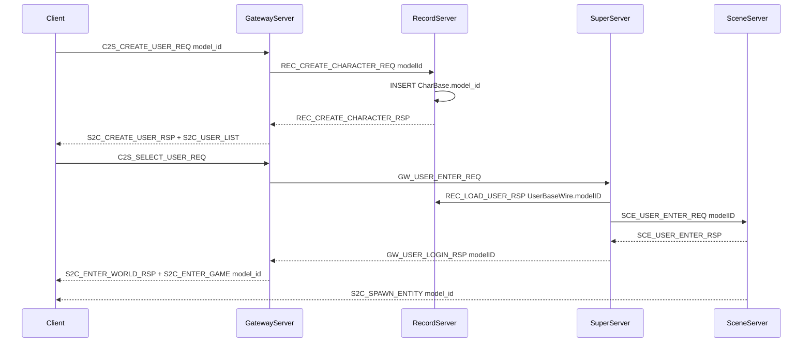

# 角色模型（model_id）服务端贯通方案

## 背景与目标

客户端已在 [`Common/LoginMsg.proto`](Common/LoginMsg.proto) 增加 `model_id`（1=男大 2=男小 3=女大 4=女小）：

| 消息 | 字段 |
|------|------|
| `C2SCreateUserReq` | `model_id = 4` |
| `UserListEntry` | `model_id = 6` |
| `S2CEnterGame` | `model_id = 10` |

当前服务端缺口：DB 无列、服间 wire 无字段、Gateway/Record/Super/Scene 未读写、[`Protobuf/`](Protobuf/) 尚未重新生成（`grep model_id` 无匹配）。



## 1. 数据库

**[`tables/init.sql`](tables/init.sql)** — `CharBase` 在 `sex` 后新增：

```sql
model_id TINYINT UNSIGNED NOT NULL DEFAULT 1 COMMENT '角色模型ID（1=男大 2=男小 3=女大 4=女小）',
```

**新建 [`tables/alter_character_model.sql`](tables/alter_character_model.sql)** — 幂等 `ALTER TABLE`（参照 [`tables/alter_login_flow.sql`](tables/alter_login_flow.sql) 的 `INFORMATION_SCHEMA` 检测模式）；存量角色默认 `model_id=1`。

**[`tables/seed_test_data.sql`](tables/seed_test_data.sql)** — 测试角色 INSERT 补充 `model_id`（如 1/2/3/4 各一）。

**[`tables/README.md`](tables/README.md)** — 登记新迁移脚本与 `CharBase.model_id` 字段说明。

## 2. 常量与错误码

**[`sdk/util/LoginSpawnConfig.h`](sdk/util/LoginSpawnConfig.h)** 新增：

```cpp
constexpr uint8_t MIN_MODEL_ID = 1;
constexpr uint8_t MAX_MODEL_ID = 4;
```

**[`sdk/util/LoginEnterErrorCode.h`](sdk/util/LoginEnterErrorCode.h)** — `CreateCharacterError::INVALID_MODEL = 5`。

## 3. 业务数据结构与服间 wire

**[`sdk/util/UserBase.h`](sdk/util/UserBase.h)** — 新增 `uint32_t modelID = 1`。

**[`sdk/util/UserWireUtil.h`](sdk/util/UserWireUtil.h)** — `toUserBaseWire` / `applyUserBaseWire` 读写 `modelID`。

**[`protocal/InternalMsg.h`](protocal/InternalMsg.h)** — 以下结构补齐 `modelID`（注释标明 1–4 语义）：

| 结构 | 改法 |
|------|------|
| `Msg_REC_CharacterEntryWire` | 将 `reserved[2]` 拆为 `uint8_t modelId` + `uint8_t reserved`（尺寸不变） |
| `Msg_REC_CreateCharacterReq` | 同上，复用 `reserved[0]` → `modelId` |
| `UserBaseWire` | 末尾追加 `uint32_t modelID` |
| `Msg_SCE_UserEnterReq` | 末尾追加 `uint32_t modelID` |
| `Msg_GW_UserLoginRsp` | 末尾追加 `uint32_t modelID` |

> 服间定长结构变更需 **Gateway / Record / Super / Scene 同批重编译重启**（与项目惯例一致）。

## 4. RecordServer — 持久化与列表

**[`RecordServer/RecordCharService.cpp`](RecordServer/RecordCharService.cpp)**

- `createCharacter`：校验 `modelId` 在 `[MIN_MODEL_ID, MAX_MODEL_ID]`；失败返回 `INVALID_MODEL`；INSERT 增加 `model_id` 列
- `listCharacters`：SELECT 增加 `model_id`，填入 `Msg_REC_CharacterEntryWire.modelId`

**[`RecordServer/RecordServer.cpp`](RecordServer/RecordServer.cpp)**

- `loadUserFromDb`：SELECT / 解析 `model_id` → `UserBase.modelID`
- `saveUserToDb`：INSERT/UPDATE 含 `model_id`
- `sendLoadUserRsp`（~279 行）：`wire.modelID = base.modelID`

## 5. GatewayServer — 客户端协议桥接

**[`GatewayServer/ClientMsgValidator.h`](GatewayServer/ClientMsgValidator.h)** — `validateCreateUser` 增加 `model_id` 范围校验（与 vocation/sex 同级）。

**[`GatewayServer/GatewayServer.cpp`](GatewayServer/GatewayServer.cpp)**

- `buildUserListProto`：`e->set_model_id(entries[i].modelId)`
- `onCreateUser`：`createReq.modelId = protoReq.model_id()`
- `onCreateCharacterRsp`：新增 `INVALID_MODEL` 分支文案「角色模型非法」
- `onUserLoginRsp`（~1036 行）：`enter.set_model_id(rsp.modelID)`

## 6. SuperServer — 进世界编排

**[`SuperServer/SuperServer.cpp`](SuperServer/SuperServer.cpp)**

- `sendUserEnterToScene`：`enter.modelID = wire.modelID`
- `onUserEnterRsp`：`gwRsp.modelID = w.modelID`（成功路径）

## 7. SceneServer — 入场与 AOI 广播

**[`SceneServer/SceneServer.cpp`](SceneServer/SceneServer.cpp)**

- `onUserEnter`：从 `req.modelID` 写入 `UserBase.modelID`
- `sendSpawnProto` / `broadcastSpawnProto`：玩家实体（`entityType==0`）从 `SceneUser::Base().modelID` 取 `modelId`，替换当前硬编码 `0`

辅助函数可放在匿名 namespace，对 `SceneEntry` 做 `dynamic_cast<const SceneUser*>` 读取 model，避免改动 `SceneEntry` 基类。

## 8. Protobuf 生成

执行 [`scripts/gen_proto.sh`](scripts/gen_proto.sh)（或 `./Build.sh` 自动触发），刷新 [`Protobuf/LoginMsg.pb.h`](Protobuf/LoginMsg.pb.h) 等，使 C++ 可调用 `set_model_id()` / `model_id()`。

## 9. 文档更新

| 文件 | 内容 |
|------|------|
| [`docs/LOGIN_CHAR_FLOW.md`](docs/LOGIN_CHAR_FLOW.md) | §4.1 增加 `model_id`；§4.4 增加 code=5；补充 `S2C_USER_LIST` / `S2C_ENTER_GAME` 字段表 |
| [`docs/PROTOCOL.md`](docs/PROTOCOL.md) | `C2S_CREATE_USER_REQ` / `S2C_USER_LIST` / `S2C_ENTER_GAME` 字段说明 |
| [`docs/DATA.md`](docs/DATA.md) 或 [`tables/README.md`](tables/README.md) | `CharBase.model_id` 列语义 |
| [`AGENTS.md`](AGENTS.md) | 创角校验项补充 model_id（若已有创角自检表） |

## 10. 验证

1. **迁移**：对已有 dev 库执行 `tables/alter_character_model.sql`
2. **编译**：`./Build.sh GatewayServer RecordServer SuperServer SceneServer`
3. **冒烟**：`TLS_INSECURE=1 python3 scripts/test_login_gateway_e2e.py <账号> <密码>`（若 e2e 脚本未传 model_id，可手动用客户端或临时改脚本带 `model_id=2` 创角）
4. **断言**：
   - 创角后 `S2C_USER_LIST.entries[].model_id` 与请求一致
   - 选角进世界后 `S2C_ENTER_GAME.model_id` 一致
   - DB `SELECT model_id FROM CharBase WHERE user_id=...` 一致
   - 第二客户端同地图可见 `S2C_SPAWN_ENTITY.model_id` 非 0

## 不在本次范围

- `model_id` 与 `sex` 的交叉校验（如男角色禁止选女模）— 客户端已选模，服务端仅做 1–4 范围校验
- NPC `model_id` 配置化（仍走 Spawn 默认 0）
- 修改 [`Common/LoginMsg.proto`](Common/LoginMsg.proto)（客户端已提交）
