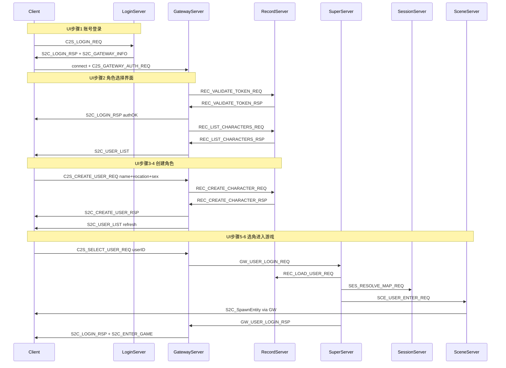

# 角色选择 → 创角 → 进游戏：服务端补全与文档

## 现状评估

**主链路已贯通**（方案 D 票据校验修复后），无需重写架构：

| 客户端 UI 步骤 | 客户端动作 | 服务端已实现点 |
|---|---|---|
| 1 登录后进选角界面 | Login → Gateway 鉴权 | [`GatewayServer::onValidateTokenRsp`](GatewayServer/GatewayServer.cpp) + [`sendUserListToClient`](GatewayServer/GatewayServer.cpp) |
| 2 右上角角色列表 | 被动收包 | [`onListCharactersRsp`](GatewayServer/GatewayServer.cpp) → `S2C_USER_LIST`（**无** `C2S_USER_LIST_REQ`，列表由服务端推送） |
| 3 无角色点「创建角色」 | 发创角包 | [`onCreateUser`](GatewayServer/GatewayServer.cpp) → [`RecordCharService::createCharacter`](RecordServer/RecordCharService.cpp) |
| 4 输入名字 + 选职业 | `name` + `vocation` + `sex` | wire 见 [`Msg_C2S_CreateUserReq`](Common/LoginMsg.h)；出生点 [`LoginSpawnConfig.h`](sdk/util/LoginSpawnConfig.h) |
| 4 有角色也可创角 | 同上 | 上限 `MAX_CHARACTERS_PER_ACCOUNT=3` |
| 5 选中角色点「进入游戏」 | `C2S_SELECT_USER_REQ.userID` | [`onSelectUser`](GatewayServer/GatewayServer.cpp) → [`SuperServer::onUserLoginReq`](SuperServer/SuperServer.cpp) 全链 |
| 6 加载地图/角色资源 | 收 `S2C_ENTER_GAME` + `S2C_SpawnEntity` | [`onUserLoginRsp`](GatewayServer/GatewayServer.cpp) + [`SceneServer::onUserEnter`](SceneServer/SceneServer.cpp) |

---

## 需补全的服务端缺口（小 diff）

### 1. 创角职业/性别校验

- **现状**：[`validateCreateUser`](GatewayServer/ClientMsgValidator.h) 只校验 `name` 非空；[`RecordCharService::createCharacter`](RecordServer/RecordCharService.cpp) 不校验 `vocation`/`sex`。
- **改动**：
  - 在 [`LoginSpawnConfig.h`](sdk/util/LoginSpawnConfig.h) 增加 `MAX_VOCATION_ID`、`MAX_SEX_ID`（与 [`UserBaseWire`](protocal/InternalMsg.h) 注释 0=战士…3=刺客 对齐）。
  - Gateway `validateCreateUser`：`vocation <= MAX_VOCATION_ID`，`sex <= MAX_SEX_ID`，非法返回 `BAD_PAYLOAD` + `S2C_ERROR`。
  - Record `createCharacter`：二次校验 vocation/sex，新增 `CreateCharacterError::INVALID_VOCATION`（[`LoginEnterErrorCode.h`](sdk/util/LoginEnterErrorCode.h)），Gateway `onCreateCharacterRsp` 映射提示文案。

### 2. 角色列表失败时的客户端反馈

- **现状**：[`sendUserListToClient`](GatewayServer/GatewayServer.cpp) 在 Record 未连接时仅打 WARN，客户端收不到列表、选角/创角可能卡在 `roleListReady=false`。
- **改动**：Record 不可达时主动下发 `S2C_USER_LIST`（`code=-1, count=0`），保持 `roleListReady=false`，客户端可提示重连/重登。

### 3. 进世界失败状态回滚（已部分实现，补日志）

- **现状**：失败时 [`onUserLoginRsp`](GatewayServer/GatewayServer.cpp) 已 `setClientState(ACCOUNT_OK)`，可再次选角/创角。
- **改动**：失败分支补充 `logLoginFlow(CHAR_SELECT, …)`；Super 超时 [`checkPendingLoginTimeouts`](SuperServer/SuperServer.cpp) 路径确认 Gateway 收到 fail rsp（已有，加 E2E 覆盖即可）。

### 4. 协议注释修正

- [`Common/LoginMsg.h`](Common/LoginMsg.h) 中 `C2S_CREATE_USER_REQ` / `S2C_CREATE_USER_RSP` / `S2C_USER_LIST` 的「处理方 LoginServer」改为 **GatewayServer**（与 [`LoginCommon.h`](Common/LoginCommon.h) 一致）。

---

## E2E 验证（扩展现有脚本）

扩展 [`scripts/test_login_gateway_e2e.py`](scripts/test_login_gateway_e2e.py) 为完整流程：

1. Login + Gateway 鉴权（已有）
2. 等待 `S2C_USER_LIST`
3. 若 `count==0`：发 `C2S_CREATE_USER_REQ`（name + vocation=0 + sex=0）→ 等 `S2C_CREATE_USER_RSP` + 刷新列表
4. 取列表首条 `userID`，发 `C2S_SELECT_USER_REQ`
5. 断言收到 `S2C_LOGIN_RSP code=0` + `S2C_ENTER_GAME`（含 mapID/坐标）
6. （可选）再等一条 `S2C_SpawnEntity`（module=SCENE）

验收标准对照日志：`gateway.log` 出现 `鉴权成功` → `phase=角色列表` → `选角进世界` → `进入游戏成功`；`record.log` 无超时。

---

## 文档更新

### 新增 [`docs/LOGIN_CHAR_FLOW.md`](docs/LOGIN_CHAR_FLOW.md)（主文档）

按你描述的 6 步 UI 写 **客户端-服务端对照表**，包含：

- Gateway 连接状态机（`CONNECTED → AUTHING → ACCOUNT_OK → ENTERING → IN_WORLD`），引用 [`GatewayUser.h`](GatewayServer/GatewayUser.h)
- 每步收发包顺序、body 关键字段（`loginToken`、`vocation`、`userID`、`loginTxnId`）
- 职业/性别枚举、角色上限 3、默认出生 map 1001
- `S2C_LOGIN_RSP` 复用场景（鉴权成功 vs 进世界成功 vs 失败）及客户端区分方式
- 错误码速查（`CreateCharacterError`、`SuperEnterError`、`GatewayValidateCode`）
- 完整 mermaid 时序图（含 Session 解析 map、Scene AOI）

### 更新存量文档

| 文件 | 更新内容 |
|---|---|
| [`docs/PROTOCOL.md`](docs/PROTOCOL.md) §4.2 | 与 UI 步骤编号对齐；补充创角后自动刷新列表、进世界后 SpawnEntity |
| [`docs/ARCHITECTURE.md`](docs/ARCHITECTURE.md) §6 | 登录序列图补全 LIST/CREATE/SELECT/Session/Scene RSP |
| [`docs/SERVERS.md`](docs/SERVERS.md) | Gateway 段落增加 ClientState 与三阶段 handler 表 |
| [`docs/DATA.md`](docs/DATA.md) | 补 `LoginSession`；`CharBase.accid/gamezone`；删除「CharBase.name 用于登录验证」过时描述 |
| [`docs/PROJECT.md`](docs/PROJECT.md) §2.1 | 登录路径改为 LoginServer 账号 + Gateway 票据 + Record 存档 |
| [`docs/INDEX.md`](docs/INDEX.md) / [`README.md`](README.md) | 增加 `LOGIN_CHAR_FLOW.md` 链接 |
| [`tables/README.md`](tables/README.md) | rpg_login 表数量改为 3（含 LoginSession） |
| [`tables/seed_test_data.sql`](tables/seed_test_data.sql) | 测试 CharBase 行补 `accid`/`gamezone`，与 `GameUser` 测试账号对齐 |

### 不在本次范围（文档中标注「后续」）

- `C2S_USER_LIST_REQ` 主动刷新（当前设计为服务端推送）
- `S2C_ENTER_MAP` wire（继续用 `S2C_ENTER_GAME` + `S2C_SPAWN_ENTITY`）
- 背包/技能/任务进世界预加载（Scene `load()` 仍为 stub）
- 职业配置表 DataDoc 化（暂用常量，文档写清 ID 约定）

---

## 实施顺序

1. **代码缺口**：职业/性别校验 + 列表失败回包 + 注释修正
2. **E2E 脚本**：login → list → create(可选) → select → enter
3. **文档**：先写 `LOGIN_CHAR_FLOW.md`，再同步修 PROTOCOL/ARCHITECTURE/DATA 等
4. **验证**：跑 E2E + Windows 客户端走完整 UI
