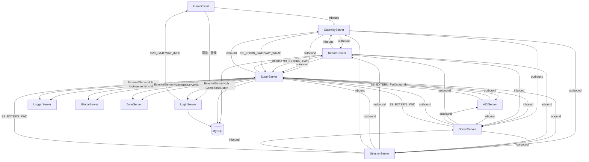
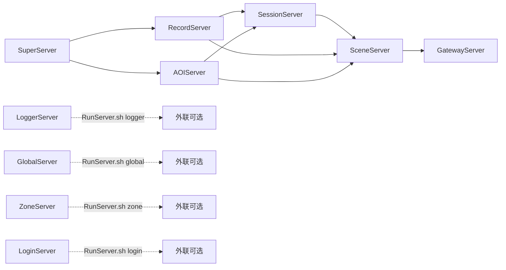
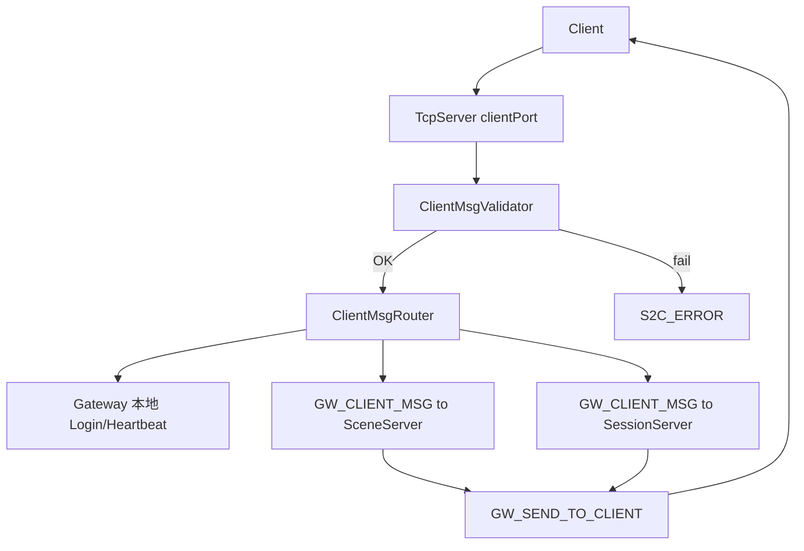
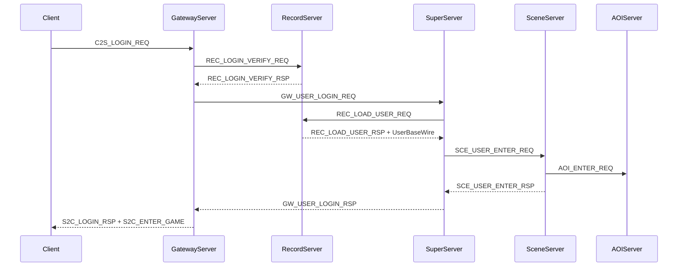
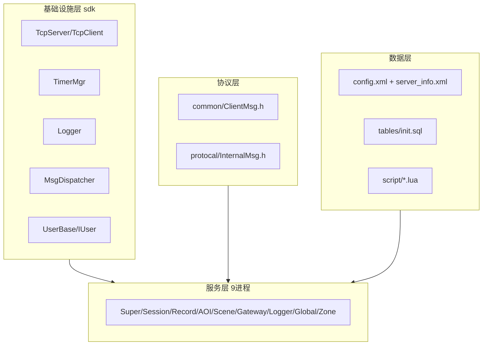

# RPG Server 架构文档

本文档描述 Linux 下 C++/Lua 分布式 MMORPG 服务器的整体架构，供开发与运维参考。  
项目说明与总结见 [PROJECT.md](PROJECT.md)。

## 1. 项目概述

| 属性 | 说明 |
|------|------|
| 语言 | C++17（核心逻辑）+ Lua 5.4（SceneServer 游戏脚本） |
| 网络模型 | 单线程 epoll ET + TCP 长连接 |
| 持久化 | MySQL（RecordServer 直连） |
| 配置 | XML（tinyxml2 解析） |
| 构建 | CMake 3.16+，输出至各服务器目录（如 `SuperServer/SuperServer`） |

**设计目标**：按职责拆分进程，SuperServer 统一注册与路由，SceneServer 可水平扩展，GatewayServer 可负载均衡，GlobalServer / ZoneServer 按需启用。

---

## 2. 整体架构

### 2.1 进程拓扑



**外联服**（Logger / Global / Zone / **Login**）不注册 SuperServer，可部署在任意机器。**仅 SuperServer** 经 `loginserverlist.xml` 维护四条外联出站；区内 Gateway/Session/Scene/Record/AOI 只连 Super，经 `SS_EXTERN_FWD_REQ` / `SS_LOGIN_GATEWAY_WRAP_REQ` 转发。RemoteLog 与 `GameZoneExternSender` 绑定 Super 路径。外联进程读各自 `extern_*.xml`；RegisterListen（GameZoneListen，默认 19010）供 Super 连接 Login。

**客户端两阶段连接（可选）**：`LoginServer` ClientListen（默认 9010）校验账号 → `S2C_GATEWAY_INFO` 下发网关地址 → 客户端再连区内 `GatewayServer`（9005）。存量客户端仍可直连 Gateway。

### 2.2 启动依赖与顺序

`RunServer.sh` 默认仅拉起**游戏区内**进程：



| 服务器 | 端口（默认） | 进程数 | 依赖 | 必选 |
|--------|-------------|--------|------|------|
| SuperServer | 9000 | 1 | MySQL（自举 ServerList） | 是 |
| RecordServer | 9002 | 1 | SuperServer | 是 |
| AOIServer | 9003 | 1 | SuperServer | 是 |
| SessionServer | 9001 | 1 | SuperServer + RecordServer | 是 |
| SceneServer | 9004 | N | Super + Record + Session + AOI | 是 |
| GatewayServer | 9005 | N | Super + Record + Session + Scene | 是 |
| LoggerServer | 9006 | 1 | 无（外联） | 否 |
| GlobalServer | 9007 | 1（全区） | 无（外联） | 否 |
| ZoneServer | 9008 | 1（全区） | 无（外联） | 否 |
| LoginServer | 9010（客户端）/ 19010（网关注册） | 1（外联） | 无（外联） | 否 |

---

## 3. 目录结构

```
RPG/
├── CMakeLists.txt
├── Build.sh / autoinit.sh / RunServer.sh / StopServer.sh / log.sh
├── sdk/                    # header-only 底层库
│   ├── net/                # epoll TCP 栈
│   ├── timer/TimerMgr.h
│   ├── log/Logger.h
│   └── util/               # ConfigLoader, MsgDispatcher, UserBase
├── common/ClientMsg.h      # 客户端协议
├── protocal/InternalMsg.h  # 服务器间协议
├── config/config.xml       # 全局配置
├── config/server_info.xml  # SceneServer 地图配置
├── database/               # Lua 策划配表
├── tables/                 # MySQL DDL（入口 init.sql）
├── script/                 # Lua 脚本
└── *Server/                # 各服务器 *Server.h + main.cpp
```

---

## 4. 各服务器职责

### SuperServer — 注册中心与登录调度

- 自举：启动读 MySQL `ServerList`；子进程经 `S2S_SERVERLIST_REQ` 拉拓扑
- 出站：**独占** `loginserverlist.xml` 外联 Logger/Global/Zone/Login（`ExternalServerHub`）
- 转发：`SuperExternRouter`（`SS_EXTERN_FWD`）、`SuperLoginMsg`（网关注册代理）
- 入站：区内子进程注册（`S2S_REGISTER_REQ`）
- 维护 `UserProxy`；协调登录：Gateway → Super → Record（加载）→ Scene

### SessionServer — 社会关系与离线数据

- 出站：SuperServer、RecordServer（`REC_RELATION_*` 读写 Relation）
- 入站：GatewayServer（`GW_CLIENT_MSG`）、SceneServer（场景/副本登记）
- 好友、离线消息、社会关系内存管理；`SessionUser` + `SocialData`
- 全区场景/副本：`SessionSceneManager` 登记与负载均衡

### RecordServer — 数据库读写

- 出站：SuperServer（注册）
- 入站：Gateway（登录验证）、Scene（CharBase 存档）、Session（Relation）
- 唯一直连 MySQL 的进程；账号验证、用户 load/save、Relation 表、定时存档

### AOIServer — 视野管理

- 出站：SuperServer
- 入站：SceneServer（enter/leave/move）
- 9 宫格 AOI；向 Scene 推送 `AOI_VIEW_NOTIFY`

### SceneServer — 核心游戏逻辑

- 出站：Super / Record / Session / AOI
- 入站：Gateway（`GW_CLIENT_MSG` 上行 + 同连接 `GW_SEND_TO_CLIENT` 下行）、Session（副本指令等）
- 内嵌 Lua；唯一可水平扩展的进程

### GatewayServer — 客户端接入

- 启动：仅监听客户端 + 连接 Super；收到 `S2S_REGISTER_RSP` 后再出站连接 Record / Session / **全部 Scene 实例**（`GatewayScenePool`）
- 出站：Super / Record / Session / 多 Scene；**不直连 Login**，经 Super `SS_LOGIN_GATEWAY_WRAP` + `LOGIN_GATEWAY_HEARTBEAT` 上报
- 入站：游戏客户端（clientPort）
- 登录成功后按 `Msg_GW_UserLoginRsp.sceneServerId` 绑定用户并路由上行消息
- `ClientMsgValidator` + `ClientMsgRouter`；60 秒心跳超时踢人

### LoginServer — 外联登录与网关列表

- **ClientListen**（默认 9010）：`C2S_LOGIN_REQ` → 可选 MySQL 校验（同 Record `CharBase.name`）→ `S2C_LOGIN_RSP` + `S2C_GATEWAY_INFO`
- **RegisterListen**（默认 19010）：Gateway `LOGIN_GATEWAY_REGISTER` / `LOGIN_GATEWAY_HEARTBEAT`；内存网关表轮询 LB
- 不向 SuperServer 注册；配置见 `LoginServer/extern_login.xml`

### LoggerServer — 集中日志

- 接收 `LOG_WRITE_REQ`，写入各服务器日志文件

### GlobalServer / ZoneServer — 可选扩展

- 通过 `ENABLE_GLOBAL=1` / `ENABLE_ZONE=1` 启动

---

## 5. 核心 SDK 设计模式

### 单线程事件循环

```cpp
while (true) {
    server.Poll();
    TimerMgr::Instance().Update();
}
```

### 消息帧

`MsgHeader { bodyLen, module, sub }`（6 字节）+ body（见 `sdk/net/NetDefine.h`）。

扁平 ID：`makeMsgId(module, sub)`，见 `sdk/net/MsgId.h`。

### 消息分发

`OnMessage(connId, module, sub, data, len)` → `MsgDispatcher::Dispatch(module, sub)` → handler。
仍可使用 `Register(uint16_t flatMsgId)` 兼容存量枚举。

### 用户基类体系

```
UserBase（纯数据结构）
    └── IUser（OnTick / OnLogin / OnLogout）
            ├── SessionUser
            ├── RecordUser
            └── SceneUser
```

---

## 6. 协议体系

### 线上帧格式（客户端与服间共用）

定义于 `sdk/net/NetDefine.h`：

```
| bodyLen (2B) | module (1B) | sub (1B) | body (变长) |
```

- **module**：功能模块（见 `ClientModule` / 服间高字节）
- **sub**：模块内具体消息
- 扁平 ID（兼容查表）：`makeMsgId(module, sub) == (module << 8) | sub`

工具函数：`sdk/net/MsgId.h`。

### Gateway 客户端消息处理



| 步骤 | 说明 |
|------|------|
| 拆包 | `TcpConnection` 解析 6 字节头 |
| 校验 | `ClientMsgValidator.h` |
| 路由 | `ClientMsgRouter.h` |
| 转发 | `Msg_GW_ClientMsg` + body |
| 下行 | `Msg_GW_SendToClient` + body |

### 客户端协议（common/ClientMsg.h）

| module | 说明 |
|--------|------|
| 0x00 | 登录/注册 |
| 0x01 | 场景/移动 |
| 0x02 | 战斗 |
| 0x05 | 聊天 |
| 0x06 | 社交 |
| 0x07 | 任务 |
| 0x08 | NPC 交互 |
| 0x0F | 系统/心跳/错误（含 `S2C_ERROR` sub=0x05） |

常用 C2S 示例：`C2S_LOGIN_REQ` = module **0x00** sub **0x01**；`C2S_MOVE_REQ` = **0x01/0x01**；`C2S_HEARTBEAT` = **0x0F/0x01**。

### 服间转发结构（protocal/InternalMsg.h）

| 结构体 | 方向 | 说明 |
|--------|------|------|
| `Msg_GW_ClientMsg` | Gateway → Scene/Session | `clientConnID` + module + sub + body |
| `Msg_GW_SendToClient` | Scene/Session → Gateway | 同上，Gateway 再组 6 字节头发给客户端 |

### 服务器内部协议（protocal/InternalMsg.h）

| msgID 范围 | 归属 |
|------------|------|
| 0x1F01–0x1F04 | 注册/心跳 |
| 0x1001–0x1003 | SuperServer |
| 0x1101–0x1105 | SessionServer |
| 0x1201–0x1206 | RecordServer |
| 0x1301–0x1306 | SceneServer |
| 0x1401–0x1405 | GatewayServer |
| 0x1501–0x1504 | AOIServer |

### 登录流程



---

## 7. 配置说明

### config.xml

- `<Database>` — MySQL 连接
- `<SuperServer>` — 注册中心地址
- `<*Server port>` — 各进程端口
- `<LogPaths>` — 日志文件路径

### server_info.xml

- `sceneID` — SceneServer 唯一编号
- `<Map id/name/file/maxPlayer>` — 承载地图列表

---

## 8. 扩展开发指南

### 新增客户端消息

1. 在 `common/ClientMsg.h` 定义 `ClientModule`、sub、body 结构体（扁平 `ClientMsgID` 可选）
2. 在 `GatewayServer/ClientMsgValidator.h` 增加白名单规则（长度、状态、payload）
3. 在 `GatewayServer/ClientMsgRouter.h` 指定转发目标（Scene / Session / LOCAL）
4. 在 SceneServer 或 SessionServer 处理 `GW_CLIENT_MSG`（或 Lua `OnMsg_{module}{sub}`）

### 新增 S2S 消息

1. 在 `protocal/InternalMsg.h` 添加 module/sub（扁平 `InternalMsgID`）和结构体
2. 在发送方/接收方 `RegisterHandlers()` 注册（支持 `Register(module, sub)` 或扁平 ID）

### 水平扩展

- **GatewayServer**：多实例 + L4 负载均衡
- **SceneServer**：不同 `sceneID` + `server_info.xml`，SuperServer 按地图路由

---

## 9. 架构分层



**核心设计原则**：

- **单线程无锁**：每个进程一个 epoll 循环
- **SuperServer 中心化注册**：支持 Scene/Gateway 扩展
- **职责单一**：DB 只在 RecordServer，AOI 独立，日志集中
- **Lua 热逻辑**：C++ 管网络/调度，Lua 管玩法
- **Header-only SDK**：逻辑集中在 `*Server.h`
