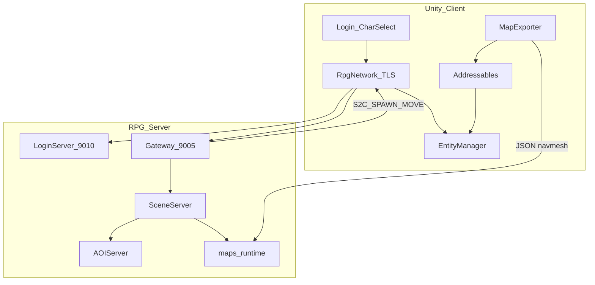
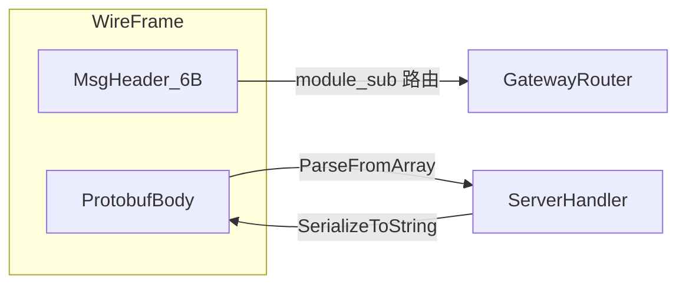
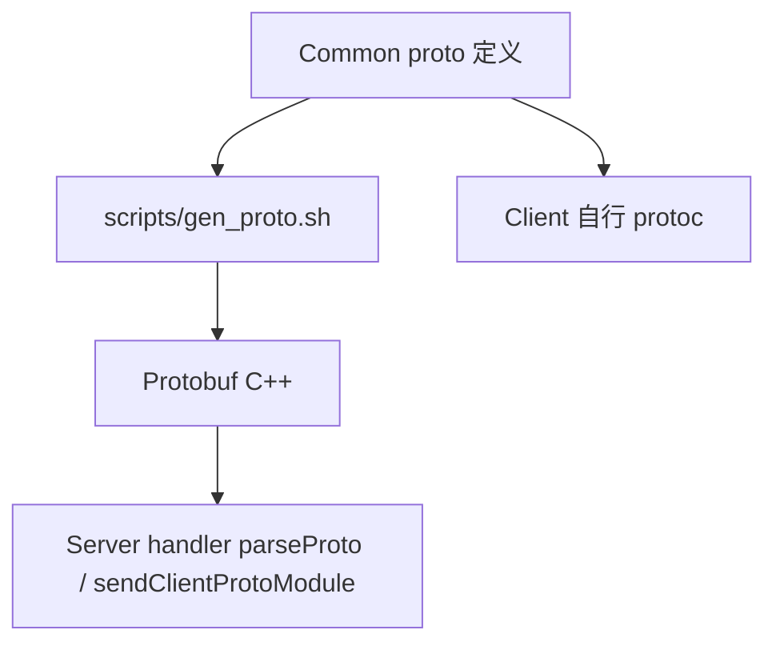
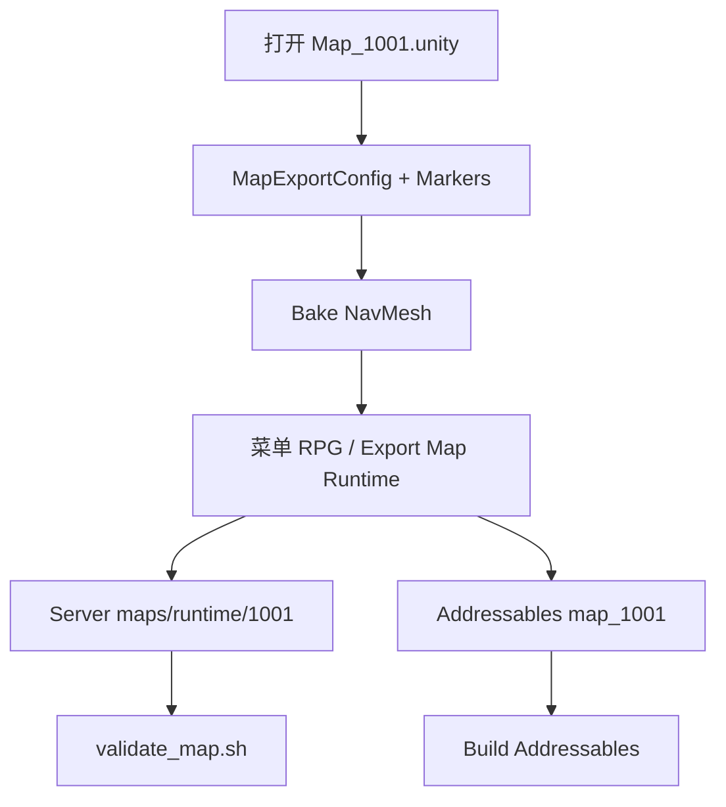
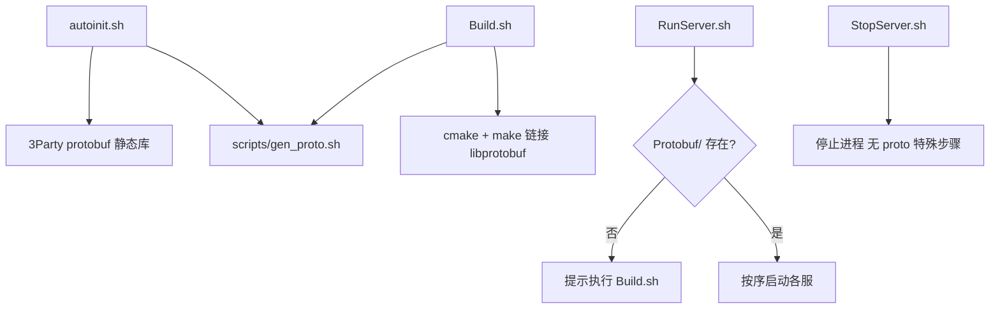

# RPG 3D 客户端设计（Unity）

本文档描述以 **Unity** 作为 PC + 移动端 3D 客户端、对接现有 C++ 分布式服务端的完整设计方案。架构红线见 [AGENTS.md](../AGENTS.md)。

相关文档：[PROTOCOL.md](PROTOCOL.md) · [TLS.md](TLS.md) · [LOGIN_CHAR_FLOW.md](LOGIN_CHAR_FLOW.md) · [DATA.md](DATA.md)

---

## 1. 决策摘要

| 项 | 决定 |
|----|------|
| 客户端引擎 | **Unity 2022.3 LTS**（或当前 LTS 稳定版） |
| 目标平台 | PC（Windows）+ Android + iOS |
| 关卡编辑 | Unity Editor + Terrain / ProBuilder + Blender 资产 |
| 服务端 | **10 进程架构不变**，扩展地图加载与移动校验 |
| 多人同步 | **禁止** Unity Netcode / NGO；沿用 Gateway → Scene → AOI |
| 坐标系 | **Y-up**（与 Unity 默认一致）；AOI 仅用 X-Z 平面 |
| **消息体序列化** | **Protocol Buffers（proto3）**；`Common/*.proto` 为双端真源，**须详细注释** |

### 1.1 服务端现状（2.5D）

| 维度 | 现状 | 关键文件 |
|------|------|----------|
| 坐标 | 协议与存档均为 `x,y,z` | `Common/MapDataMsg.proto`、`sdk/util/UserBase.h` |
| AOI | 九宫格 X-Z 平面，Y 不参与 | `AOIServer/AOIServer.h`（`GRID_SIZE=200`） |
| 移动 | 客户端坐标直接落库 | `SceneServer/SceneServer.cpp` `onMoveReq` |
| 地图 | `map/{id}.map` 占位，未解析 | `config/server_info.xml`、`SceneServer/Scene.cpp` |

**改造重点：** Unity 新客户端 + **Protobuf 协议迁移** + 地图导出管线 + Scene 地图/移动校验；**不推倒**进程拓扑与 6 字节帧路由头。

---

## 2. Unity 选型与费用

### 2.1 为何选 Unity

- PC + 移动**一套 C# 代码**，导出成熟
- NavMesh、Terrain、Animation、UI 开箱
- 自定义 **TCP + TLS** + **Protobuf body** 对接 6 字节帧路由
- `.proto` 位于 `Common/`（RPG_Common submodule），按 **`XxxCommon.proto` + `XxxMsg.proto`** 成对组织
- PoC 周期约 **2–3 周**（含 proto 脚手架）

### 2.2 费用（2025–2026，indie 量级）

| 项目 | 费用 | 说明 |
|------|------|------|
| Unity Personal | **$0** | 年收入 < $200k |
| Unity Pro | **~$185/月/席位** | 超收入门槛或需 Pro 功能 |
| 版税 | **无** | 2024 起已取消运行时安装费 |
| Google Play | **$25** 一次性 | Android 发布 |
| Apple Developer | **$99/年** | iOS 发布 |
| Asset Store | **$0–$500+** | 可选素材 |
| **首年典型（1 人 Personal）** | **~$124** | 仅双端开发者账号 |

### 2.3 Unity 约束（必遵）

- **不用** Netcode for GameObjects / Netcode for Entities 做状态同步
- **不用** Unity Relay / Lobby 替代 Gateway / Login
- 客户端：TLS 连接 → 发 `C2S_*` → 收 `S2C_*` → 本地插值
- 服端权威：SceneServer 校验移动，AOIServer 管视野

---

## 3. 总体架构



### 3.1 登录与进世界（与现网一致）

详见 [LOGIN_CHAR_FLOW.md](LOGIN_CHAR_FLOW.md)：

1. LoginServer **9010**（TLS）— 账号登录，拿 Gateway 地址
2. Gateway **9005**（TLS）— `C2S_GATEWAY_AUTH` → 选角/创角
3. Super → Record → Session → Scene → AOI
4. 客户端收 `S2C_ENTER_GAME` + `S2C_SPAWN_ENTITY`，加载 Unity 地图资源

---

## 4. 网络层设计（Protobuf）

3D / Unity 客户端上线时，**客户端 wire 消息体**由现有 `#pragma pack(1)` C struct 迁移为 **Protocol Buffers（proto3）**。  
**保留** 6 字节帧头用于 Gateway 路由；**仅 body** 改为 Protobuf 二进制。服间协议（`protocal/InternalMsg.h`）暂维持现状，后续可按需单独迁移。

### 4.1 消息帧（不变）

与 [PROTOCOL.md](PROTOCOL.md) 一致：

```
| bodyLen (2B, LE) | module (1B) | sub (1B) | body (Protobuf 二进制) |
```

- `bodyLen` = **Protobuf 序列化字节数**（不含 6 字节头）
- `module` / `sub` = 路由键，与现有 `ClientModule` / `XxxMsgSub` 枚举值对齐
- TLS 见 [TLS.md](TLS.md)



### 4.2 为何用 Protobuf

| 对比项 | 现有 C struct | Protobuf |
|--------|---------------|----------|
| 双端同步 | 手动对齐 `Common/*.h` + 可选 C# 生成 | `.proto` 单源，`protoc` 出 C++/C# |
| 字符串 | `WireStringUtil` + 定长 `char[N]` | `string` 类型，UTF-8 |
| 变长消息 | 手工 header + 尾随布局 | `repeated` / `bytes` 原生支持 |
| 扩展字段 | 破坏性改 struct 布局 | 新增 field number，向后兼容 |
| Unity | 易与 C++ 字段偏移不一致 | `Google.Protobuf` 官方 C# 运行时 |

### 4.3 `.proto` 目录布局（仍在 `Common/`）

Protobuf **不另建顶层 `proto/` 目录**，与现有 [`Common/`](../Common/) 头文件**同仓同路径**（RPG_Common submodule）。  
文件命名与域划分遵循 [`Common/Common.txt`](../Common/Common.txt)：**每组 `XxxCommon.proto` + `XxxMsg.proto`** 成对组织。

```
Common/                              # RPG_Common submodule（仅消息源）
├── ClientTypes.h                    # ClientModule 路由枚举
├── NetDefine.h / MsgId.h            # 6 字节头常量与工具
├── ClientCommon.proto … NpcMsg.proto
├── Common.txt
└── README.md

Protobuf/                            # RPG_Server 主仓（Server C++ 生成物）
├── *.pb.h / *.pb.cc                 # scripts/gen_proto.sh 输出
└── README.md
```

**文件职责：**

| 文件 | 职责 |
|------|------|
| `ClientTypes.h` `ClientModule` | module 编号（6 字节帧路由头） |
| `XxxCommon.proto` `XxxMsgSub` 等 | 域内 enum、常量、辅助 message |
| `XxxMsg.proto` `C2S*` / `S2C*` | C2S/S2C wire message（Protobuf body） |

**命名约定：**

| 层 | 约定 | 示例 |
|----|------|------|
| 文件名 | `XxxCommon.proto` / `XxxMsg.proto` 成对 | `LoginMsg.proto` |
| proto message | PascalCase，`C2S`/`S2C` 前缀 | `C2SMoveReq`、`S2CSpawnEntity` |
| proto 字段 | snake_case | `entity_id`、`move_type` |
| proto enum | 与 `XxxMsgSub` 同名 | `LoginMsgSub`、`MapDataMsgSub` |
| C# 生成类 | PascalCase 属性 | `EntityId`、`MoveType` |
| C++ 生成类 | `LoginMsg.pb.h` 内 `C2SMoveReq` | `ParseFromArray` / `SerializeToString` |

**Server 依赖：** `3Party` 引入 **protobuf**（`libprotobuf`）；CMake 引用 `Protobuf/`。

### 4.3.1 新增消息 workflow（与 `Common/README.md` 对齐）

迁移完成后，在 Common 新增/修改消息仍按域成对操作：

1. **`ClientTypes.h`** — 若新域，补 `ClientModule`（module 编号不变）
2. **`XxxCommon.proto`** — 增加 `XxxMsgSub` enum 值（注释方向、处理方；enum 值与现网 sub **十六进制一致**）
3. **`XxxMsg.proto`** — `import "XxxCommon.proto"`；定义 `C2S*` / `S2C*` message 及字段
4. 运行 **`./scripts/gen_proto.sh`** — 刷新 `Protobuf/`（Server）；Client 自行生成
5. **Server** — Gateway Validator 登记 module/sub；handler 用 `parseProto` / `sendClientProtoModule`
6. **Unity** — `RpgMessageDispatcher` 按 module/sub 选对应 `Parser`；禁止手写平行 struct

**禁止：** 在 `Common/` 外散落 `.proto`；禁止单文件堆全部 message（破坏域边界）。

### 4.3.2 Protobuf 注释规范（必遵）

与 [`docs/COMMENTS.md`](COMMENTS.md) §Common 协议**对齐**，细则见该节。**所有新增/修改 `.proto` 必须带完整注释**，CI 脚本 `scripts/check_common_proto.sh` 做冒烟校验（缺文件头 / message 块注释 / 关键 enum 注释则失败）。

| 类型 | 要求 | 示例 |
|------|------|------|
| **文件头** | 每个 `.proto` 顶部块注释：`文件名`、`对应 ClientModule`、`关联 *Common.proto/*Msg.proto` | 见下方范本 |
| **`XxxCommon.proto` enum** | 每个枚举值：**方向**（C→S/S→C）、**sub 十六进制**、**处理进程**、简述 | `C2S_MOVE_REQ = 1; // 0x01 C→S 移动请求；Gateway→Scene` |
| **业务 enum** | `MoveType`、`GatewayValidateCode` 等：每个值一行注释 | `MOVE_TYPE_WALK = 0; // 走，速度见 map.meta maxWalkSpeed` |
| **`message` 块** | 每个 C2S/S2C message 前块注释：**方向**、**module/sub**、**触发时机**、变长/repeated 布局 | 见 `LoginMsg.proto` `C2SLoginReq` 块 |
| **字段** | 每个 field 行尾或上一行注释：单位、范围、0/空含义、是否必填 | `uint32 model_id = 5; // Unity Addressable key，0=默认外观` |
| **`reserved`** | 删除字段时 `reserved N;` 并注释原字段名与废弃原因 | `reserved 7; // 原 foo，v2 移除` |
| **import** | 非显然依赖在文件头说明为何 import | `import "ClientCommon.proto"; // Vec3` |

**注释形式：** 使用 `//` 行注释或 `/* ... */` 块注释；`protoc` 会保留部分注释到生成 C# XML doc（取决于 `--csharp_opt`）。

**带注释范本（`MapDataMsg.proto` 节选）：**

```protobuf
// @file MapDataMsg.proto
// @brief 地图域 wire message（module=SCENE/0x01）
// sub 枚举见 MapDataCommon.proto

syntax = "proto3";
package rpg.mapdata;

import "ClientCommon.proto";
import "MapDataCommon.proto";

// C→S module=0x01 sub=0x01
// 触发：客户端摇杆/点击地面；Gateway 校验后转 SceneServer
message C2SMoveReq {
  uint32 entity_id = 1;       // 移动实体 ID（通常为本角色）
  rpg.client.Vec3 pos = 2;    // 目标世界坐标，Y-up
  MoveType move_type = 3;     // WALK/RUN；步长由服务端 MoveValidator 限制
}

// S→C module=0x01 sub=0x05
// 触发：AOI 进视野或首次进图；Gateway 下行
message S2CSpawnEntity {
  uint32 entity_id = 1;
  uint32 template_id = 2;       // 策划模板 ID
  rpg.client.Vec3 pos = 3;
  float rotation_y = 4;         // 绕 Y 轴朝向（弧度或度，双端约定）
  uint32 model_id = 5;          // Unity Prefab/Addressable，0=默认
  uint32 anim_state = 6;        // 客户端动画状态机枚举
}
```

**提交前检查：**

- [ ] 文件头块注释完整
- [ ] 每个 `message` 有方向 + module/sub + 触发时机
- [ ] 每个 enum 值有方向/处理方（`XxxCommon.proto`）
- [ ] 非显然字段均有注释
- [ ] `./scripts/check_common_proto.sh` 通过

### 4.4 module/sub 与 Protobuf 映射

路由仍用 `module` + `sub`；handler 内按枚举选择 message 类型解析。

| 方向 | module/sub | 定义文件 | Protobuf message | 说明 |
|------|------------|----------|------------------|------|
| C→S | 0x00/0x0D | `LoginMsg.proto` | `C2SGatewayAuthReq` | Gateway 票据鉴权 |
| C→S | 0x00/0x05 | `LoginMsg.proto` | `C2SSelectUserReq` | 选角 |
| S→C | 0x01/0x05 | `MapDataMsg.proto` | `S2CSpawnEntity` | 实体进视野 |
| C→S | 0x01/0x01 | `MapDataMsg.proto` | `C2SMoveReq` | 移动请求 |
| S→C | 0x01/0x02 | `MapDataMsg.proto` | `S2CMoveNotify` | 移动广播 |

Phase 0 仅实现上表子集；其余域按 [PROTOCOL.md](PROTOCOL.md) 消息表逐批迁移。

### 4.5 `.proto` 示例（注释见 §4.3.2）

**`ClientCommon.proto`（跨域公共类型）：**

```protobuf
syntax = "proto3";
package rpg.client;

message Vec3 {
  float x = 1;
  float y = 2;
  float z = 3;
}
```

**`MapDataCommon.proto`（域 enum，对照 `MapDataCommon.h`）：**

```protobuf
syntax = "proto3";
package rpg.mapdata;

enum MapDataMsgSub {
  MAP_DATA_MSG_SUB_UNSPECIFIED = 0;
  C2S_MOVE_REQ = 1;      // 0x01，与 LoginCommon/MapDataCommon.h 子编号一致
  S2C_MOVE_NOTIFY = 2;   // 0x02
  S2C_SPAWN_ENTITY = 5;  // 0x05
}

enum MoveType {
  MOVE_TYPE_WALK = 0;
  MOVE_TYPE_RUN = 1;
}
```

**`MapDataMsg.proto`：**

```protobuf
syntax = "proto3";
package rpg.mapdata;

import "ClientCommon.proto";
import "MapDataCommon.proto";

message C2SMoveReq {
  uint32 entity_id = 1;
  rpg.client.Vec3 pos = 2;
  MoveType move_type = 3;
}

message S2CMoveNotify {
  uint32 entity_id = 1;
  rpg.client.Vec3 pos = 2;
  MoveType move_type = 3;
}

message S2CSpawnEntity {
  uint32 entity_id = 1;
  uint32 template_id = 2;
  rpg.client.Vec3 pos = 3;
  float rotation_y = 4;
  uint32 model_id = 5;    // Unity Prefab/Addressable，0=默认
  uint32 anim_state = 6;
}
```

**字段编号规则：** 已发布 field number **不可复用**；删除字段用 `reserved`；新增字段仅追加 number。

### 4.6 双端编解码

**C++（Server）：**

```cpp
#include "MapDataMsg.pb.h"
rpg::mapdata::C2SMoveReq req;
if (!req.ParseFromArray(body, bodyLen)) { /* LOG_WARN + 拒包 */ return; }
// req.pos().x() 等
```

**C#（Unity）：**

```csharp
var req = C2SMoveReq.Parser.ParseFrom(body);
// req.Pos.X 等
```

**组包：**

```cpp
std::string out;
req.SerializeToString(&out);
// bodyLen = out.size(); 写入 MsgHeader + out
```

### 4.7 Unity 网络模块划分

| 脚本 / 目录 | 职责 |
|-------------|------|
| `RpgTcpClient.cs` | TLS 连接 Login / Gateway |
| `RpgProtocolFramer.cs` | 6 字节头拆包/组包 |
| `RpgMessageDispatcher.cs` | 按 module/sub 选 Parser |
| `Handlers/*` | 登录、进世界、移动 |
| `Generated/` | Client 工程内自行 `protoc --csharp_out` |

**禁止：** 手写与 `.proto` 并行的 C# struct；所有 wire 类型必须来自代码生成。

### 4.8 Gateway 校验适配

[`GatewayServer/ClientMsgValidator.h`](../GatewayServer/ClientMsgValidator.h) 迁移策略：

| 阶段 | 校验方式 |
|------|----------|
| Phase 0 | 白名单 module/sub + `bodyLen` 上限（如 64KB） |
| Phase 1+ | 对关键上行消息 `ParseFromArray` 轻量校验（必填字段、数值范围） |

路由逻辑（LOCAL / SCENE / SESSION）**不变**。

### 4.9 迁移状态（已完成）

客户端 wire 已全量迁至 Protobuf；legacy `*Msg.h` / `ClientMsgBody.h` 已从 Common 删除。线上帧仍为 **6 字节头 + Protobuf body**，路由仅靠 header 的 module/sub。



| 步骤 | 内容 |
|------|------|
| 1 | `Common/` 内按域维护 `XxxCommon.proto` + `XxxMsg.proto` |
| 2 | Gateway / Login / Scene handler 使用 Protobuf 解析与序列化 |
| 3 | Client 自行从 Common `.proto` 生成对应语言代码 |
| 4 | [`Common/Common.txt`](../Common/Common.txt) 以 `.proto` 为索引 |

**破坏性说明：** body 为 Protobuf 后，**旧定长 struct 客户端无法与新 Gateway 互通**；需统一 cutover。`C2SLoginReq`（或 Gateway 首包）可带 `protocol_version` 字段做版本协商。

### 4.10 代码生成命令（草案）

```bash
# 项目根目录
./scripts/gen_proto.sh

# 等价于
protoc -I Common \
  --cpp_out=Protobuf \
  Common/ClientCommon.proto Common/LoginCommon.proto Common/LoginMsg.proto
  # … 其余域按 Common.txt 成对追加
```

Server CI / `./Build.sh` 前自动调用；Client 自行从 Common `.proto` 生成。

---

## 5. 地图编辑器与工作流

**原则：** Unity Editor 为关卡**唯一真源**，不另建 Tiled 等第二套编辑器。

| 角色 | 工具 |
|------|------|
| 关卡 | Unity Scene + Terrain + ProBuilder |
| 导航 | Unity NavMesh Bake → 导出 `navmesh.bin` |
| 资产 | Blender → FBX → Unity |
| 可选 | Gaia / World Creator（大面积野外） |

**首版 PoC：** mapId **1001** 新手村（spawn 100,0,100，见 `config/server_info.xml`）。

### 5.1 MapExporter 流程



**导出路径：**

- Server：`../../RPG_Server/maps/runtime/{mapId}/`（相对 Unity 工程）
- 或环境变量 `RPG_SERVER_MAPS_ROOT`

**navmesh.bin：** Phase 1 可写占位 magic `RPGN`；Phase 2 对接 Recast 二进制。

---

## 6. 服务端目录与改造

> 红线：DB 仅 RecordServer；AOI 在 AOIServer；客户端上行经 Gateway 校验；handler 内不阻塞 IO。

### 6.1 目录结构

```
RPG_Server/
├── config/
│   ├── config.xml              # <Aoi gridSize="200"/>
│   └── server_info.xml         # Map@file → maps/runtime/{id}
├── maps/
│   ├── README.md
│   └── runtime/{mapId}/
│       ├── map.meta.json       # 必填
│       ├── spawns.json
│       ├── npc_placements.json # 可选
│       ├── teleports.json
│       ├── triggers.json
│       └── navmesh.bin         # 可选
├── tools/map_export/
│   └── validate_map.sh
├── SceneServer/
│   ├── MapDataLoader.*         # 新增
│   ├── MoveValidator.*         # 新增
│   └── Scene.*                 # 持有 MapRuntimeData
├── sdk/util/
│   ├── MapRuntimeTypes.h
│   └── SimpleJsonUtil.h
└── AOIServer/                  # 可配置 gridSize
```

### 6.2 新增模块说明

#### MapDataLoader

- **时机：** `Scene::onLoadResources()`，失败则场景不启动
- **路径：** `maps/runtime/{mapId}/`；兼容 `map/1001.map` → `maps/runtime/1001/`
- **输出：** `MapRuntimeData`（bounds、aoiGridSize、步长上限等）

#### MoveValidator（Phase 2）

1. `moveType` 仅 WALK / RUN
2. 目标点在 `worldBounds` 内
3. 单步距离 ≤ `maxStepWalk` / `maxStepRun`
4. （后续）NavMesh 可达性

失败：拒绝、`LOG_WARN`、不更新坐标、不转发 AOI。

#### AOI 可配置

| 层级 | 配置 |
|------|------|
| 全局默认 | `config.xml` `<Aoi gridSize="200"/>` |
| 按地图 | `map.meta.json` `aoiGridSize` → `Msg_AOI_SceneRegister` |

**建议：** 主城/新手村 200；野外 100；副本 50–100。

### 6.3 server_info.xml 示例

```xml
<Map id="1001" name="新手村" file="maps/runtime/1001" maxPlayer="200"
     spawnX="100" spawnY="0" spawnZ="100"/>
<Map id="1002" name="主城" file="maps/runtime/1002" maxPlayer="500"/>
<Map id="2001" name="迷雾森林" file="maps/runtime/2001" maxPlayer="100"/>
<Map id="2002" name="荒漠要塞" file="maps/runtime/2002" maxPlayer="100"/>
```

### 6.4 mapId 分段

| mapId 段 | 类型 | 示例 |
|----------|------|------|
| 1000–1999 | 主城/新手村 | 1001 新手村 |
| 2000–2999 | 野外 | 2001 迷雾森林 |
| 3000–3999 | 副本 | — |
| 4000–4999 | PvP | — |

### 6.5 map.meta.json Schema

```json
{
  "mapId": 1001,
  "version": 1,
  "coordSystem": "Y-up",
  "worldBounds": {
    "minX": 0, "minY": 0, "minZ": 0,
    "maxX": 512, "maxY": 64, "maxZ": 512
  },
  "aoiGridSize": 200,
  "defaultSpawn": { "x": 100, "y": 0, "z": 100 },
  "maxWalkSpeed": 4,
  "maxRunSpeed": 8,
  "maxStepWalk": 6,
  "maxStepRun": 12
}
```

| 字段 | 说明 |
|------|------|
| mapId | 与 server_info.xml 一致 |
| version | 与 Unity Addressables / manifest 对齐 |
| worldBounds | MoveValidator 越界检测 |
| aoiGridSize | 0 = 用 AOIServer 全局默认 |
| maxStepWalk/Run | 单次 `C2S_MOVE_REQ` 最大步长（防瞬移） |

### 6.6 辅助 JSON 示例

**spawns.json：**

```json
[
  { "name": "newbie_spawn", "x": 100, "y": 0, "z": 100 },
  { "name": "revive", "x": 105, "y": 0, "z": 100 }
]
```

**teleports.json：**

```json
[
  {
    "id": 1, "name": "to_main_city",
    "x": 200, "y": 0, "z": 200,
    "targetMapId": 1002, "targetX": 512, "targetY": 0, "targetZ": 512
  }
]
```

**triggers.json：**

```json
[
  {
    "id": 1, "type": "safe_zone",
    "minX": 0, "minY": 0, "minZ": 0,
    "maxX": 512, "maxY": 64, "maxZ": 512
  }
]
```

### 6.7 四张配置地图参数建议

| mapId | 名称 | aoiGridSize | bounds (XZ) |
|-------|------|-------------|-------------|
| 1001 | 新手村 | 200 | 512×512 |
| 1002 | 主城 | 200 | 1024×1024 |
| 2001 | 迷雾森林 | 100 | 2048×2048 |
| 2002 | 荒漠要塞 | 100 | 2048×2048 |

### 6.8 校验命令

```bash
./tools/map_export/validate_map.sh maps/runtime/1001
```

---

## 7. Unity 客户端目录

**独立仓库：** `RPG_Client_Unity`（或替换现有 RPG_Client）。

```
RPG_Client_Unity/
├── Assets/
│   ├── _Project/
│   │   ├── Scenes/
│   │   │   ├── Boot.unity
│   │   │   ├── Login.unity
│   │   │   └── Game.unity
│   │   └── Resources/certs/ca.crt
│   ├── Maps/
│   │   ├── Source/                    # Git 入库
│   │   │   ├── Map_1001_Newbie/
│   │   │   │   ├── Map_1001.unity
│   │   │   │   └── Markers/
│   │   │   │       ├── SpawnPoints/
│   │   │   │       ├── NpcPoints/
│   │   │   │       ├── Teleports/
│   │   │   │       └── Triggers/
│   │   │   ├── Map_1002_MainCity/
│   │   │   ├── Map_2001_Forest/
│   │   │   └── Map_2002_Desert/
│   │   ├── Shared/                      # 共用材质/模型/Prefab
│   │   └── Addressable/
│   ├── Characters/Player/、NPC/
│   ├── UI/Login/、CharSelect/、HUD/
│   ├── Networking/                      # 禁 Netcode
│   │   ├── RpgTcpClient.cs
│   │   ├── RpgProtocolFramer.cs
│   │   └── RpgMessageDispatcher.cs
│   ├── Packages/                          # Google.Protobuf；自行 protoc 生成 C#
│   ├── GameWorld/                       # EntityManager、MapLoader
│   └── Editor/MapExporter/
├── AddressableAssetsData/AssetGroups/
│   ├── map_1001/
│   ├── map_1002/
│   └── Shared/
├── Build/                               # .gitignore
└── StreamingAssets/maps/version_manifest.json
```

### 7.1 MapExportMarker 字段

| 字段 | 说明 |
|------|------|
| mapId | 与 server_info 一致 |
| markerType | Spawn / Npc / Teleport / Trigger |
| spawnName | 写入 spawns.json |
| targetMapId | Teleport 专用 |
| triggerType | safe_zone / pk_zone |

### 7.2 Addressables 命名

| Key | 内容 |
|-----|------|
| `map_{mapId}_terrain` | 地形 + 静态物 |
| `map_{mapId}_lighting` | 光照（可选） |
| `shared_{name}` | 共用 Prefab |
| `char_player` | 玩家 Prefab |

### 7.3 运行时加载顺序

1. Boot — TLS 证书、Addressables 初始化
2. Login — LoginServer 9010 → Gateway 地址
3. Gateway — 鉴权、选角、进世界
4. `MapLoader.Load(mapId)` — Addressables
5. `S2C_SPAWN_ENTITY` — `modelId` 映射 Prefab
6. 输入 → `C2S_MOVE_REQ`；收 `S2C_MOVE_NOTIFY` 插值

### 7.4 平台构建

| 平台 | 产物 | 备注 |
|------|------|------|
| Windows | `Build/Windows/*.exe` | 发布推荐 IL2CPP |
| Android | `.aab` / `.apk` | minSdk 24+，IL2CPP |
| iOS | Xcode 工程 | 需 macOS，IL2CPP |

---

## 8. 双仓协作与 Git

| 仓库 | 入库 | 忽略 |
|------|------|------|
| **RPG_Common (`Common/`)** | `*Common.proto`、`*Msg.proto`、`generated/`、`tools/gen_proto.sh` | — |
| RPG_Server | `maps/runtime/**/*.json`、代码、工具 | `.build/`、`navmesh.bin` 大文件可用 LFS |
| RPG_Client_Unity | Submodule `Common/`、`Assets/Maps/Source/` 等 | `Library/`、`Build/`、`Temp/` |

**版本对齐：** `map.meta.json.version` 与 `StreamingAssets/maps/version_manifest.json` 中 mapId 版本一致。

---

## 9. 分阶段里程碑

| 阶段 | 周期 | 内容 | 验收 |
|------|------|------|------|
| Phase 0 | 2–3 周 | Unity；**Protobuf 脚手架**；TLS；登录进 1001；MOVE | 双 PC 互见移动 |
| Phase 1 | 2–3 周 | MapExporter；MapDataLoader；四图 runtime | Scene 日志加载 runtime |
| Phase 2 | 2–3 周 | MoveValidator；navmesh | 越界/超速拒绝 |
| Phase 3 | 1–2 周 | AOI 可配置；Spawn modelId | 野外 grid=100 |
| Phase 4 | 持续 | 四图美术；Addressables | 四图可玩 |
| Phase 5 | 1–2 周 | CI + 热更；Android/iOS 首包 | 移动端连 Gateway |

### 9.1 Phase 0 检查清单

- [ ] Unity 2022.3 LTS 工程创建
- [ ] `Common/` 内 `LoginMsg.proto`、`MapDataMsg.proto`（**含 §4.3.2 完整注释**）+ `gen_proto.sh`
- [ ] `./Build.sh` 集成 `gen_proto` + `check_common_proto`；`autoinit.sh` 构建 3Party protobuf
- [ ] `./RunServer.sh` 启动前 `preflight_proto` 检查
- [ ] Unity 引入 `Google.Protobuf` + 生成 C#
- [ ] `RpgTcpClient` TLS 连 Login 9010 / Gateway 9005
- [ ] Protobuf 版登录 → 选角 → 进 1001
- [ ] `C2SMoveReq` / `S2CMoveNotify` Protobuf 编解码
- [ ] 确认未引用 Netcode 包

### 9.2 Phase 1 检查清单

- [ ] `MapExporterWindow` 导出 JSON
- [ ] `maps/runtime/1001–2002/` 种子数据
- [ ] `SceneServer/MapDataLoader` 加载成功
- [ ] `validate_map.sh` 纳入 CI

---

## 10. 风险与缓解

| 风险 | 缓解 |
|------|------|
| 误用 Unity Netcode | 工程规范 + 禁止引用 Netcode 包 |
| 双端协议漂移 | **`.proto` 单源 + protoc 生成 C++/C#** |
| 旧客户端不兼容 Protobuf body | `protocol_version` + cutover 计划 |
| 坐标系不一致 | Y-up；MapExporter 写死 coordSystem |
| 移动外挂 | MoveValidator 必开 |
| 移动包体过大 | Addressables 按 mapId 分包；LOD |
| navmesh 不一致 | 同一 Editor Bake 后导出 bin |
| 改 proto 忘生成 | `Build.sh` 自动 `gen_proto`；`RunServer.sh` 启动前检查 |

---

## 11. 构建与运维脚本（Protobuf 集成）

Protobuf 引入后，**编译链与启动链**需与现有 [`Build.sh`](Build.sh)、[`RunServer.sh`](RunServer.sh)、[`StopServer.sh`](StopServer.sh)、[`autoinit.sh`](autoinit.sh) 打通，避免「改了 `.proto` 忘生成」或「缺 libprotobuf 编译失败」。

### 11.1 总体流程



### 11.2 `3Party` 与 `autoinit.sh`

| 项 | 改造 |
|----|------|
| 新增 | `3Party/protobuf/` — vendor 源码离线编译 `libprotobuf.a` + `protoc`（与 Lua/tinyxml2 同级） |
| `autoinit.sh` 步骤 2 | 增加 protobuf 构建；检测 `3Party/protobuf/bin/protoc` |
| `autoinit.sh` 步骤 0 | 确保 `Common/` submodule 已初始化 |
| `autoinit.sh` 步骤 4 | 执行 **`scripts/gen_proto.sh`** → `Protobuf/` |
| 依赖检查 | `protoc`：优先 `3Party/protobuf/bin/protoc`，fallback 系统 PATH |

### 11.3 `Build.sh` 改造

| 函数 | 职责 |
|------|------|
| `check_protoc()` | 解析 `PROTOC`；缺失则提示 `./autoinit.sh` |
| `gen_proto()` | 调用 `scripts/gen_proto.sh`；`.proto` 新于生成物或生成物缺失时**必须**执行 |
| `check_common_proto()` | `scripts/check_common_proto.sh`（注释 + 生成物）；**失败阻断编译** |
| `do_clean` | 可选清除 `Protobuf/*.pb.*` |

**推荐 `main()` 顺序：**

```
parse_args → check_deps → check_protoc → gen_proto → check_common_proto
  → check_common_headers → gen_datadoc → print_env → configure → build
```

**用法不变：** `./Build.sh`、`./Build.sh SceneServer`、`./Build.sh clean`、`./Build.sh rebuild`。

**CMake：** 链接 `3Party/protobuf` 静态库；include `Protobuf/`。

### 11.4 `RunServer.sh` 改造

| 项 | 改造 |
|----|------|
| `preflight_proto()` | 启动前检查 `Protobuf/*.pb.h`；缺失则 warn 并提示 `./Build.sh` |
| `failure_hint_for` | 增加 `ParseFromArray`、`protobuf`、`Invalid wire type` → 提示协议版本/`protocol_version` |
| 启动顺序 | **不变**；Protobuf 无独立运行时进程 |

### 11.5 `StopServer.sh` 改造

| 项 | 说明 |
|----|------|
| 停止逻辑 | **无需** Protobuf 专用步骤；反序 SIGTERM → SIGKILL |
| 可选 | 停止后提示「若刚改协议请 `./Build.sh` 再启动」 |

### 11.6 新增脚本

| 脚本 | 路径 |
|------|------|
| `gen_proto.sh` | `scripts/gen_proto.sh` |
| `check_common_proto.sh` | `scripts/check_common_proto.sh` |
| `build_protobuf.sh` | `3Party/build_protobuf.sh` |

### 11.7 脚本验收（Phase 0）

- [ ] `./autoinit.sh` 后 `Protobuf/` 存在
- [ ] 改 `.proto` → `./Build.sh` 自动再生成且编译通过
- [ ] 删 `Protobuf/*.pb.h` → `./RunServer.sh` 告警
- [ ] `./StopServer.sh` 端口释放与现网一致

---

## 12. 源码索引

| 主题 | 路径 |
|------|------|
| 消息帧 | `sdk/net/NetDefine.h` |
| 客户端 proto | `Common/*Common.proto`、`*Msg.proto` |
| 域索引 | `Common/Common.txt` |
| 网关校验 | `GatewayServer/ClientMsgValidator.h` |
| 场景加载 | `SceneServer/Scene.cpp` |
| AOI 九宫格 | `AOIServer/AOIServer.h` |
| 地图配置 | `config/server_info.xml` |
| TLS | `docs/TLS.md` |
| 地图 runtime | `maps/README.md` |
| 构建脚本 | `Build.sh`、`RunServer.sh`、`StopServer.sh`、`autoinit.sh` |
| proto 生成 | `scripts/gen_proto.sh` |
| proto 注释校验 | `scripts/check_common_proto.sh` |
