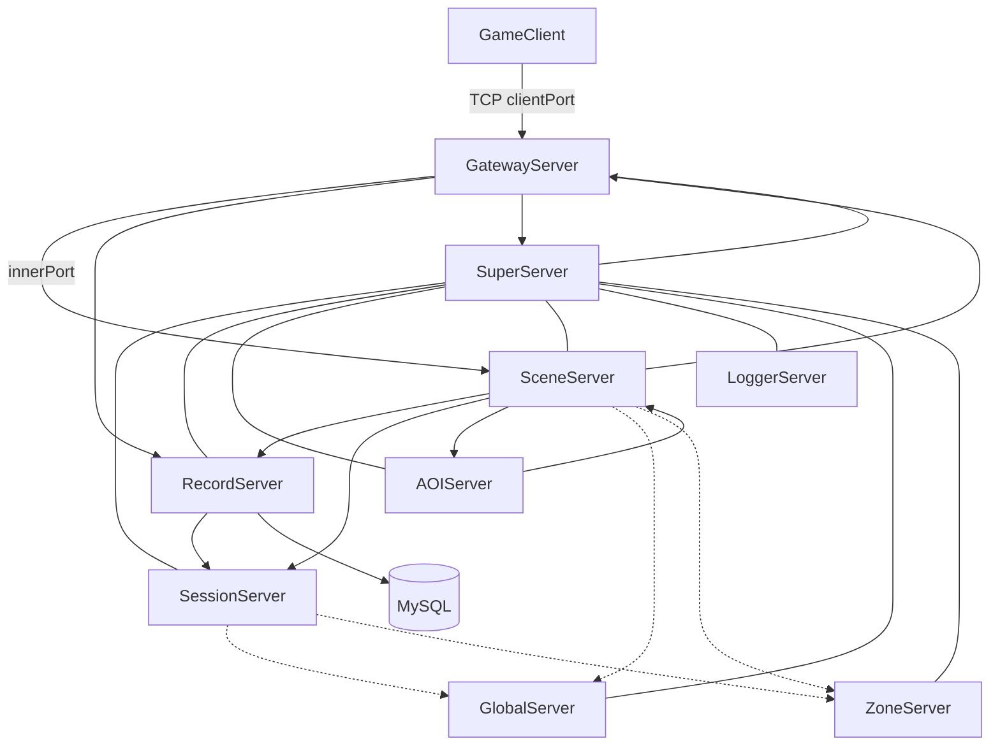
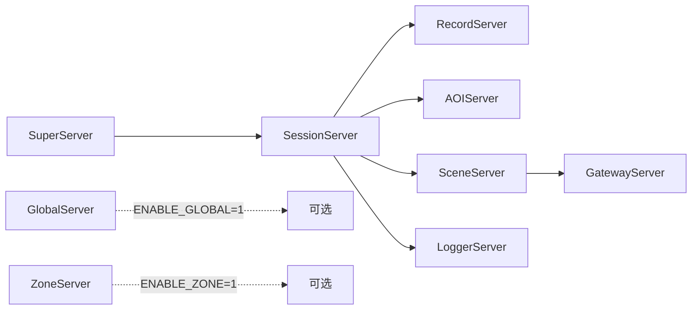
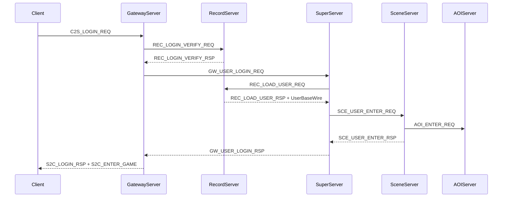
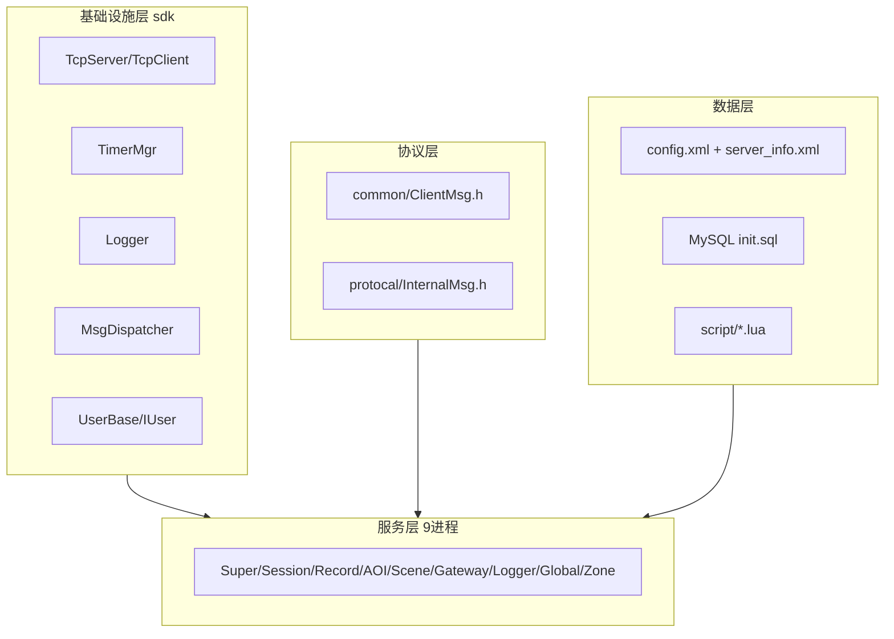

# RPG Server 架构文档

本文档描述 Linux 下 C++/Lua 分布式 MMORPG 服务器的整体架构，供开发与运维参考。

## 1. 项目概述

| 属性 | 说明 |
|------|------|
| 语言 | C++17（核心逻辑）+ Lua 5.4（SceneServer 游戏脚本） |
| 网络模型 | 单线程 epoll ET + TCP 长连接 |
| 持久化 | MySQL（RecordServer 直连） |
| 配置 | XML（tinyxml2 解析） |
| 构建 | CMake 3.16+，输出至 `build/bin/` |

**设计目标**：按职责拆分进程，SuperServer 统一注册与路由，SceneServer 可水平扩展，GatewayServer 可负载均衡，GlobalServer / ZoneServer 按需启用。

---

## 2. 整体架构

### 2.1 进程拓扑



### 2.2 启动依赖与顺序

`RunServer.sh` 严格按依赖顺序拉起进程：



| 服务器 | 端口（默认） | 进程数 | 依赖 | 必选 |
|--------|-------------|--------|------|------|
| SuperServer | 9000 | 1 | 无 | 是 |
| SessionServer | 9001 | 1 | SuperServer | 是 |
| RecordServer | 9002 | 1 | SessionServer | 是 |
| AOIServer | 9003 | 1 | SessionServer | 是 |
| SceneServer | 9004 | N | SessionServer | 是 |
| GatewayServer | 9005 / 19005 | N | SceneServer | 是 |
| LoggerServer | 9006 | 1 | SessionServer | 是 |
| GlobalServer | 9007 | 1（全区） | 无 | 否 |
| ZoneServer | 9008 | 1（全区） | 无 | 否 |

---

## 3. 目录结构

```
RPG/
├── CMakeLists.txt
├── build.sh / autoinit.sh / RunServer.sh / StopServer.sh / log.sh
├── sdk/                    # header-only 底层库
│   ├── net/                # epoll TCP 栈
│   ├── timer/TimerMgr.h
│   ├── log/Logger.h
│   └── util/               # ConfigLoader, MsgDispatcher, UserBase
├── common/ClientMsg.h      # 客户端协议
├── protocal/InternalMsg.h  # 服务器间协议
├── config/config.xml       # 全局配置
├── config/server_info.xml  # SceneServer 地图配置
├── database/init.sql
├── script/                 # Lua 脚本
└── *Server/                # 各服务器 *Server.h + main.cpp
```

---

## 4. 各服务器职责

### SuperServer — 注册中心与登录调度

- 子服务器通过 `S2S_REGISTER_REQ` 注册，维护路由表
- 90 秒心跳超时标记离线
- 维护 `UserProxy`（用户 ↔ Gateway / Scene 连接映射）
- 协调登录：Gateway → Super → Record（加载）→ Scene

### SessionServer — 社会关系与离线数据

- 好友、离线消息、用户社会关系内存管理
- `SessionUser` 继承 `IUser`，扩展 `SocialData`

### RecordServer — 数据库读写

- 唯一直连 MySQL 的进程
- 账号验证、用户 load/save、定时自动存档
- `RecordUser` 继承 `IUser`

### AOIServer — 视野管理

- 9 宫格 AOI，处理 enter/leave/move
- 向 SceneServer 推送 `AOI_VIEW_NOTIFY`

### SceneServer — 核心游戏逻辑

- 在线用户与地图实例管理
- 处理客户端游戏消息（移动、聊天、技能、心跳）
- 内嵌 Lua VM，加载 `script/scene/init.lua`
- 唯一可水平扩展的进程

### GatewayServer — 客户端接入

- 双端口：clientPort（玩家）+ innerPort（内部下行）
- 登录验证、客户端 ↔ SceneServer 消息透传
- 60 秒心跳超时踢人

### LoggerServer — 集中日志

- 接收 `LOG_WRITE_REQ`，写入各服务器日志文件

### GlobalServer / ZoneServer — 可选扩展

- 通过 `ENABLE_GLOBAL=1` / `ENABLE_ZONE=1` 启动

---

## 5. 核心 SDK 设计模式

### 单线程事件循环

```cpp
while (true) {
    server.Poll();
    TimerMgr::Instance().Update();
}
```

### 消息帧

`MsgHeader { length, msgID }` + body（见 `sdk/net/NetDefine.h`）

### 消息分发

`OnMessage` → `MsgDispatcher::Dispatch(msgID)` → 已注册 handler

### 用户基类体系

```
UserBase（纯数据结构）
    └── IUser（OnTick / OnLogin / OnLogout）
            ├── SessionUser
            ├── RecordUser
            └── SceneUser
```

---

## 6. 协议体系

### 客户端协议（common/ClientMsg.h）

| 范围 | 模块 |
|------|------|
| 0x0001–0x00FF | 登录/注册 |
| 0x0100–0x01FF | 场景/移动 |
| 0x0200–0x02FF | 战斗 |
| 0x0500–0x05FF | 聊天 |
| 0x0F00–0x0FFF | 系统/心跳 |

### 服务器内部协议（protocal/InternalMsg.h）

| msgID 范围 | 归属 |
|------------|------|
| 0x1F01–0x1F04 | 注册/心跳 |
| 0x1001–0x1003 | SuperServer |
| 0x1101–0x1105 | SessionServer |
| 0x1201–0x1206 | RecordServer |
| 0x1301–0x1306 | SceneServer |
| 0x1401–0x1405 | GatewayServer |
| 0x1501–0x1504 | AOIServer |

### 登录流程



---

## 7. 配置说明

### config.xml

- `<Database>` — MySQL 连接
- `<SuperServer>` — 注册中心地址
- `<*Server port>` — 各进程端口
- `<LogPaths>` — 日志文件路径

### server_info.xml

- `sceneID` — SceneServer 唯一编号
- `<Map id/name/file/maxPlayer>` — 承载地图列表

---

## 8. 扩展开发指南

### 新增客户端消息

1. 在 `common/ClientMsg.h` 添加 msgID 和结构体
2. 在 `SceneServer::RegisterHandlers()` 或 Lua `OnMsg_XXXX` 中处理

### 新增 S2S 消息

1. 在 `protocal/InternalMsg.h` 添加 msgID 和结构体
2. 在发送方/接收方 `RegisterHandlers()` 注册

### 水平扩展

- **GatewayServer**：多实例 + L4 负载均衡
- **SceneServer**：不同 `sceneID` + `server_info.xml`，SuperServer 按地图路由

---

## 9. 架构分层



**核心设计原则**：

- **单线程无锁**：每个进程一个 epoll 循环
- **SuperServer 中心化注册**：支持 Scene/Gateway 扩展
- **职责单一**：DB 只在 RecordServer，AOI 独立，日志集中
- **Lua 热逻辑**：C++ 管网络/调度，Lua 管玩法
- **Header-only SDK**：逻辑集中在 `*Server.h`
