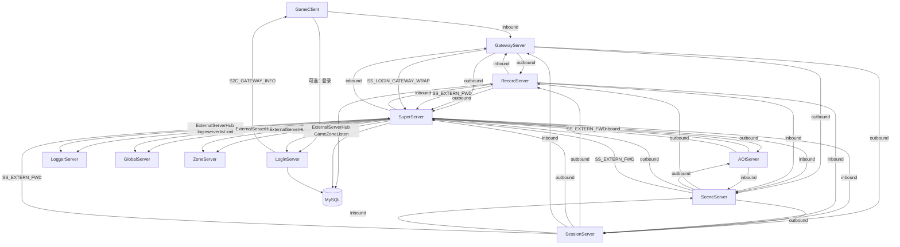
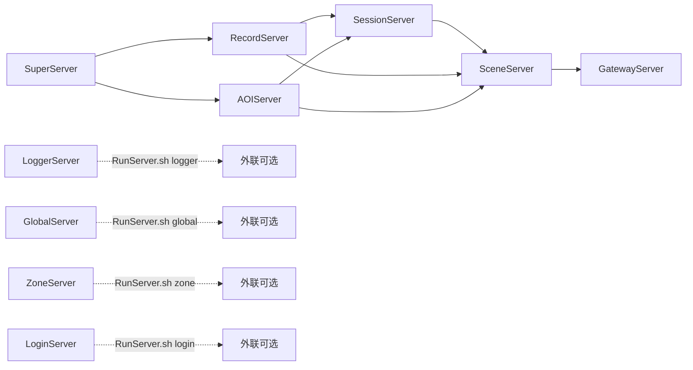
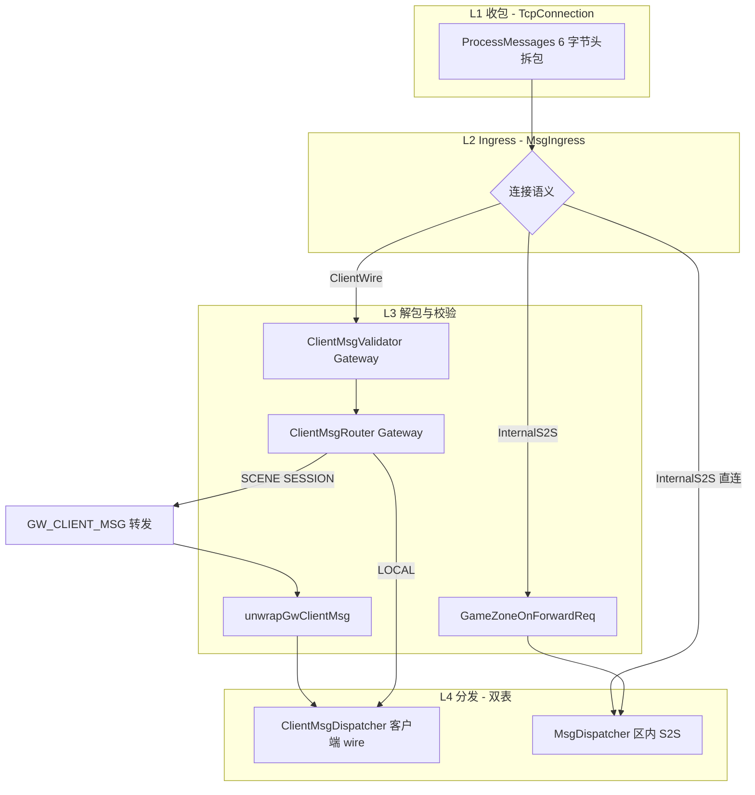
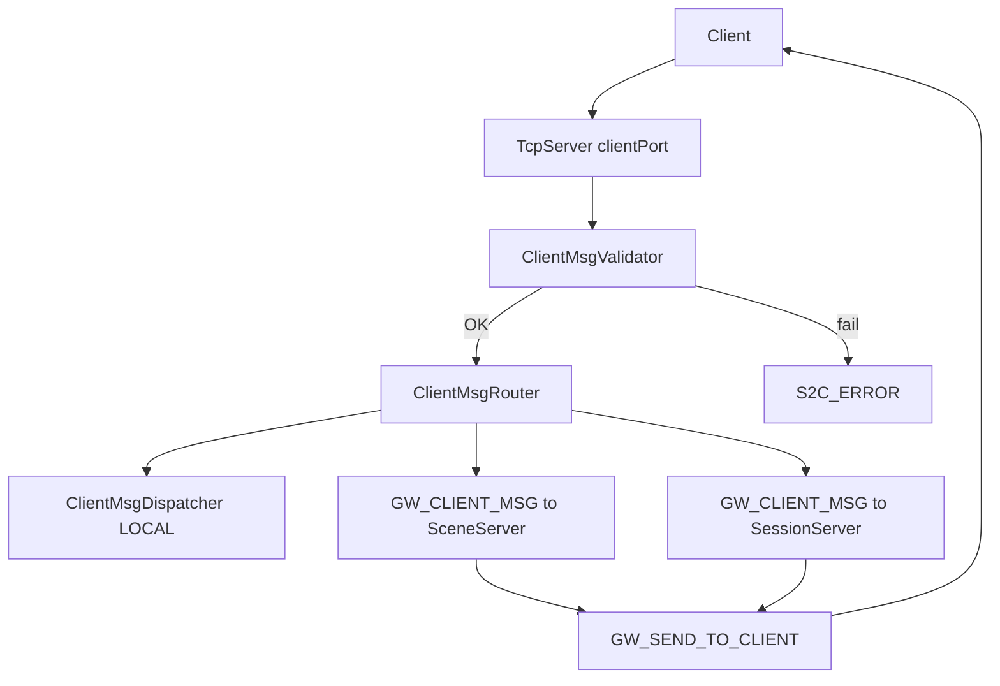
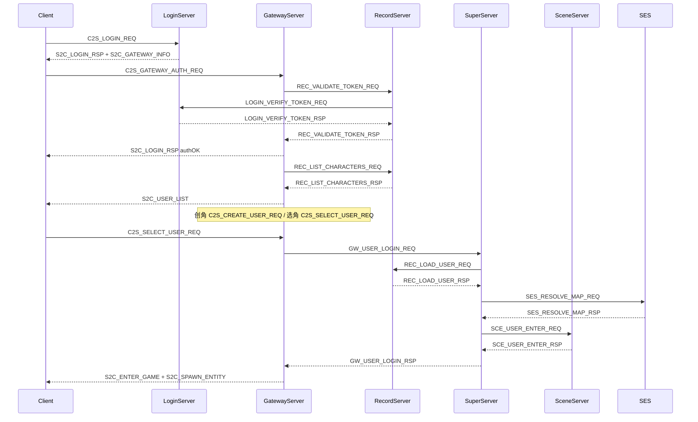
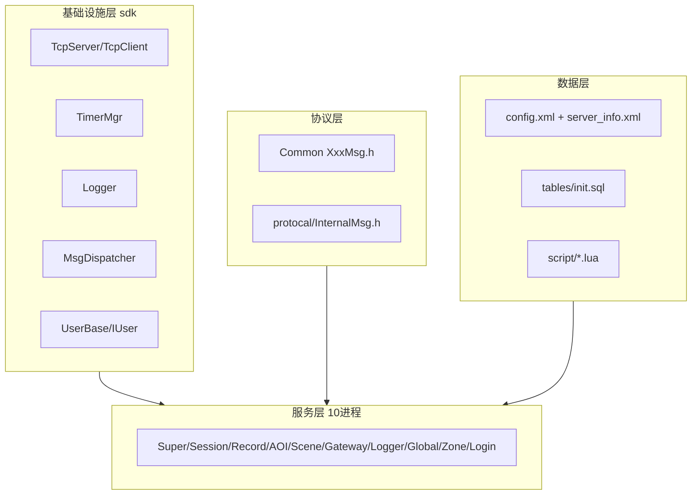

# RPG Server 架构文档

本文档描述 Linux 下 C++/Lua 分布式 MMORPG 服务器的整体架构，供开发与运维参考。  
项目说明与总结见 [PROJECT.md](PROJECT.md)。

## 1. 项目概述

| 属性 | 说明 |
|------|------|
| 语言 | C++17（核心逻辑）+ Lua 5.4（SceneServer 游戏脚本） |
| 网络模型 | 单线程 epoll ET + **TLS over TCP** 长连接（见 [TLS.md](TLS.md)） |
| 持久化 | MySQL 三库（rpg_login / rpg_game / rpg_global） |
| 配置 | XML（tinyxml2 解析） |
| 构建 | CMake 3.16+；CMake 产物在 `.build/`，可执行文件输出至各服务器目录（如 `SuperServer/SuperServer`） |

**设计目标**：按职责拆分进程，SuperServer 统一注册与路由，SceneServer 可水平扩展，GatewayServer 可负载均衡，GlobalServer / ZoneServer 按需启用。

---

## 2. 整体架构

### 2.1 进程拓扑



**外联服**（Logger / Global / Zone / **Login**）不注册 SuperServer，可部署在任意机器。**仅 SuperServer** 经 `loginserverlist.xml` 维护四条外联出站；区内 Gateway/Session/Scene/Record/AOI 只连 Super，经 `SS_EXTERN_FWD_REQ` / `SS_LOGIN_GATEWAY_WRAP_REQ` 转发。RemoteLog 与 `GameZoneExternSender` 绑定 Super 路径。外联进程读各自 `extern_*.xml`；RegisterListen（GameZoneListen，默认 19010）供 Super 连接 Login。

**客户端两阶段连接（可选）**：`LoginServer` ClientListen（默认 9010）校验账号 → `S2C_GATEWAY_INFO` 下发网关地址 → 客户端再连区内 `GatewayServer`（9005）。存量客户端仍可直连 Gateway。

### 2.2 启动依赖与顺序

`RunServer.sh` 默认仅拉起**游戏区内**进程：



| 服务器 | 端口（默认） | 进程数 | 依赖 | 必选 |
|--------|-------------|--------|------|------|
| SuperServer | 9000 | 1 | MySQL（自举 ServerList） | 是 |
| RecordServer | 9002 | 1 | SuperServer | 是 |
| AOIServer | 9003 | 1 | SuperServer | 是 |
| SessionServer | 9001 | 1 | SuperServer + RecordServer | 是 |
| SceneServer | 9004 | N | Super + Record + Session + AOI | 是 |
| GatewayServer | 9005 | N | Super + Record + Session + Scene | 是 |
| LoggerServer | 9006 | 1 | 无（外联） | 否 |
| GlobalServer | 9007 | 1（全区） | 无（外联） | 否 |
| ZoneServer | 9008 | 1（全区） | 无（外联） | 否 |
| LoginServer | 9010（客户端）/ 19010（网关注册） | 1（外联） | 无（外联） | 否 |

---

## 3. 目录结构

```
RPG/
├── CMakeLists.txt
├── Build.sh / autoinit.sh / RunServer.sh / StopServer.sh / log.sh
├── sdk/                    # 公共底层库（头文件为主 + 部分 .cpp）
│   ├── net/                # epoll TCP 栈
│   ├── timer/              # TimerMgr（相对间隔）
│   ├── time/               # TimeUtil、AlarmClock（墙钟）
│   ├── log/                # Logger、RemoteLog
│   ├── http/               # GlobalServer HTTP
│   ├── math/               # Vec、Random
│   └── util/               # ConfigLoader、MsgDispatcher、Bootstrap、外联转发
├── LoginServer/            # 外联登录（可选）
├── docs/                   # 文档（见 INDEX.md）
├── Common/              # Git Submodule → RPG_Common（*.proto）
├── protocal/InternalMsg.h  # 服务器间协议
├── config/config.xml       # 全局配置
├── config/server_info.xml  # SceneServer 地图配置
├── database/               # Lua 策划配表
├── tables/                 # MySQL DDL（入口 init.sql）
├── script/                 # Lua 脚本
├── 3Party/                 # 第三方静态库
│   ├── vendor/             # tar.gz 源码包（纳入 Git）
│   ├── src/                # 解压临时目录（gitignore）
│   └── lua|tinyxml2|mysql/ # 编译产物 .a（gitignore）
└── *Server/                # 各服务器 *Server.h + main.cpp
```

---

## 4. 各服务器职责

### SuperServer — 注册中心与登录调度

- 自举：启动读 MySQL `ServerList`；子进程经 `S2S_SERVERLIST_REQ` 拉拓扑
- 出站：**独占** `loginserverlist.xml` 外联 Logger/Global/Zone/Login（`ExternalServerHub`）
- 转发：`SuperExternRouter`（`SS_EXTERN_FWD`）、`SuperLoginMsg`（网关注册代理）
- 入站：区内子进程注册（`S2S_REGISTER_REQ`）
- 维护 `UserProxy`；协调登录：Gateway → Super → Record（加载）→ Session（map 解析）→ Scene
- **登录选 Scene**：`SES_RESOLVE_MAP_REQ/RSP`，Session 按用户 `mapId` 返回 `sceneServerId`

### SessionServer — 社会关系与离线数据

- 出站：SuperServer、RecordServer（`REC_RELATION_*` 读写 Relation）
- 入站：GatewayServer（`GW_CLIENT_MSG`）、SceneServer（场景/副本登记）
- **直连 rpg_game**（config.xml）：预留本区排行榜等玩法；Relation 仍经 Record 协议
- 好友、离线消息、社会关系内存管理；`SessionUser` + `SocialData`（**社交/任务 GW 消息 handler 多为骨架**）
- 全区场景/副本：`SessionSceneManager` 登记与负载均衡

### RecordServer — 数据库读写

- 出站：SuperServer（注册）
- 入站：Gateway（登录验证）、Scene（CharBase 存档）、Session（Relation）
- **rpg_game 主写库**：用户 load/save、Relation 表、定时存档

### AOIServer — 视野管理

- 出站：SuperServer（注册）；**不连 Session**
- 入站：SceneServer（enter/leave/move、scene register）
- 9 宫格 AOI；向 Scene 推送 `AOI_VIEW_NOTIFY`

### SceneServer — 核心游戏逻辑

- 出站：`SessionClient` / `RecordClient` / `AOIClient`（独立 INetCallback，与 Gateway 入站分离）；Super 注册
- 入站：Gateway（`GW_CLIENT_MSG` 上行 + 同连接 `GW_SEND_TO_CLIENT` 下行）、Session（副本指令等）
- 内嵌 Lua；唯一可水平扩展的进程

### GatewayServer — 客户端接入

- 启动：仅监听客户端 + 连接 Super；收到 `S2S_REGISTER_RSP` 后再出站连接 Record / Session / **全部 Scene 实例**（`GatewayScenePool`）
- 出站：Super / Record / Session / 多 Scene；**不直连 Login**，经 Super `SS_LOGIN_GATEWAY_WRAP` + `LOGIN_GATEWAY_HEARTBEAT` 上报
- 入站：游戏客户端（clientPort）
- 登录成功后按 `Msg_GW_UserLoginRsp.sceneServerId` 绑定用户；SCENE 上行经 `SceneClient` 严格路由（无 firstConnected 兜底）
- `ClientMsgValidator` + `ClientMsgRouter`；60 秒心跳超时踢人

### LoginServer — 外联登录与网关列表

- **ClientListen**（默认 9010）：`C2S_LOGIN_REQ` → **rpg_login** `GameUser`（bcrypt）→ `S2C_LOGIN_RSP` + `S2C_GATEWAY_INFO`
- **RegisterListen**（默认 19010）：Super 代理 Gateway `LOGIN_GATEWAY_REGISTER` / `LOGIN_GATEWAY_HEARTBEAT`（Gateway **不直连** Login）
- 不向 SuperServer 注册；配置见 `LoginServer/extern_login.xml`

### LoggerServer — 集中日志

- 接收 `LOG_WRITE_REQ`，写入各服务器日志文件

### GlobalServer / ZoneServer — 可选扩展

- 通过 `ENABLE_GLOBAL=1` / `ENABLE_ZONE=1` 启动
- **GlobalServer**：经 Super `ExternalServerHub` 接收 `GLB_RANK_UPDATE`；可选 HTTP API（`GlobalHttpServer`）；`SyncGlobalData()` 尚未向 Scene 广播 rank
- **ZoneServer**：`ZONE_CROSS_REQ` 路由骨架；`ZONE_FORWARD` 当前 log-only

详细说明见 [EXTERNAL.md](EXTERNAL.md)。

---

## 5. 核心 SDK 设计模式

### 单线程事件循环

```cpp
while (true) {
    server.Poll();
    TimerMgr::Instance().Update();
}
```

### 消息帧

`MsgHeader { bodyLen, module, sub }`（6 字节）+ body（见 `sdk/net/NetDefine.h`）。

扁平 ID：`makeMsgId(module, sub)`，见 `sdk/net/MsgId.h`。

### 消息管道（四层）



| 组件 | 路径 | 职责 |
|------|------|------|
| `MsgIngress` | `sdk/net/MsgIngress.h` | 统一 `dispatchInternal` / `dispatchClient`；未注册打 DEBUG/WARN |
| `MsgDispatcher` | `sdk/util/MsgDispatcher.h` | 区内 `InternalMsgID` 分发 |
| `ClientMsgDispatcher` | `sdk/util/ClientMsgDispatcher.h` | 客户端 module/sub 分发（与区内表物理隔离） |
| `MsgHandlerBinder` | `sdk/util/MsgHandlerBinder.h` | `registerInternal` / `registerClient` 成员绑定 + sizeof 守卫 |
| `GwClientUnwrap` | `sdk/net/GwClientUnwrap.h` | `GW_CLIENT_MSG` 解包 |
| `*InternMsgRegister` / `*ClientMsgRegister` | 各服目录 | `registerHandlers()` 聚合为 1–2 行 |

各服 `OnMessage` 统一调用 `MsgIngress::dispatchInternal`（Gateway 客户端连接另走 `handleClientMsg` → Validator → Router）。

### 消息分发（区内）

`OnMessage` → `MsgIngress::dispatchInternal` → `MsgDispatcher::Dispatch` → handler。仍可使用 `Register(uint16_t flatMsgId)` 兼容存量枚举；推荐 `registerInternal` / `registerInternalRaw`（见 `MsgHandlerBinder.h`）。

### 用户基类体系

```
UserBase（纯数据结构）
    └── IUser（OnTick / OnLogin / OnLogout）
            ├── SessionUser
            ├── RecordUser
            └── SceneUser
```

---

## 6. 协议体系

### 线上帧格式（客户端与服间共用）

定义于 `sdk/net/NetDefine.h`：

```
| bodyLen (2B) | module (1B) | sub (1B) | body (变长) |
```

- **module**：功能模块（见 `ClientModule` / 服间高字节）
- **sub**：模块内具体消息
- 扁平 ID（兼容查表）：`makeMsgId(module, sub) == (module << 8) | sub`

工具函数：`sdk/net/MsgId.h`。

### Gateway 客户端消息处理



| 步骤 | 说明 |
|------|------|
| 拆包 | `TcpConnection` 解析 6 字节头 |
| 校验 | `ClientMsgValidator.h` |
| 路由 | `ClientMsgRouter.h` |
| 本地处理 | `GatewayClientMsgRegister` → `ClientMsgDispatcher` |
| 转发 | `Msg_GW_ClientMsg` + body |
| 下行 | `Msg_GW_SendToClient` + body |

### 客户端协议（Common/*.proto）

权威定义按域分布在 `Common/*Common.proto` + `Common/*Msg.proto`；Server 链接 `Protobuf/*.pb.cc`。

| module | 说明 | Gateway 路由 |
|--------|------|--------------|
| 0x00 | 登录/注册 | LOCAL |
| 0x01 | 场景/移动 | SCENE |
| 0x02 | 战斗 | SCENE |
| 0x03 | 背包/物品 | SCENE |
| 0x04 | 技能 | SCENE |
| 0x05 | 聊天 | SCENE（sub=0x03 私聊 → SESSION） |
| 0x06 | 社交 | SESSION |
| 0x07 | 任务 | SESSION |
| 0x08 | NPC 交互 | SCENE |
| 0x0F | 系统/心跳/错误（含 `S2C_ERROR` sub=0x05） | LOCAL |

完整消息表见 [PROTOCOL.md](PROTOCOL.md)。

常用 C2S 示例：`C2S_LOGIN_REQ` = module **0x00** sub **0x01**；`C2S_MOVE_REQ` = **0x01/0x01**；`C2S_HEARTBEAT` = **0x0F/0x01**。

### 服间转发结构（protocal/InternalMsg.h）

| 结构体 | 方向 | 说明 |
|--------|------|------|
| `Msg_GW_ClientMsg` | Gateway → Scene/Session | `clientConnID` + module + sub + body |
| `Msg_GW_SendToClient` | Scene/Session → Gateway | 同上，Gateway 再组 6 字节头发给客户端 |

### 服务器内部协议（protocal/InternalMsg.h）

| msgID 范围 | 归属 |
|------------|------|
| 0x1F01–0x1F06 | 注册/心跳/ServerList |
| 0x1F10–0x1F15 | Super 外联转发 / 网关注册代理 |
| 0x1001–0x1003 | SuperServer |
| 0x1101–0x1111 | SessionServer（含场景/副本） |
| 0x1201–0x120C | RecordServer（含 Relation） |
| 0x1301–0x1306 | SceneServer |
| 0x1401–0x1405 | GatewayServer |
| 0x1501–0x1506 | AOIServer |
| 0x1601 | LoggerServer |
| 0x1701–0x1702 | GlobalServer |
| 0x1801–0x1803 | ZoneServer |
| 0x1901–0x1905 | LoginServer |

完整列表见 [PROTOCOL.md](PROTOCOL.md)。

### 登录流程



角色选择全流程见 [LOGIN_CHAR_FLOW.md](LOGIN_CHAR_FLOW.md)。

---

## 7. 配置说明

### config.xml

- `<Database>` — MySQL 连接
- `<SuperServer>` — 注册中心地址
- `<*Server port>` — 各进程端口
- `<LogPaths>` — 日志文件路径

### server_info.xml

- `sceneID` — SceneServer 唯一编号
- `<Map id/name/file/maxPlayer>` — 承载地图列表

---

## 8. 扩展开发指南

新增客户端消息、S2S 消息、副本类型、Scene 实例、策划表等步骤见 **[DEVELOPMENT.md](DEVELOPMENT.md)**。

简要 checklist：

1. 客户端消息：各域 `*Common.proto` / `*Msg.proto` → `./scripts/gen_proto.sh` → **已实现 handler 后**再登记 `ClientMsgValidator` + `ClientMsgRouter`
2. S2S 消息：`InternalMsg.h` → 双方 `RegisterHandlers()`
3. 水平扩展：多 Gateway（L4 LB）；多 Scene（不同 `sceneID` + `server_info.xml`）

---

## 9. 架构分层



**核心设计原则**：

- **单线程无锁**：每个进程一个 epoll 循环
- **SuperServer 中心化注册**：支持 Scene/Gateway 扩展
- **职责单一**：DB 只在 RecordServer，AOI 独立，日志集中
- **Lua 热逻辑**：C++ 管网络/调度，Lua 管玩法
- **SDK 复用**：头文件为主，部分模块有 `.cpp` 实现；详见 [SDK.md](SDK.md)
