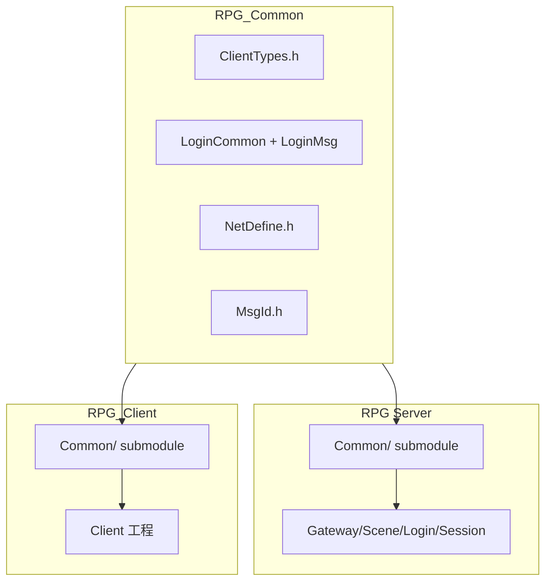
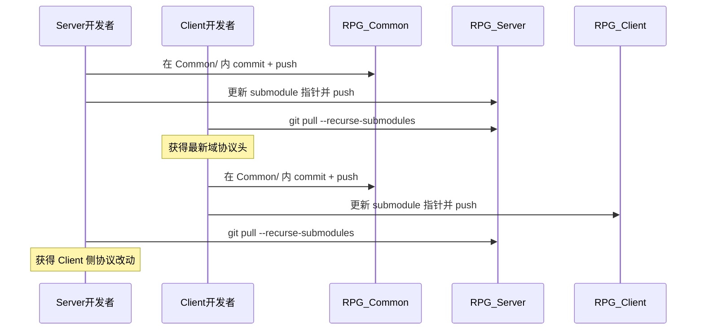

# RPG_Common 共享协议（Server / Client）

[RPG_Common](https://github.com/hechuangguo/RPG_Common) 是 Server 与 Client **共用**的客户端 wire 协议独立仓库。双方通过 Git Submodule 挂载到各自主仓库的 `Common/` 目录，保证 `ClientTypes.h` 与各域 `*.proto` 同源同版本。

服间协议（`protocal/InternalMsg.h`）**仅**留在 Server 仓库，不迁入 Common。

---

## 1. 职责与文件

| 文件 | 说明 |
|------|------|
| `ClientTypes.h` | 全局 `ClientModule`（指令编号 BYTE） |
| `*Common.proto` | 域内 enum（`XxxMsgSub`、结果码等） |
| `*Msg.proto` | Protobuf wire message |
| `NetDefine.h` | 客户端侧 `MsgHeader`（6 字节帧）与缓冲区常量 |
| `MsgId.h` | `makeMsgId` / `msgModule` / `msgSub` 工具函数 |

Server C++ 生成物在主仓 [`Protobuf/`](../Protobuf/)（`./scripts/gen_proto.sh`）；Client 自行从 `.proto` 生成。

域头文件一览见 [`Common/Common.txt`](../Common/Common.txt)。

### 协议头注释约定

改协议时须同步补齐 Protobuf 注释（细则见 [`COMMENTS.md`](COMMENTS.md) §Common Protobuf）：

| 文件 | 要求 |
|------|------|
| `*Common.proto` | `XxxMsgSub` 每个枚举值行尾注释；结果码 enum |
| `*Msg.proto` | 每个 message 前块注释含方向、module/sub、触发时机；字段行尾注释 |

范本：`LoginMsg.proto` 中 `C2SLoginReq`、`S2CUserList`（repeated）。

线上帧格式（双方一致）：

```
| bodyLen (2B) | module (1B) | sub (1B) | Protobuf body |
```

Server 运行时网络栈另见 [`sdk/net/NetDefine.h`](../sdk/net/NetDefine.h)；字段布局须与 `Common/NetDefine.h` 保持一致。

---

## 2. 目录布局

| 仓库 | Submodule 路径 | 远程 |
|------|----------------|------|
| **RPG**（Server） | `Common/` | `https://github.com/hechuangguo/RPG_Common.git` |
| **RPG_Client**（Client） | `Common/` | 同上 |



---

## 3. Linux 克隆与初始化（Server）

### 新克隆（推荐）

```bash
git clone --recurse-submodules git@github.com:hechuangguo/RPG.git
cd RPG
./autoinit.sh
```

`autoinit.sh` 会自动执行 `git submodule update --init --recursive` 并校验 `Common/ClientTypes.h` 与 `Common/LoginMsg.proto` 存在。

### 已克隆但未拉 submodule

```bash
git submodule update --init --recursive
```

### 日常拉取对方对 Common 的修改

```bash
./pull.sh
# 等价于：git pull --rebase && git submodule sync && git submodule update --init --recursive
```

或手动：

```bash
git pull --recurse-submodules
# 等价于：
# git pull && git submodule update --init --recursive
```

可选（减少遗忘 submodule 更新）：

```bash
git config submodule.recurse true
```

---

## 4. 修改协议（核心工作流）

协议改动 **必须先提交到 RPG_Common**，再在主仓库更新 submodule 指针。无论改动来自 Server 还是 Client，步骤相同。

### 4.1 在 Server 侧修改

```bash
cd Common
git checkout main    # 子模块默认为 detached HEAD，改协议前切到 main
# 编辑 XxxCommon.h / XxxMsg.h / ClientTypes.h / NetDefine.h / MsgId.h（含字段注释）
git add .
git commit -m "feat(protocol): add C2S_XXX"
git push origin main

cd ..
git add Common
git commit -m "chore: bump Common to <short-sha>"
git push origin main
```

Server 侧还需在 Gateway 登记新消息（见 [DEVELOPMENT.md](DEVELOPMENT.md) §1.2）。

### 4.2 在 Client 侧修改（RPG_Client）

```bash
cd Common
git checkout main
# 编辑并 commit
git push origin main

cd ..
git add Common
git commit -m "chore: bump Common to <short-sha>"
git push origin main   # 推到 RPG_Client
```

### 4.3 对方同步

| 等待方 | 操作 |
|--------|------|
| Server 开发者 | 在 RPG 仓库：`git pull --recurse-submodules` |
| Client 开发者 | 在 RPG_Client 仓库：`git pull --recurse-submodules` |



---

## 5. RPG_Client 首次挂载 submodule

若 Client 仓库尚未配置 `Common/`：

```bash
git clone git@github.com:hechuangguo/RPG_Client.git
cd RPG_Client

git submodule add -b main https://github.com/hechuangguo/RPG_Common.git Common
git commit -m "chore: add RPG_Common as Common/ submodule"
git push
```

构建时将 `Common/` 加入 include 路径，例如 CMake：

```cmake
include_directories(${CMAKE_SOURCE_DIR}/Common)
```

引用方式：Server 链接 `Protobuf/*.pb.h`（CMake include）；路由枚举用 `ClientTypes.h`。Client 自行从 `.proto` 生成。

**Server 开放状态**：Common 中已登记的 proto enum 未必已在 Gateway Validator 白名单；以 [PROTOCOL.md](PROTOCOL.md) §2.2「实现状态」列为准。

示例：

```cpp
#include "../Common/ClientTypes.h"
#include "LoginMsg.pb.h"
#include "../sdk/net/ClientProtoWire.h"
```

---

## 6. 常见陷阱与排错

| 现象 | 原因 | 处理 |
|------|------|------|
| `Common/` 为空或缺少 `ClientTypes.h` | clone 时未拉 submodule | `git submodule update --init --recursive` |
| `git pull` 后协议仍是旧的 | 只更新了主仓库指针未 checkout | `git submodule update` 或 `git pull --recurse-submodules` |
| 对方看不到你的协议改动 | 只 push 了 RPG_Common，未 bump 主仓库指针 | 在 RPG / RPG_Client 执行 `git add Common && git commit && git push` |
| `git status` 显示 `Common` modified | 在父仓库改了子模块但未在子模块内 commit | `cd Common`，在子模块内单独 commit/push，再 bump 指针 |
| 子模块 detached HEAD | Submodule 正常检出行为 | `cd Common && git checkout main` 后再改协议 |

**禁止**：在 Server 或 Client 主仓库内手抄一份协议头；所有协议变更只通过 RPG_Common 流转。

---

## 7. 与服间协议的边界

| 内容 | 位置 |
|------|------|
| 客户端 ↔ 服务器 wire 协议 | `Common/`（RPG_Common submodule） |
| 服务器进程间 S2S 协议 | `protocal/InternalMsg.h`（仅 Server 仓库） |
| Server 网络运行时（epoll、连接回调等） | `sdk/net/`（仅 Server 仓库） |

---

## 相关文档

- [PROTOCOL.md](PROTOCOL.md) — 协议号与消息表
- [DEVELOPMENT.md](DEVELOPMENT.md) — 新增客户端消息检查清单
- [Common/README.md](../Common/README.md) — RPG_Common 仓库内说明
