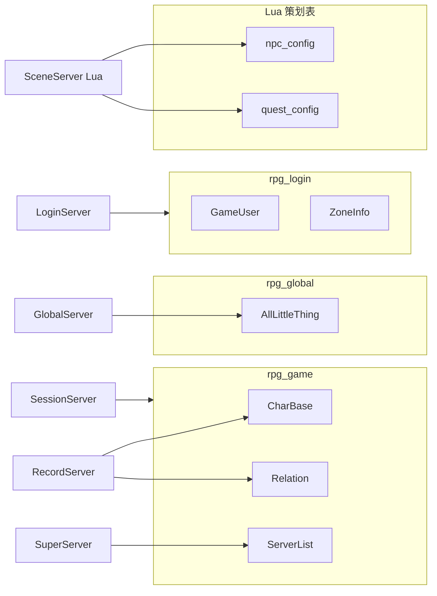

# 数据层参考

项目使用**双轨数据**：MySQL 存玩家持久化；Excel/Lua 存静态策划表。

| 轨道 | 路径 | 说明 |
|------|------|------|
| MySQL | [`tables/`](../tables/) | 三库：rpg_login / rpg_game / rpg_global；Record 主写游戏数据 |
| 策划 Lua | [`DataDoc/`](../DataDoc/) → [`database/`](../database/) | 静态配置，SceneServer Lua 加载 |

脚本说明见 [tables/README.md](../tables/README.md)、[database/README.md](../database/README.md)、[DataDoc/README.md](../DataDoc/README.md)。

---

## 1. MySQL 三库（`tables/init.sql`）

应用账号 `rpg_table` / `rpg_table`（三库均有权限）。

| 库 | 配置来源 | 连接进程 | 表 |
|----|----------|----------|-----|
| **rpg_login** | `LoginServer/extern_login.xml` | LoginServer | GameUser, ZoneInfo, LoginSession |
| **rpg_game** | `config/config.xml` | SuperServer, RecordServer, SessionServer | CharBase, Relation, Friend, Mail, MapInfo, ServerList |
| **rpg_global** | `GlobalServer/extern_global.xml` | GlobalServer | AllLittleThing |

### 1.1 总览

| 表 | 库 | 设计意图 | 读写进程 | 实现状态 |
|----|-----|----------|----------|----------|
| **GameUser** | rpg_login | 账号主表（账号/密码哈希/区号/绑定角色） | LoginServer | **已实现** |
| **ZoneInfo** | rpg_login | 登录区入口参考/种子 | LoginServer `ZoneInfoStore`（运行时读 serverlist.xml） | **已实现** |
| **LoginSession** | rpg_login | Gateway 鉴权 loginToken（一次性） | LoginServer 写 / Record 经 Login 校验 | **已实现** |
| **CharBase** | rpg_game | 角色基础；`` `binary` `` 存 bag/skills/buffs/quests | RecordServer | **已实现** |
| **Relation** | rpg_game | 好友/黑名单 JSON + 社交扩展 `` `binary` `` | RecordServer ↔ SessionServer | **已实现** |
| **Friend** | rpg_game | 双向好友/黑名单行 | — | **仅 DDL** |
| **Mail** | rpg_game | 离线邮件 + 附件 | — | **仅 DDL** |
| **MapInfo** | rpg_game | 每用户每地图 JSON 存档 | — | **仅 DDL** |
| **ServerList** | rpg_game | 区内 6 服拓扑 | SuperServer 启动只读 | **已实现** |
| **AllLittleThing** | rpg_global | 全区杂项 KV 持久化 | GlobalServer | **仅 DDL** |

### 1.2 CharBase

**读写**：RecordServer（`RecordUserManager`）

| 字段 | 说明 |
|------|------|
| `user_id` | 自增主键 |
| `accid` | 所属账号 ID（LoginServer `GameUser.accid`） |
| `gamezone` | 区服 ID（与登录所选 zone 一致） |
| `name` | 角色名，**全局唯一** |
| `level`, `vocation`, `sex` | 基础属性 |
| `map_id`, `pos_x/y/z` | 位置 |
| `hp`, `max_hp`, `mp`, `max_mp`, `gold` | 战斗/货币 |
| `` `binary` `` | 包裹/技能/Buff/任务等序列化 blob |
| `create_time`, `update_time` | 时间戳 |

**登录语义**：账号密码在 LoginServer `GameUser` 校验；角色列表/创角/选角在 Gateway → Record `CharBase`（按 `accid`+`gamezone`）。流程见 [LOGIN_CHAR_FLOW.md](LOGIN_CHAR_FLOW.md)。

### 1.2 GameUser

**读写**：LoginServer（注册/登录）

| 字段 | 说明 |
|------|------|
| `accid` | 账号自增主键 |
| `account` | 账号名，唯一 |
| `password_hash` | bcrypt(hex(SHA-256(UTF-8 密码)))；wire 传 32B digest，见 [PROTOCOL.md](PROTOCOL.md) §1.2 |
| `user_id` | 绑定角色 ID；注册后默认为 0（未创角） |
| `gamezone` | 注册时选择的区号 |
| `create_time`, `update_time` | 时间戳 |

**约束**：
- LoginServer 仅存哈希，不存明文密码
- `user_id` 与 `CharBase.user_id`、`Relation.user_id` 对齐

### 1.3 Relation

**读写**：SessionServer 内存 `SessionUser` ↔ RecordServer `RelationStore`（`REC_RELATION_PRELOAD/LOAD/SAVE`）

| 字段 | 说明 |
|------|------|
| `user_id` | 主键 |
| `friends_json` | 好友 ID 列表（逗号分隔文本） |
| `blacklist_json` | 黑名单 ID 列表 |
| `guild_id`, `team_id` | 公会/队伍 |
| `` `binary` `` | 社交扩展二进制（申请列表、缓存等） |

Session 启动时会 **阻塞** 直到 Relation 全表预载完成。

### 1.4 Friend / Mail / MapInfo

表结构已在 `init.sql` 中定义并注释，**当前 C++ 代码无读写**。后续实现时：

- `Friend`：可替代或补充 `Relation.friends_json`
- `Mail`：离线邮件系统
- `MapInfo`：副本/场景独立进度

### 1.5 ServerList

**读写**：SuperServer 启动 `loadServerList()` 只读 MySQL；子服经 `S2S_SERVERLIST_REQ` 从 Super 拉缓存

| server_type | 含义 |
|-------------|------|
| 0 | SuperServer |
| 1 | SessionServer |
| 2 | RecordServer |
| 3 | AOIServer |
| 4 | SceneServer |
| 5 | GatewayServer |

**不含** Logger/Global/Zone/Login（外联服见 `loginserverlist.xml`）。

`init.sql` 种子写入 6 行默认拓扑（9000–9005）。

### 1.6 ZoneInfo（rpg_login）

**读写**：LoginServer `ZoneInfoStore`（运行时读 `serverlist.xml`；`loadFromDb` 工具路径读 rpg_login）

| 字段 | 说明 |
|------|------|
| `zone_id` | 区号（同 `game_type` 下唯一） |
| `game_type` | 游戏产品类型（0=当前 RPG） |
| `name`, `ip`, `super_port` | 区服展示名与 Super 入口 |
| `enabled` | 1=可登录，0=维护 |

### 1.7 AllLittleThing（rpg_global）

**读写**：GlobalServer（首期仅 DDL；`thing_key` + `thing_value` MEDIUMBLOB）

| 字段 | 说明 |
|------|------|
| `thing_key` | 业务键，全区唯一 |
| `thing_value` | 序列化 blob（配置/排行榜快照等） |
| `update_time` | 最后更新时间 |

---

## 2. 策划 Lua 配表

### 2.1 生成管线

```
DataDoc/*.xlsx  →  ./gen_data.sh  →  tools/gen_datadoc.py  →  database/<name>_config.lua
```

| 步骤 | 说明 |
|------|------|
| 编辑 | `DataDoc/*.xlsx`（首次 `./gen_data.sh --init` 生成示例） |
| 生成 | `./gen_data.sh` → `database/*_config.lua`（**勿手改** AUTO-GENERATED 文件） |
| 加载 | SceneServer Lua：`DataTable.load("npc_config")` 等 |

Excel 格式：首 sheet、第 1 行字段名、必须有 `id` 列；`a_b_c` → 嵌套 `a.b.c`。

### 2.2 当前配表

| 模块 | 文件 | 消费者 |
|------|------|--------|
| NPC | `database/npc_config.lua` | `script/scene/npc_mgr.lua` |
| 任务 | `database/quest_config.lua` | `script/quest/quest_mgr.lua` |

### 2.3 加载 API

[`basefile/data_table.lua`](../basefile/data_table.lua)：

```lua
local tbl = DataTable.load("npc_config")
local row = DataTable.getById(tbl, 1)
local list = DataTable.filter(tbl, "mapId", 1001)
DataTable.clearCache()  -- 热更前清缓存
```

详见 [basefile/README.md](../basefile/README.md)。

### 2.4 非 DataDoc 配置

| 内容 | 位置 | 说明 |
|------|------|------|
| 技能 | `script/scene/skill_mgr.lua` | **硬编码** `SKILL_CONFIG`，未走 Excel |
| 地图列表 | `config/server_info.xml` | SceneServer C++ 读取 |
| 运行时端口/DB | `config/config.xml` | 各进程 `ConfigLoader` |
| 区内拓扑 | MySQL `ServerList` | 优先于 config 中的端口 |
| 外联地址 | `loginserverlist.xml` | Super `ExternalServerHub` |

---

## 3. 数据边界



**原则**：

- 玩家 CharBase 存档变更主经 **RecordServer**；Session 可直连 rpg_game 做本区玩法（如排行榜）
- 账号数据仅在 **rpg_login**（LoginServer）；全区数据在 **rpg_global**（GlobalServer）
- 静态数值走 **DataDoc → database/**，不在 C++/Lua 硬编码大表
- 集群拓扑：**ServerList**（区内）+ **loginserverlist.xml**（外联）

---

## 4. 初始化命令

```bash
./tables/setup_database.sh                    # 推荐：三库建表
# 存量升级（rpg_game 含 GameUser/ZoneInfo）：mysql -u root -p < tables/migrate_login_db.sql
mysql -u root -p < tables/seed_test_data.sql  # 可选：test001/123456（rpg_game）
./gen_data.sh                                 # 策划 Lua
```

测试账号见 [README.md](../README.md)。
