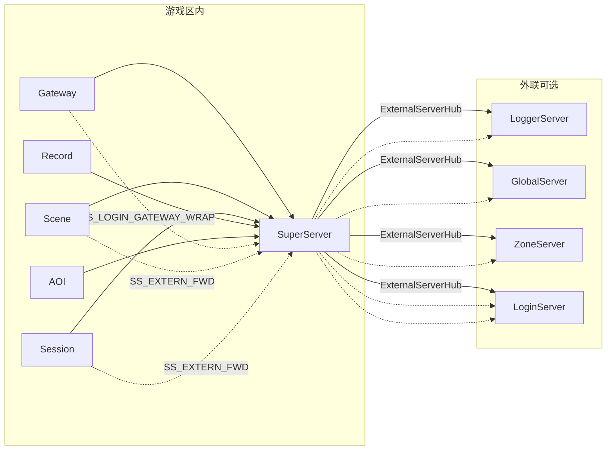
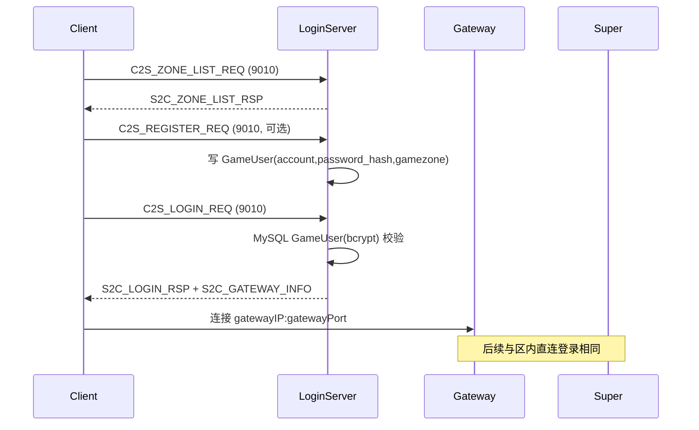

# 外联服务器架构

Logger、Global、Zone、Login 四个进程**不注册 SuperServer**，可部署在任意机器。  
区内 6 服只连 Super，经信封协议访问外联能力。

---

## 1. 拓扑



**原则**：

- **仅 SuperServer** 读 `loginserverlist.xml` 并维护四条外联 TcpClient
- 区内服使用 `GameZoneExternSender` 发 `SS_EXTERN_FWD_REQ`
- Super `SuperExternRouter` 解包/封包转发
- 外联服用 `GameZoneMsgDispatch` 解 `EXT_GAMEZONE_FWD_REQ`

---

## 2. 配置文件

| 文件 | 读取者 | 内容 |
|------|--------|------|
| `loginserverlist.xml`（项目根） | SuperServer `ExternalServerHub` | Logger/Global/Zone/Login 的 IP:port |
| `LoggerServer/extern_logger.xml` | LoggerServer | listen 端口、logDir |
| `GlobalServer/extern_global.xml` | GlobalServer | listen、HTTP、rpg_global |
| `ZoneServer/extern_zone.xml` | ZoneServer | listen（不连 MySQL） |
| `LoginServer/extern_login.xml` | LoginServer | ClientListen、RegisterListen、rpg_login |

`config/README.md` 也描述了 `config.xml` 与上述文件的关系。

---

## 3. 转发信封协议

| 消息 | 方向 | 说明 |
|------|------|------|
| SS_EXTERN_FWD_REQ | 区内 → Super | 信封 + inner module/sub/body |
| SS_EXTERN_FWD_RSP | Super → 区内 | 响应 |
| EXT_GAMEZONE_FWD_REQ | Super → 外联 | 同上 |
| EXT_GAMEZONE_FWD_RSP | 外联 → Super | 响应 |

实现：[`sdk/util/GameZoneExternSender.*`](../sdk/util/GameZoneExternSender.cpp)、[`SuperServer/SuperExternRouter.*`](../SuperServer/SuperExternRouter.cpp)、[`sdk/util/GameZoneMsgDispatch.*`](../sdk/util/GameZoneMsgDispatch.cpp)

### 典型用途

| 能力 | 路径 |
|------|------|
| 远程日志 | 区内 `RemoteLogClient` → SS_EXTERN_FWD → Logger `LOG_WRITE_REQ` |
| 全区排行 | Scene → SS_EXTERN_FWD → Global `GLB_RANK_UPDATE` |
| 充值/GM（骨架） | Session/Scene → SS_EXTERN_FWD → Login `LOGIN_RECHARGE/GM` |

---

## 4. LoginServer — 两阶段登录

### 4.1 流程



存量客户端可**跳过 LoginServer**，直连 Gateway（9005）。

### 4.2 双端口

| 端口 | 默认 | 监听方 | 用途 |
|------|------|--------|------|
| ClientListen | 9010 | LoginServer | 玩家区列表、登录、下发网关 |
| RegisterListen | 19010 | LoginServer | Super 代理的网关注册 |

### 4.3 Gateway 注册（经 Super 代理）

Gateway **不直连** Login RegisterListen，而是：

1. `SS_LOGIN_GATEWAY_WRAP_REQ` → Super → Login `LOGIN_GATEWAY_REGISTER_REQ`
2. 周期 `LOGIN_GATEWAY_HEARTBEAT`（经 Super 包装）

实现：[`SuperServer/SuperLoginMsg.*`](../SuperServer/SuperLoginMsg.cpp)、[`GatewayServer/GatewayServer.cpp`](../GatewayServer/GatewayServer.cpp)

### 4.4 区列表与 LoginAuthService

**配置命名区分**（勿与区内拓扑混淆）：

| 名称 | 位置 | 用途 |
|------|------|------|
| `serverlist.xml` | `LoginServer/serverlist.xml` | 玩家可见游戏区列表；启动加载至 `ZoneInfoStore` |
| `loginserverlist.xml` | 项目根 | 区内进程连外联 Logger/Global/Zone |
| MySQL `ServerList` | `tables/init.sql`（rpg_game） | Super 区内拓扑 |
| MySQL `ZoneInfo` | `tables/init.sql`（rpg_login） | 参考/种子；LoginServer 运行时读 serverlist.xml |

- `extern_login.xml` 中 `<ServerList path="..."/>` 指定区列表路径（默认 `LoginServer/serverlist.xml`）
- `C2S_REGISTER_REQ` / `S2C_REGISTER_RSP`：注册账号（区状态校验、重复校验、返回 accid）
- `C2S_ZONE_LIST_REQ` / `S2C_ZONE_LIST_RSP`：登录前返回全部区服（含维护中条目；`loadLevel` 0畅通/1繁忙/2爆满/3维护）
- Super 每 15s 经 `LOGIN_ZONE_STATUS_REPORT` 上报区在线人数（Gateway 心跳汇总）与存活网关数；Login `ZoneInfoStore` 合并静态 `serverlist.xml` 与运行时数据
- `config.xml` `<Zone zoneId gameType/>` 与 `serverlist.xml` 区号须一致
- 登录 `C2S_LOGIN_REQ` 须带所选 `zoneId`/`gameType`；`S2C_GATEWAY_INFO` 按区从 `LoginGatewayRegistry` 轮询网关
- 可选 MySQL：Login 依赖 `GameUser` 账号表（bcrypt 校验），不再按 `CharBase.name` 自动建号
- `LoginGatewayRegistry`：内存网关表，round-robin LB
- 10s 清理 stale 网关

### 4.5 骨架能力

- `LOGIN_RECHARGE_REQ` — 充值
- `LOGIN_GM_CMD_REQ` — GM 指令

经 `EXT_GAMEZONE_FWD` 解包后由 `LoginRechargeService` / `LoginGmService` 处理（当前为骨架）。

### 4.6 Windows 客户端连接检查清单

两阶段登录需 **两个** 客户端口均可达：

| 阶段 | 端口 | 进程 | 客户端行为 |
|------|------|------|------------|
| 账号登录 | **9010** | LoginServer ClientListen | **TLS** → `C2S_LOGIN_REQ`（32B 密码 SHA-256 摘要）→ 收 `S2C_GATEWAY_INFO` |
| 网关鉴权 / 角色列表 | **9005** | GatewayServer | 断开 9010 后 **TLS** 连网关 → `C2S_GATEWAY_AUTH_REQ` → `S2C_USER_LIST` |

**症状对照**：

- `login.log` 有 `账号登录成功` 但 **无** `gateway.log` 的 `客户端连接建立` → 9010 通、**9005 未通**（防火墙/安全组常见）
- 客户端「正在获取角色列表」后「验证账号超时」→ 同上，或 Gateway 鉴权链路未闭环（见 [LOGIN_CHAR_FLOW.md](LOGIN_CHAR_FLOW.md)）

Windows 客户端连不上时，**先看 `logs/login.log` 是否出现 `登录客户端连接`**。若无该日志但有 `登录客户端 TLS 握手未完成即断开`，说明 TCP 已到达但 **客户端未启用 TLS**（或 CA 不匹配）；若无任一连接相关日志，则为防火墙/地址错误。

**TLS**：9010/9005 为 TLS 端口（非明文 TCP）。客户端须信任 `config/tls/ca.crt`（dev 执行 `./scripts/gen_tls_certs.sh` 生成）；**无需**出示客户端证书。详见 [TLS.md](TLS.md)。

**serverlist.xml IP**：`LoginServer/serverlist.xml` 中 `<Zone ip="..."/>` 须为 Linux 服务器 LAN IP（`hostname -I`），Windows 客户端用该地址连 Gateway；改后重启 LoginServer。

| 检查项 | 说明 |
|--------|------|
| **地址** | 填 **Linux 服务器局域网 IP**（如 `192.168.65.128`），**勿用** `127.0.0.1`（在 Windows 上指向本机） |
| **端口** | **9010**（Login）与 **9005**（Gateway）均须可达；仅开 9010 会导致登录成功但选角超时 |
| **LoginServer 已启动** | `./RunServer.sh login`（默认 `./RunServer.sh` 不含 LoginServer） |
| **防火墙** | `firewall-cmd --list-ports` 需含 `9010/tcp` **与** `9005/tcp`；云安全组入站同样放行 |
| **serverlist.xml** | `LoginServer/serverlist.xml` 中 `<Zone ip="..."/>` 须为 **Windows 可达 IP**（`S2C_GATEWAY_INFO` 下发网关地址）；改后重启 LoginServer |
| **DB ServerList** | `rpg_game.ServerList` 中 Gateway（`server_type=5`）`ip` 宜为 LAN IP，非仅 `127.0.0.1` |

**服务器自检**（项目根目录）：

```bash
./scripts/gen_tls_certs.sh                        # 首次 / dev 生成证书
./scripts/check_login_ports.sh 192.168.65.128   # ss + TLS 握手探测 9010/9005
sudo ./scripts/open_game_ports.sh               # firewalld 永久放行 9010+9005
sudo ./scripts/open_game_ports.sh --check         # 只读检查 firewalld
python3 scripts/test_login_gateway_e2e.py         # 同机 E2E（TLS）：鉴权 + 角色列表 + 进世界
openssl s_client -connect 127.0.0.1:9010 -CAfile config/tls/ca.crt -brief </dev/null
python3 scripts/test_zone_list_tls.py                  # 区列表 TLS 冒烟（仅需 LoginServer）
grep "已下发区列表" logs/login.log
```

**Windows 侧**（PowerShell，将 IP 换成服务器实际地址）：

```powershell
Test-NetConnection -ComputerName 192.168.65.128 -Port 9010
Test-NetConnection -ComputerName 192.168.65.128 -Port 9005
```

两者均需 `TcpTestSucceeded : True`。再连客户端：`login.log` 应有 `登录客户端连接`，`gateway.log` 应有 `客户端连接建立` → `鉴权成功` → `phase=角色列表`。

**虚拟机 / NAT**：若 Linux 在 VMware/VirtualBox NAT 下，Windows 可能无法直连；改用桥接模式或配置 **9010 与 9005** 端口转发。

---

## 5. LoggerServer

| 项 | 说明 |
|----|------|
| 启动 | `./RunServer.sh logger` 或 `ENABLE_*` 等价 |
| 入站 | Super ExternalServerHub 连接 |
| 处理 | `LOG_WRITE_REQ` → `{logDir}/{SubServerType}.log` + 小时归档 |
| 配置 | `extern_logger.xml` |

---

## 6. GlobalServer

| 项 | 说明 |
|----|------|
| 启动 | `ENABLE_GLOBAL=1 ./RunServer.sh` |
| TCP | Super 连接；`GLB_RANK_UPDATE` / `GLB_DATA_SYNC` |
| HTTP | `GlobalHttpServer` — `/health`、`/rank` 等 |
| MySQL | **rpg_global**（AllLittleThing 等全区表） |
| 局限 | `SyncGlobalData()` 未向 Scene 推送 rank；`OnDataSync` fan-out 可用 |

**生产路径**：Super `ExternalServerHub`，非 Scene 直连 Global。

---

## 7. ZoneServer

| 项 | 说明 |
|----|------|
| 启动 | `ENABLE_ZONE=1 ./RunServer.sh` |
| 用途 | 跨区 `ZONE_CROSS_REQ` → `ZONE_FORWARD` |
| 状态 | **骨架**：`OnForward` 当前 log-only；路由表 `m_routes` 未完整登记 |

---

## 8. 启动命令

```bash
./RunServer.sh              # 仅区内 6 服
./RunServer.sh logger       # LoggerServer
./RunServer.sh global       # GlobalServer
./RunServer.sh zone         # ZoneServer
./RunServer.sh login        # LoginServer

# 或环境变量
ENABLE_GLOBAL=1 ENABLE_ZONE=1 ./RunServer.sh
```

外联服需先配置 `loginserverlist.xml`（Super 侧）与各 `extern_*.xml`。

---

## 9. 与 MySQL 的关系

| 进程 | 库 | MySQL |
|------|-----|-------|
| SuperServer | rpg_game | 启动只读 `ServerList` |
| RecordServer | rpg_game | 写 CharBase / Relation（主写库） |
| SessionServer | rpg_game | 直连（本区排行榜等后期玩法） |
| LoginServer | rpg_login | GameUser 注册/登录；区列表运行时读 `serverlist.xml` |
| GlobalServer | rpg_global | AllLittleThing 等全区表 |
| ZoneServer | — | 不连接 MySQL |
| LoggerServer | — | 无 |

外联服**不在** `ServerList` 表登记。
