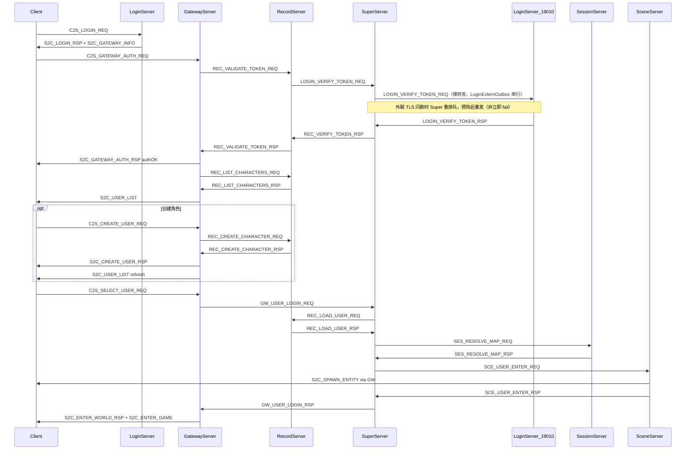
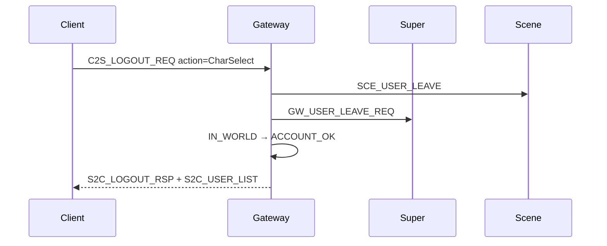

# 角色选择 → 创角 → 进游戏流程

本文档描述客户端 UI 六步与服务器协议、Gateway 状态机的对应关系。协议细节见 [PROTOCOL.md](PROTOCOL.md) §2.2、§4.2。

---

## 1. 客户端 UI 与服务端步骤

| UI 步骤 | 客户端动作 | 服务端处理 | 关键消息 |
|---------|-----------|-----------|---------|
| 1 登录后进选角 | Login 9010 收 `S2C_LOGIN_CHALLENGE` → 登录 → 断开 → 连 Gateway 9005 | LoginServer 发 token；Gateway 鉴权 | `C2S_LOGIN_REQ` → `S2C_LOGIN_RSP` + `S2C_GATEWAY_INFO`；`C2S_GATEWAY_AUTH_REQ` → `S2C_GATEWAY_AUTH_RSP` |
| 2 右上角角色列表 | 等待列表 | Gateway 鉴权成功后**主动推送**（无 `C2S_USER_LIST_REQ`） | `S2C_USER_LIST`（变长，`count` 条 `EntryWire`） |
| 3 无角色点「创建角色」 | 打开创角 UI | Gateway 校验 `ACCOUNT_OK` | — |
| 4 输入名字 + 选职业 | 发创角包 | Gateway → Record 写 `CharBase` | `C2S_CREATE_USER_REQ` → `S2C_CREATE_USER_RSP`；成功后刷新 `S2C_USER_LIST` |
| 5 选中角色点「进入游戏」 | 发选角包 | Gateway → Super 编排进 Scene | `C2S_SELECT_USER_REQ` |
| 6 加载地图/角色 | 收进世界 + AOI | Scene 下发实体 | `S2C_ENTER_WORLD_RSP` + `S2C_ENTER_GAME`；`S2C_SPAWN_ENTITY`（邻居/NPC 可能早于 `S2C_ENTER_GAME` 到达，客户端须缓冲） |

**同账号重登**：`LoginSession` 按 `(accid, zone_id)` 唯一；再次 `C2S_LOGIN_REQ` 会 `REPLACE` 覆盖旧 token，尚未完成 Gateway 鉴权的旧 token 将失效。

---

## 2. Gateway 连接状态机

定义于 [`GatewayServer/GatewayUser.h`](../GatewayServer/GatewayUser.h)：

```
CONNECTED → AUTHING → ACCOUNT_OK → ENTERING → IN_WORLD
```

| 状态 | 允许的上行消息 |
|------|----------------|
| `CONNECTED` | `C2S_GATEWAY_AUTH_REQ`、心跳 |
| `AUTHING` | 心跳（鉴权等待中） |
| `ACCOUNT_OK` | `C2S_CREATE_USER_REQ`、`C2S_SELECT_USER_REQ`、心跳 |
| `ENTERING` | 心跳（进世界中，选角/创角被拒） |
| `IN_WORLD` | 场景/战斗/聊天等（经 Validator 白名单） |

鉴权成功后 Gateway 置 `ACCOUNT_OK` 并请求 Record 拉列表。创角成功后会刷新 `S2C_USER_LIST`；在列表包到达前，若 `ownedRoleIds` 已包含创角返回的 `user_id`，也允许 `C2S_SELECT_USER_REQ`（`roleListReady` 仍为 false 时由 `ownedRoleIds` 兜底）。

---

## 3. 完整时序（含 Session / Scene）



---

## 4. 关键 wire 字段

### 4.1 创角 `C2S_CREATE_USER_REQ`

| 字段 | 说明 |
|------|------|
| `name` | 2–12 码点（UTF-8 ≤31 字节）；中文/英文字母、数字、下划线 `_`；可混排 |
| `vocation` | 职业 ID：0=战士 1=法师 2=弓手 3=刺客（见 `LoginSpawnConfig.h` `MAX_VOCATION_ID`） |
| `sex` | 0=男 1=女（`MAX_SEX_ID`） |

每账号每区最多 **3** 个角色（`MAX_CHARACTERS_PER_ACCOUNT`）。新角色出生在 map **1001**，坐标见 `LoginSpawnConfig.h`。

### 4.2 选角 `C2S_SELECT_USER_REQ`

| 字段 | 说明 |
|------|------|
| `userID` | 须属于当前 `accid` 且已在 Gateway 缓存的 `ownedRoleIds` |
| `loginTxnId` | 幂等事务 ID；非 0 时 Super 对重复请求去重 |

### 4.3 Gateway 阶段回包（sub 拆分）

| sub | 消息 | 阶段 | 说明 |
|-----|------|------|------|
| 0x02 | `S2C_LOGIN_RSP` | Login 9010 | **仅**账号登录；含 `login_token` |
| 0x11 | `S2C_GATEWAY_AUTH_RSP` | Gateway 9005 | 票据鉴权成功/失败；成功后可等 `S2C_USER_LIST` |
| 0x12 | `S2C_ENTER_WORLD_RSP` | Gateway 9005 | 选角进世界结果；成功时另收 `S2C_ENTER_GAME`（0x09） |

**鉴权时序预算**（Gateway Phase B）：

| 阶段 | 超时 | 说明 |
|------|------|------|
| `CONNECTED` 未发鉴权 | 10s | `GATEWAY_AUTH_TIMEOUT_MS` |
| `AUTHING` 票据校验 | 17s | `VERIFY_TOKEN_TIMEOUT_MS + 2s`；Super 外联闪断会重排队 |
| `ENTERING` 进世界 | 60s | 对齐 Super `LOGIN_TXN_LOCK_TIMEOUT_MS` |

Unity 客户端契约见 [UNITY_LOGIN_CLIENT.md](UNITY_LOGIN_CLIENT.md)。

### 4.4 创角 `S2C_CREATE_USER_RSP.code`

与 C++ `CreateCharacterError`（[`LoginEnterErrorCode.h`](../sdk/util/LoginEnterErrorCode.h)）一致：

| code | 含义 | 客户端处理 |
|------|------|-----------|
| 0 | 成功 | 等待刷新 `S2C_USER_LIST`，可发选角 |
| 1 | 角色名已存在（**全局唯一**） | 提示换名，**保持 Gateway 连接** |
| 2 | 本账号角色数达上限（3） | 提示，保持连接 |
| 3 | 角色名非法 | 修正后重试 |
| 4 | 职业/性别非法 | 修正后重试 |
| 其它 | 系统错误 | 可重试或重连 |

---

## 5. 游戏中退出

客户端 X/ESC 二级弹窗三选项与服端映射：

| UI 选项 | `LogoutAction` | 客户端行为 | 服端行为 |
|---------|----------------|-----------|----------|
| **选择角色** | `RETURN_CHAR_SELECT`(1) | 保持 Gateway 连接 | `SCE_USER_LEAVE` + `GW_USER_LEAVE_REQ` → 状态回 `ACCOUNT_OK` → `S2C_LOGOUT_RSP` + 刷新 `S2C_USER_LIST` |
| **登录游戏** | `RETURN_LOGIN`(2) | 收 rsp 后断 Gateway，连 Login 9010 拉区列表 | 同上清理；**不**主动 Kick，由客户端 disconnect |
| **退出游戏** | — | 直接关进程 | 可无上行包；`OnDisconnect` 走 `leaveWorldSession` 兜底 |



### 5.1 `C2S_LOGOUT_REQ`

| 字段 | 说明 |
|------|------|
| `action` | 1=回选角（保持账号会话）；2=回登录（客户端随后断 Gateway） |

允许 Gateway 状态：`ENTERING`（进世界中可取消）、`IN_WORLD`。

---

## 6. 日志排查

全链路统一格式由 [`sdk/util/LoginFlowLog.h`](../sdk/util/LoginFlowLog.h) 输出，grep 关键字：

```bash
grep '\[登录链路\]' logs/*.log
# 或单服
grep '\[登录链路\]' logs/gateway.log logs/login.log logs/super.log
```

### 6.1 phase 含义

| phase（日志字段） | 典型进程 | 含义 |
|-------------------|----------|------|
| 账号登录 | LoginServer | 客户端账号密码登录、下发网关地址 |
| 网关鉴权 | Gateway / Record / Login | 票据校验、连接后鉴权超时 |
| 角色列表 | Gateway / Record | 拉取/下发角色列表 |
| 创角 | Gateway / Record | 创建角色 |
| 选角 | Gateway | 选角进世界请求 |
| 超级服进世界 | Super / Record / Session | 加载角色、地图解析、下发 Scene 入场 |
| 场景入场 | Scene / Super | 用户进入场景实例 |
| 角色离世界 / 退出登录 | Gateway / Super | 离世界、回选角/回登录 |

### 6.2 正常成功顺序（E2E 参考）

**登录进世界**：

```
账号登录 → 网关鉴权 → 角色列表 → 选角 → 超级服进世界 → 场景入场
```

**退出（`C2S_LOGOUT_REQ` / TCP 断开）**：

```
# 回选角（action=1）
客户端退出请求 → 角色离世界(回选角前离世界) → 退出登录(返回选角) → 角色列表

# 回登录（action=2）
客户端退出请求 → 角色离世界(回登录前离世界) → 退出登录(返回登录)

# 异常断开 / 踢线 / 心跳超时
角色离世界(客户端TCP断开|Super踢线|心跳超时) → Scene(Scene清理) → Super(收到离世界请求)
```

### 6.3 常见卡住场景

| 现象 | 日志特征 | 可能原因 |
|------|----------|----------|
| UI 停在「获取角色列表」 | `gateway.log` 仅有 `客户端连接建立`，无 `Gateway 票据鉴权` / `phase=网关鉴权` | 客户端连上 Gateway 但未发 `C2S_GATEWAY_AUTH_REQ` |
| 同上，约 10s 后踢线 | `Gateway 鉴权超时踢线` 或 `phase=网关鉴权 ... 鉴权超时` | CONNECTED ≥10s 未鉴权，或 AUTHING ≥17s（`checkTimeout` 每 1s 轮询） |
| 票据无效或已过期 | `login.log` 无 `登录服收到票据校验`；`super.log` 见 `外联断开，票据校验重排队` 或（旧二进制）`票据校验在途时登录外联断开` | Super→Login 19010 mTLS 闪断；新 Super 会重排队重试，见 [TLS.md](TLS.md) §7.1 |
| 鉴权后无列表 | 有 `Record转发Login校验` 无 `phase=角色列表` | Record/Login 票据校验失败 |
| 有 `客户端首条上行` 但无鉴权 | mod/sub 不是 `0x00/0x0D` | 客户端发了错误消息号 |
| 有 `客户端消息被拒绝` | vr=BAD_LENGTH/BAD_PAYLOAD | body 非 Protobuf；须 `C2SGatewayAuthReq` Protobuf |
| 客户端「会话写入失败」 | `login.log`：`写入 LoginSession 失败` | `rpg_login` 缺 `LoginSession` 或缺 `uk_accid_zone` |

### 6.4 LoginSession 表缺失（会话写入失败）

**症状**：账号密码已通过，但客户端报「会话写入失败」；`login.log` 出现 `写入 LoginSession 失败` 或启动时 `登录服缺少数据表 LoginSession`。

**与 GameUser 区别**：`GameUser` 存账号与密码哈希（长期）；`LoginSession` 存本次登录的 `loginToken`（短期、一次性），供 Gateway `C2S_GATEWAY_AUTH_REQ` 校验。

**修复**（按 `extern_login.xml` 中 Database 主机执行）：

```bash
mysql -h 192.168.45.128 -u rpg_table -prpg_table rpg_login < tables/migrate_login_session.sql
mysql -h 192.168.45.128 -u rpg_table -prpg_table rpg_login < tables/migrate_login_session_unique.sql
```

验证：

```bash
mysql -h 192.168.45.128 -u rpg_table -prpg_table -e "USE rpg_login; SHOW TABLES LIKE 'LoginSession';"
./RunServer.sh login   # 重启后应见「登录服数据表校验通过」
```

### 6.5 无可用网关（账号登录成功但客户端提示无可用网关）

**症状**：Login 日志 `账号登录成功` 后紧跟 `已下发网关信息: code=-1` 或 `[登录链路] ... code=-1 无可用网关`；区列表日志 `gateway=0`。

**根因**：[`LoginGatewayRegistry`](../LoginServer/LoginGatewayRegistry.h) 内存表为空或未含所选 `zoneId/gameType` 的网关。常见触发场景：

1. **Gateway 未运行** — `fetchServerList` TLS 连 Super 失败时 [`GatewayServer/main.cpp`](../GatewayServer/main.cpp) 直接退出
2. **仅重启 Login** — 网关表随进程清空；需 Gateway 仍在运行并通过 Super 重新 `LOGIN_GATEWAY_REGISTER`（约 10s 内心跳补注册）。**网关注册不再依赖 Record 就绪**，但鉴权/拉列表仍需要 Record
3. **Super→Login 外联未通** — `loginserverlist.xml` 未启用 Login 或 Super 日志 `登录网关注册回包失败: code=-1`（Login 未起 / 19010 未通）

**推荐启动顺序**：

```bash
./StopServer.sh
./RunServer.sh          # 区内 6 服（Super 默认 warmup 5s 后再拉子服）
./RunServer.sh login    # 外联 Login（RegisterListen 19010）
```

**验证（四项均应有输出）**：

```bash
grep '网关服启动完成' logs/gateway.log | tail -1
grep '网关注册成功' logs/login.log | tail -1
grep '登录外联: 网关包装消息已转发' logs/super.log | tail -1
grep 'gateway=[1-9]' logs/login.log | tail -1
```

失败时 Login 会输出 `无可用网关: zone=... zoneGatewayCount=... registryTotal=...` 便于定位。

Gateway 额外诊断日志：

- `客户端首条上行: conn=... mod=... sub=... len=...` — CONNECTED 态收到首包
- `Gateway 票据鉴权: account=...` — 收到合法鉴权请求

### 6.6 客户端退出排查

**grep**：

```bash
grep '\[登录链路\].*角色离世界\|退出登录' logs/gateway.log logs/scene.log logs/super.log
grep '客户端退出请求\|客户端连接断开' logs/gateway.log
```

| detail / 日志 | 含义 | 触发 |
|---------------|------|------|
| `客户端退出请求 action=回选角` | 收到 `C2S_LOGOUT_REQ` action=1 | 主动回选角 |
| `客户端退出请求 action=回登录` | 收到 `C2S_LOGOUT_REQ` action=2 | 主动回登录 UI |
| `phase=退出登录 ... 返回选角` | 已下发 `S2C_LOGOUT_RSP`，随后拉角色列表 | 回选角成功 |
| `phase=退出登录 ... 返回登录` | 已下发 `S2C_LOGOUT_RSP` | 回登录成功 |
| `phase=角色离世界 ... 回选角前离世界` | Gateway 通知 Scene/Super 离场 | logout action=1 |
| `phase=角色离世界 ... 回登录前离世界` | 同上 | logout action=2 |
| `phase=角色离世界 ... 客户端TCP断开` | 未发 logout 包直接断线 | 关客户端/网络断开 |
| `phase=角色离世界 ... Super踢线` | Super 下发踢线 | 重复登录等 |
| `phase=角色离世界 ... 心跳超时` | 60s 无心跳 | 客户端挂起 |
| `phase=角色离世界 ... Scene清理` | Scene 完成用户移除与存档 | `SCE_USER_LEAVE` |
| `收到离世界请求`（super.log） | Super 清 pending/在线映射 | `GW_USER_LEAVE_REQ` |

---

## 7. 错误码速查

### CreateCharacterError（`S2C_CREATE_USER_RSP.code`）

| 值 | 名称 | 含义 |
|----|------|------|
| -1 | SYSTEM_ERROR | 系统/DB 失败 |
| 0 | OK | 成功 |
| 1 | NAME_EXISTS | 重名 |
| 2 | LIMIT_REACHED | 达上限（3/区） |
| 3 | INVALID_NAME | 名非法 |
| 4 | INVALID_VOCATION | 职业或性别非法 |

### SuperEnterError（进世界失败，`S2C_ENTER_WORLD_RSP.code`）

见 [PROTOCOL.md](PROTOCOL.md) §2.3 与 `sdk/util/LoginEnterErrorCode.h`。

### GatewayValidateCode（`S2C_ERROR.code`）

状态/包长/字段非法时 Gateway 本地拒收。

---

## 8. 本地冒烟

```bash
./RunServer.sh && ./RunServer.sh login
python3 scripts/test_login_gateway_e2e.py autotest_e2e test1234
```

期望：`grep '[登录链路]' logs/*.log` 出现完整 phase 链；`gateway.log` 出现 `鉴权成功` → `phase=角色列表` → `选角进世界` → `进入游戏成功`；E2E 脚本还会测 `C2S_LOGOUT_REQ` 返回选角。

---

## 9. 后续（未实现）

- 客户端主动 `C2S_USER_LIST_REQ` 刷新列表
- `S2C_ENTER_MAP`（当前用 `S2C_ENTER_GAME` + `S2C_SPAWN_ENTITY`）
- 进世界预加载背包/技能/任务（Scene `load()` 仍为 stub）
- 职业表 DataDoc 化（当前为常量 ID）
