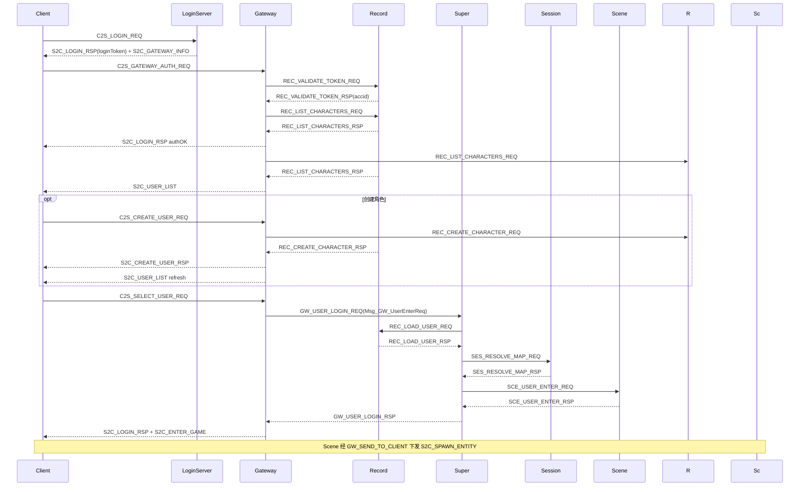

# 协议参考

客户端与服间 TCP **共用** 6 字节消息头，定义于 [`sdk/net/NetDefine.h`](../sdk/net/NetDefine.h)。  
权威源码：[`Common/ClientCommon.proto`](../Common/ClientCommon.proto)、[`Common/WireCommon.proto`](../Common/WireCommon.proto) 与各域 `*.proto`、[`protocal/InternalMsg.h`](../protocal/InternalMsg.h)。共享层维护见 [COMMON.md](COMMON.md)。

---

## 1. 消息帧

```
| bodyLen (2B, LE) | module (1B) | sub (1B) | body (变长) |
```

**Protobuf body**：`body` 为 proto3 二进制，**不含** module/sub 前缀。**LoginServer（9010）与 GatewayServer（9005）** 客户端上行/下行均仅接受 Protobuf；旧 wire v2 定长 struct（body 内嵌 module/sub，如鉴权包 107B）将被 Gateway 拒收并返回 `S2C_ERROR`（`BAD_PAYLOAD`，提示升级客户端）。

帧头为 4 字节 `MsgHeader`（`bodyLen` + `module` + `sub`），见 [`sdk/net/NetDefine.h`](../sdk/net/NetDefine.h)。

| 工具 | 说明 |
|------|------|
| `makeMsgId(module, sub)` | 扁平 ID = `(module << 8) \| sub`（日志/调试） |
| `msgModule(flatId)` / `msgSub(flatId)` | 从扁平 ID 拆 module/sub |
| `parseProto` / `serializeProto` | [`sdk/net/ClientProtoWire.h`](../sdk/net/ClientProtoWire.h) |
| `sendClientProto` | [`sdk/net/ClientWireSend.h`](../sdk/net/ClientWireSend.h) |

### 1.1 字节序

| 范围 | 约定 |
|------|------|
| `MsgHeader.bodyLen` 及服间 wire struct 数值字段 | **小端（LE）host order**，与 x86/Linux 一致 |
| 服间 body | `#pragma pack(1)` + 直接 `memcpy` / `reinterpret_cast`，**禁止**对协议字段使用 `htons`/`ntohl` |
| 客户端 Protobuf body | proto3 二进制序列化（`parseProto` / `serializeProto`），不适用 `#pragma pack` |
| socket API | `sockaddr_in.sin_port` 等 OS 结构仍用 `htons`（与协议层无关） |

服间定长结构（如 `UserBaseWire`）遵循上表 LE + pack 策略。

### 1.2 登录密码（应用层）

| 项 | 约定 |
|----|------|
| wire 字段 | `C2SLoginReq.password_digest` = **SHA-256(UTF-8 明文密码)** 32 字节 |
| 存库 | `GameUser.password_hash` = **bcrypt(hex(digest))** |
| 禁止 | 明文密码、可打印 ASCII 短串（legacy 客户端将被 LoginServer 拒绝） |
| 工具 | `./scripts/gen_password_digest.sh` 生成 dev 种子哈希 |

TLS 仍必须启用；摘要避免 TLS 解密后 payload/日志中出现明文。

### 1.3 Protobuf 技术栈（Server）

| 步骤 | 路径 | 说明 |
|------|------|------|
| 真源 | `Common/*.proto`（RPG_Common 子模块） | 客户端 wire 定义 |
| 生成 | `./scripts/gen_proto.sh` | 增量 protoc → `Protobuf/*.pb.h` / `*.pb.cc` |
| 校验 | `./scripts/check_common_proto.sh` | Build 前注释冒烟 |
| 编解码 | `sdk/net/ClientProtoWire.h` | `parseProto` / `serializeProto` |
| 发送 | `sdk/net/ClientWireSend.h` | `sendClientProto` |
| 网关 | `GatewayServer/ClientMsgValidator.h` | 白名单 + Protobuf payload 校验 |
| Handler | `*ClientMsgRegister.cpp` | 按 `(module, sub)` 注册 |

服间协议 **不** Protobuf 化，见 [`protocal/InternalMsg.h`](../protocal/InternalMsg.h)。维护流程见 [COMMON.md](COMMON.md)。

---

## 2. 客户端协议（ClientModule）

**字段与错误码的权威定义**在各域 `*Msg.proto` / `*Common.proto`。本节消息表为索引。

路由枚举定义于 [`Common/ClientCommon.proto`](../Common/ClientCommon.proto)（`ClientModule`）；帧常量见 [`Common/WireCommon.proto`](../Common/WireCommon.proto)。Protobuf message 见 [`Common/Common.txt`](../Common/Common.txt)。

### 2.0 域 proto 文件

| 域 | Common.proto | Msg.proto | module |
|----|--------------|-----------|--------|
| 登录 | LoginCommon.proto | LoginMsg.proto | 0x00 |
| 区服 | ZoneCommon.proto | ZoneMsg.proto | 0x00（区列表 sub） |
| 地图 | MapDataCommon.proto | MapDataMsg.proto | 0x01 |
| 聊天 | ChatCommon.proto | ChatMsg.proto | 0x05 |
| NPC | NpcCommon.proto | NpcMsg.proto | 0x08 |
| 系统 | SystemCommon.proto | SystemMsg.proto | 0x0F |
| 未实现 | — | — | 0x02–0x07（BATTLE/BAG/SKILL/SOCIAL/QUEST） |

### 2.1 模块路由

**当前 Gateway 实现**（[`ClientMsgRouter.h`](../GatewayServer/ClientMsgRouter.h) + [`ClientMsgValidator.h`](../GatewayServer/ClientMsgValidator.h)）：

| module | 名称 | 当前路由 | 说明 |
|--------|------|----------|------|
| 0x00 | LOGIN | LOCAL | 鉴权/选角/创角/离世界（Login 登录/注册仅 LoginServer） |
| 0x01 | SCENE | SCENE | 移动等 |
| 0x02 | BATTLE | **DROP** | Common 无 proto，Validator 拒收 |
| 0x03 | BAG | **DROP** | 同上 |
| 0x04 | SKILL | **DROP** | 同上 |
| 0x05 | CHAT | SCENE | 含频道聊天；私聊 sub=0x03 **未实现** |
| 0x06 | SOCIAL | **DROP** | SessionClientMsgRegister 空 |
| 0x07 | QUEST | **DROP** | 同上 |
| 0x08 | NPC | SCENE | NPC 对话 |
| 0x0F | SYSTEM | LOCAL | 心跳 |

**规划路由**（玩法立项后同步扩展 Validator + Router + Session handler）：

| module | 规划目标 |
|--------|----------|
| 0x02–0x04 | SCENE |
| 0x05 sub=0x03 私聊 | SESSION |
| 0x06–0x07 | SESSION |

### 2.2 消息编号表（module + sub）

子编号定义于各域 `XxxMsgSub`（`*Common.proto`）；wire message 见 `*Msg.proto`（package `rpg.login` / `rpg.mapdata` 等）。

**实现状态**：`已实现` = Gateway `ClientMsgValidator` 白名单且 Server 有 handler；`未实现` = enum 已登记但 Gateway **拒收**（`S2C_ERROR` / `UNKNOWN_MSG`）。`C2S_LOGIN_REQ` / `C2S_REGISTER_REQ` 仅 **LoginServer** 处理。

| module | sub | 名称 | 方向 | Protobuf message | 实现状态 | 说明 |
|--------|-----|------|------|------------------|----------|------|
| 0x00 | 0x01 | C2S_LOGIN_REQ | C→S | `rpg::login::C2SLoginReq` | LoginServer | 账号 + SHA-256 密码摘要 |
| 0x00 | 0x02 | S2C_LOGIN_RSP | S→C | `rpg::login::S2CLoginRsp` | 已实现 | 登录结果 |
| 0x00 | 0x03 | C2S_REGISTER_REQ | C→S | `rpg::login::C2SRegisterReq` | LoginServer | 注册（非 Gateway） |
| 0x00 | 0x04 | S2C_REGISTER_RSP | S→C | `rpg::login::S2CRegisterRsp` | 已实现 | 注册结果 |
| 0x00 | 0x05 | C2S_SELECT_USER_REQ | C→S | `rpg::login::C2SSelectUserReq` | 已实现 | 选角进世界（**Protobuf only**） |
| 0x00 | 0x06 | S2C_USER_LIST | S→C | `rpg::login::S2CUserList` | 已实现 | repeated UserListEntry |
| 0x00 | 0x07 | C2S_CREATE_USER_REQ | C→S | `rpg::login::C2SCreateUserReq` | 已实现 | 创角（**Protobuf only**） |
| 0x00 | 0x08 | S2C_CREATE_USER_RSP | S→C | `rpg::login::S2CCreateUserRsp` | 已实现 | 创角响应 |
| 0x00 | 0x0D | C2S_GATEWAY_AUTH_REQ | C→S | `rpg::login::C2SGatewayAuthReq` | 已实现 | Gateway 票据鉴权（**Protobuf only**） |
| 0x00 | 0x0E | C2S_LOGOUT_REQ | C→S | `rpg::login::C2SLogoutReq` | 已实现 | 离世界/退出 |
| 0x00 | 0x0F | S2C_LOGOUT_RSP | S→C | `rpg::login::S2CLogoutRsp` | 已实现 | 离世界响应 |
| 0x00 | 0x09 | S2C_ENTER_GAME | S→C | `rpg::login::S2CEnterGame` | 已实现 | 进入游戏世界 |
| 0x00 | 0x0A | S2C_GATEWAY_INFO | S→C | `rpg::login::S2CGatewayInfo` | 已实现 | LoginServer 下发网关 |
| 0x00 | 0x0B | C2S_ZONE_LIST_REQ | C→S | `rpg::zone::C2SZoneListReq` | LoginServer | 区列表 |
| 0x00 | 0x0C | S2C_ZONE_LIST_RSP | S→C | `rpg::zone::S2CZoneListRsp` | 已实现 | repeated ZoneListEntry |
| 0x01 | 0x01 | C2S_MOVE_REQ | C→S | `rpg::mapdata::C2SMoveReq` | 已实现 | 移动 |
| 0x01 | 0x02 | S2C_MOVE_NOTIFY | S→C | `rpg::mapdata::S2CMoveNotify` | 已实现 | AOI 移动广播 |
| 0x01 | 0x03 | S2C_ENTER_MAP | S→C | — | 未实现 | 由 SpawnEntity 替代 |
| 0x01 | 0x04 | S2C_LEAVE_MAP | S→C | — | 未实现 | 由 DespawnEntity 替代 |
| 0x01 | 0x05 | S2C_SPAWN_ENTITY | S→C | `rpg::mapdata::S2CSpawnEntity` | 已实现 | 实体进视野 |
| 0x01 | 0x06 | S2C_DESPAWN_ENTITY | S→C | `rpg::mapdata::S2CDespawnEntity` | 已实现 | 实体出视野 |
| 0x01 | 0x07 | C2S_TELEPORT_REQ | C→S | — | 未实现 | Gateway 拒收 |
| 0x02 | 0x01 | C2S_ATTACK_REQ | C→S | — | 未实现 | Gateway 拒收 |
| 0x02 | 0x02 | S2C_ATTACK_NOTIFY | S→C | — | 未实现 | — |
| 0x02 | 0x03 | S2C_HP_CHANGE | S→C | — | 未实现 | — |
| 0x02 | 0x04 | S2C_ENTITY_DIE | S→C | — | 未实现 | — |
| 0x03 | 0x01 | C2S_BAG_INFO_REQ | C→S | — | 未实现 | Gateway 拒收 |
| 0x03 | 0x02 | S2C_BAG_INFO_RSP | S→C | — | 未实现 | — |
| 0x03 | 0x03 | C2S_USE_ITEM_REQ | C→S | — | 未实现 | Gateway 拒收 |
| 0x03 | 0x04 | S2C_USE_ITEM_RSP | S→C | — | 未实现 | — |
| 0x03 | 0x05 | C2S_DROP_ITEM_REQ | C→S | — | 未实现 | Gateway 拒收 |
| 0x04 | 0x01 | C2S_SKILL_REQ | C→S | — | 未实现 | Gateway 拒收 |
| 0x04 | 0x02 | S2C_SKILL_NOTIFY | S→C | — | 未实现 | — |
| 0x05 | 0x01 | C2S_CHAT_REQ | C→S | `rpg::chat::C2SChatReq` | 已实现 | 频道聊天 |
| 0x05 | 0x02 | S2C_CHAT_NOTIFY | S→C | `rpg::chat::S2CChatNotify` | 已实现 | 聊天广播 |
| 0x05 | 0x03 | C2S_WHISPER_REQ | C→S | — | 未实现 | Gateway 拒收 |
| 0x05 | 0x04 | S2C_WHISPER_NOTIFY | S→C | — | 未实现 | — |
| 0x06 | 0x01 | C2S_ADD_FRIEND_REQ | C→S | — | 未实现 | Gateway 拒收 |
| 0x06 | 0x02 | S2C_ADD_FRIEND_RSP | S→C | — | 未实现 | — |
| 0x06 | 0x03 | S2C_FRIEND_LIST | S→C | — | 未实现 | — |
| 0x06 | 0x10 | C2S_CREATE_TEAM_REQ | C→S | — | 未实现 | Gateway 拒收 |
| 0x06 | 0x11 | S2C_TEAM_INFO | S→C | — | 未实现 | — |
| 0x07 | 0x01 | C2S_QUEST_ACCEPT_REQ | C→S | — | 未实现 | Gateway 拒收 |
| 0x07 | 0x02 | S2C_QUEST_INFO | S→C | — | 未实现 | — |
| 0x07 | 0x03 | C2S_QUEST_SUBMIT_REQ | C→S | — | 未实现 | Gateway 拒收 |
| 0x07 | 0x04 | S2C_QUEST_RESULT | S→C | — | 未实现 | — |
| 0x08 | 0x01 | C2S_NPC_TALK_REQ | C→S | `rpg::npc::C2SNpcTalkReq` | 已实现 | NPC 对话 |
| 0x08 | 0x02 | S2C_NPC_TALK_RSP | S→C | `rpg::npc::S2CNpcTalkRsp` | 已实现 | 对话内容与选项 |
| 0x0F | 0x01 | C2S_HEARTBEAT | C→S | `rpg::system::C2SHeartbeat` | 已实现 | 心跳（Gateway 本地） |
| 0x0F | 0x02 | S2C_HEARTBEAT | S→C | `rpg::system::S2CHeartbeat` | 已实现 | 心跳响应 |
| 0x0F | 0x03 | S2C_KICK | S→C | `rpg::system::S2CKick` | 未实现 | 踢线经服间 GW_KICK_CLIENT |
| 0x0F | 0x04 | S2C_NOTICE | S→C | `rpg::system::S2CNotice` | 未实现 | 系统公告 |
| 0x0F | 0x05 | S2C_ERROR | S→C | `rpg::system::S2CError` | 已实现 | 网关校验失败 |

**说明**：标「—」的结构体在域 `XxxMsgSub` 中已登记子编号，wire message 待实现；未实现上行消息勿加入 Validator，落地时同步补 `XxxMsg.proto` message + handler。服间 `REC_LOGIN_VERIFY_*`（0x1205/0x1206）已废弃。

### 2.3 登录进场景错误码

定义于 [`sdk/util/LoginEnterErrorCode.h`](../sdk/util/LoginEnterErrorCode.h)：

| 枚举 | 值 | 含义 |
|------|-----|------|
| `SuperEnterError::NO_RECORD` | -1 | 无存档服或 userID 非法 |
| `SuperEnterError::NO_SESSION` | -2 | 无会话服 |
| `SuperEnterError::MAP_NOT_REGISTERED` | -3 | 地图未注册 |
| `SuperEnterError::SCENE_OFFLINE` | -4 | 场景服离线 |
| `SuperEnterError::LOAD_USER_FAILED` | -5 | 加载角色失败 |
| `SuperEnterError::TXN_TIMEOUT` | -10 | 登录事务超时 |
| `SuperEnterError::TXN_IN_PROGRESS` | -11 | 同角色事务进行中 |

`C2S_SELECT_USER_REQ.loginTxnId` 与 `Msg_GW_UserEnterReq.loginTxnId` 为幂等键；Super 对相同 txn 的重复请求静默忽略。

`S2C_CREATE_USER_RSP.code` / `REC_CREATE_CHARACTER_RSP.code` 使用 `CreateCharacterError`：

| 值 | 名称 | 含义 |
|----|------|------|
| -1 | SYSTEM_ERROR | 系统失败（DB 异常等） |
| 0 | OK | 创角成功 |
| 1 | NAME_EXISTS | 角色名重复 |
| 2 | LIMIT_REACHED | 达每账号每区角色上限 |
| 3 | INVALID_NAME | 角色名非法 |
| 4 | INVALID_VOCATION | 职业或性别非法 |

`C2S_CREATE_USER_REQ.name`：UTF-8，2–12 码点，≤31 字节；允许中文（CJK 统一汉字）、英文字母、数字、下划线；校验见 `sdk/util/RoleNameUtil.h`。

### 2.4 Gateway 校验错误码

`Msg_S2C_Error.code` 使用 `rpg::system::GatewayValidateCode`（见 `SystemCommon.proto`）：

| 值 | 名称 | 含义 |
|----|------|------|
| 0 | OK | 通过 |
| 1 | UNKNOWN_MSG | 未登记 module/sub |
| 2 | BAD_LENGTH | 包长不匹配 |
| 3 | BAD_STATE | 连接状态不允许 |
| 4 | BAD_PAYLOAD | 字段非法；若 body 为 legacy wire v2 定长包（如鉴权 107B），Gateway 额外提示「请使用 Protobuf 重发 Gateway 消息」 |
| 5 | RATE_LIMITED | 频率限制 |

**Legacy wire v2 特征（已拒绝）**：body 前两字节重复帧头 module/sub，且长度为定长（鉴权 107、创角 38、选角 18）。客户端应改为 `SerializeToString()` / `ParseFromString()`，与 Login 9010 一致。

---

## 3. Gateway 转发结构

服间封装客户端包，避免 Scene/Session 直接面对客户端 TCP：

| 结构体 | 消息 ID | 方向 | 字段 |
|--------|---------|------|------|
| `Msg_GW_ClientMsg` | GW_CLIENT_MSG (0x1401) | Gateway → Scene/Session | `clientConnID`, `module`, `sub`, `body[]` |
| `Msg_GW_SendToClient` | GW_SEND_TO_CLIENT (0x1402) | Scene/Session → Gateway | 同上，Gateway 组 6 字节头发客户端 |

---

## 4. 服间协议（InternalMsgID）

定义于 [`protocal/InternalMsg.h`](../protocal/InternalMsg.h)。

### 4.1 分区总览

| 范围 | 归属 | 主要消息 |
|------|------|----------|
| 0x1F01–0x1F06 | 全区 | S2S_REGISTER、HEARTBEAT、SERVERLIST |
| 0x1F10–0x1F15 | Super 转发 | SS_EXTERN_FWD、EXT_GAMEZONE_FWD、SS_LOGIN_GATEWAY_WRAP |
| 0x1001–0x1003 | SuperServer | SS_KICK_USER、SS_QUERY_ONLINE |
| 0x1101–0x1113 | SessionServer | SES_LOAD/SAVE、SES_SCENE_*、SES_COPY_*、SES_RESOLVE_MAP_* |
| 0x1201–0x1212 | RecordServer | REC_LOAD/SAVE、REC_VALIDATE_TOKEN、REC_LIST/CREATE_CHARACTER、REC_RELATION_*（`REC_LOGIN_VERIFY_*` 已废弃） |
| 0x1301–0x1306 | SceneServer | SCE_USER_ENTER/LEAVE、SCE_FORWARD_TO_CLIENT |
| 0x1401–0x1406 | GatewayServer | GW_CLIENT_MSG、GW_SEND_TO_CLIENT、GW_USER_LOGIN_*、GW_USER_LEAVE_REQ |
| 0x1501–0x1506 | AOIServer | AOI_ENTER/LEAVE/MOVE、AOI_VIEW_NOTIFY、AOI_SCENE_* |
| 0x1601 | LoggerServer | LOG_WRITE_REQ |
| 0x1701–0x1702 | GlobalServer | GLB_DATA_SYNC、GLB_RANK_UPDATE |
| 0x1801–0x1803 | ZoneServer | ZONE_CROSS_REQ/RSP、ZONE_FORWARD |
| 0x1901–0x1906 | LoginServer | LOGIN_GATEWAY_*、LOGIN_RECHARGE、LOGIN_GM_CMD、LOGIN_ZONE_STATUS_REPORT |

### 4.2 登录链路（区内）



**Gateway 鉴权超时**：`CONNECTED` 10s / `AUTHING` 17s；`checkTimeout` 每 1s 轮询（`GATEWAY_TIMEOUT_POLL_MS`）。

**创角后立即选角**：`ownedRoleIds` 含目标 `user_id` 时不必等 `S2C_USER_LIST`（见 [LOGIN_CHAR_FLOW.md](LOGIN_CHAR_FLOW.md) §2）。

完整 UI 对照见 [LOGIN_CHAR_FLOW.md](LOGIN_CHAR_FLOW.md)。

### 4.3 场景/副本登记

| 消息 | 方向 | 说明 |
|------|------|------|
| SES_SCENE_REGISTER_REQ/RSP | Scene → Session | 普通/副本场景注册 |
| SES_SCENE_UNREGISTER | Scene → Session | 场景注销 |
| SES_COPY_CREATE_REQ | Scene → Session | 请求创建/分配副本 |
| SES_COPY_CREATE_RSP | Session → Scene | 分配结果（含 reused 标志） |
| SES_COPY_CREATE_CMD | Session → Scene | 指示目标 Scene 创建副本 |
| SES_RESOLVE_MAP_REQ | Super → Session | 登录时按 mapId 解析 sceneServerId |
| SES_RESOLVE_MAP_RSP | Session → Super | 解析结果（含 userId、sceneServerId） |
| AOI_SCENE_REGISTER/UNREGISTER | Scene → AOI | AOI 侧场景实例登记 |

### 4.4 外联转发信封

区内服不直连 Logger/Global/Zone/Login，经 Super 转发：

| 消息 | 方向 | 说明 |
|------|------|------|
| SS_EXTERN_FWD_REQ | 区内 → Super | 信封 + inner module/sub/body |
| SS_EXTERN_FWD_RSP | Super → 区内 | 响应信封 |
| EXT_GAMEZONE_FWD_REQ | Super → 外联 | 同上，外联服解包 |
| EXT_GAMEZONE_FWD_RSP | 外联 → Super | 响应 |

详见 [EXTERNAL.md](EXTERNAL.md)。

---

## 5. 新增消息 checklist

### 客户端消息

1. [`Common/XxxCommon.proto`](../Common/) — 新增 `XxxMsgSub` enum
2. [`Common/XxxMsg.proto`](../Common/) — 定义 C2S/S2C message
3. `./scripts/gen_proto.sh` — 生成 `Protobuf/*.pb.h` / `*.pb.cc`
4. [`Common/ClientCommon.proto`](../Common/ClientCommon.proto) — 仅当新增 `ClientModule` 时修改
5. [`GatewayServer/ClientMsgValidator.h`](../GatewayServer/ClientMsgValidator.h) — 白名单、长度、Protobuf payload 校验
6. [`GatewayServer/ClientMsgRouter.h`](../GatewayServer/ClientMsgRouter.h) — LOCAL / SCENE / SESSION / DROP
7. Scene — `SceneClientMsgRegister` + handler；或 Login/Gateway 本地 handler

### S2S 消息

1. [`protocal/InternalMsg.h`](../protocal/InternalMsg.h) — `InternalMsgID` + struct
2. 发送方/接收方 `*InternMsgRegister` — `MsgHandlerBinder`

服间定长字符串仍用 [`sdk/util/WireStringUtil.h`](../sdk/util/WireStringUtil.h)。

更多扩展步骤见 [DEVELOPMENT.md](DEVELOPMENT.md)。
