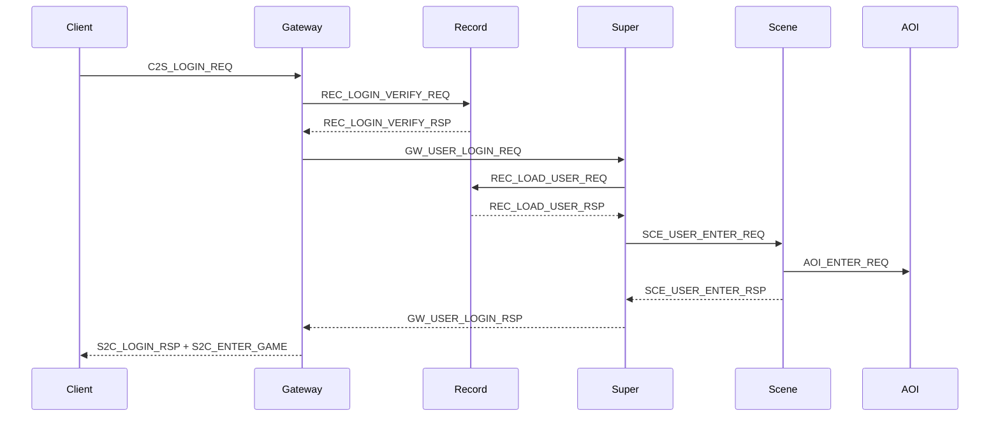

# 协议参考

客户端与服间 TCP **共用** 6 字节消息头，定义于 [`sdk/net/NetDefine.h`](../sdk/net/NetDefine.h)。  
权威源码：[`Common/ClientMsg.h`](../Common/ClientMsg.h)、[`protocal/InternalMsg.h`](../protocal/InternalMsg.h)。共享层维护见 [COMMON.md](COMMON.md)。

---

## 1. 消息帧

```
| bodyLen (2B, LE) | module (1B) | sub (1B) | body (变长) |
```

| 工具 | 说明 |
|------|------|
| `makeMsgId(module, sub)` | 扁平 ID = `(module << 8) \| sub` |
| `msgModule(flatId)` / `msgSub(flatId)` | 从扁平 ID 拆 module/sub |

---

## 2. 客户端协议（ClientModule）

定义于 [`Common/ClientMsg.h`](../Common/ClientMsg.h)。

### 2.1 模块枚举

| module | 名称 | Gateway 路由 |
|--------|------|--------------|
| 0x00 | LOGIN | LOCAL |
| 0x01 | SCENE | SCENE |
| 0x02 | BATTLE | SCENE |
| 0x03 | BAG | SCENE |
| 0x04 | SKILL | SCENE |
| 0x05 | CHAT | SCENE（sub=0x03 私聊 → SESSION） |
| 0x06 | SOCIAL | SESSION |
| 0x07 | QUEST | SESSION |
| 0x08 | NPC | SCENE |
| 0x0F | SYSTEM | LOCAL |

路由实现：[`GatewayServer/ClientMsgRouter.h`](../GatewayServer/ClientMsgRouter.h)  
校验规则：[`GatewayServer/ClientMsgValidator.h`](../GatewayServer/ClientMsgValidator.h)

### 2.2 消息 ID 表（ClientMsgID）

| 扁平 ID | 名称 | 方向 | 结构体 | 说明 |
|---------|------|------|--------|------|
| 0x0001 | C2S_LOGIN_REQ | C→S | `Msg_C2S_LoginReq` | 账号密码（Gateway→Record 验证） |
| 0x0002 | S2C_LOGIN_RSP | S→C | `Msg_S2C_LoginRsp` | 登录结果 |
| 0x0003 | C2S_REGISTER_REQ | C→S | — | 注册（enum 占位） |
| 0x0004 | S2C_REGISTER_RSP | S→C | — | 注册响应 |
| 0x0005 | C2S_SELECT_USER_REQ | C→S | — | 选角 |
| 0x0006 | S2C_USER_LIST | S→C | — | 用户列表 |
| 0x0007 | C2S_CREATE_USER_REQ | C→S | — | 创角 |
| 0x0008 | S2C_CREATE_USER_RSP | S→C | — | 创角响应 |
| 0x0009 | S2C_ENTER_GAME | S→C | `Msg_S2C_EnterGame` | 进入游戏世界 |
| 0x000A | S2C_GATEWAY_INFO | S→C | `Msg_S2C_GatewayInfo` | LoginServer 下发网关地址 |
| 0x000B | C2S_ZONE_LIST_REQ | C→S | `Msg_C2S_ZoneListReq` | LoginServer 请求区列表（空 body 视为全部） |
| 0x000C | S2C_ZONE_LIST_RSP | S→C | `Msg_S2C_ZoneListRspHeader` + N×`Msg_S2C_ZoneEntryWire` | 区列表（变长，最多 64 条；含 onlineCount/loadLevel/gatewayCount） |
| 0x0101 | C2S_MOVE_REQ | C→S | `Msg_C2S_MoveReq` | 移动 |
| 0x0102 | S2C_MOVE_NOTIFY | S→C | `Msg_S2C_MoveNotify` | 移动广播 |
| 0x0103 | S2C_ENTER_MAP | S→C | — | 进图 |
| 0x0104 | S2C_LEAVE_MAP | S→C | — | 离图 |
| 0x0105 | S2C_SPAWN_ENTITY | S→C | `Msg_S2C_SpawnEntity` | 实体进视野 |
| 0x0106 | S2C_DESPAWN_ENTITY | S→C | `Msg_S2C_DespawnEntity` | 实体出视野 |
| 0x0107 | C2S_TELEPORT_REQ | C→S | — | 传送 |
| 0x0201 | C2S_ATTACK_REQ | C→S | — | 普攻 |
| 0x0202 | S2C_ATTACK_NOTIFY | S→C | — | 攻击广播 |
| 0x0203 | S2C_HP_CHANGE | S→C | — | 血量变化 |
| 0x0204 | S2C_ENTITY_DIE | S→C | — | 实体死亡 |
| 0x0301 | C2S_BAG_INFO_REQ | C→S | — | 背包查询 |
| 0x0302 | S2C_BAG_INFO_RSP | S→C | — | 背包数据 |
| 0x0303 | C2S_USE_ITEM_REQ | C→S | — | 使用物品 |
| 0x0304 | S2C_USE_ITEM_RSP | S→C | — | 使用结果 |
| 0x0305 | C2S_DROP_ITEM_REQ | C→S | — | 丢弃物品 |
| 0x0401 | C2S_SKILL_REQ | C→S | — | 释放技能（Scene→Lua） |
| 0x0402 | S2C_SKILL_NOTIFY | S→C | — | 技能广播 |
| 0x0501 | C2S_CHAT_REQ | C→S | `Msg_C2S_Chat` | 聊天 |
| 0x0502 | S2C_CHAT_NOTIFY | S→C | `Msg_S2C_Chat` | 聊天广播 |
| 0x0503 | C2S_WHISPER_REQ | C→S | — | 私聊 → Session |
| 0x0504 | S2C_WHISPER_NOTIFY | S→C | — | 私聊通知 |
| 0x0601 | C2S_ADD_FRIEND_REQ | C→S | — | 加好友 → Session |
| 0x0602 | S2C_ADD_FRIEND_RSP | S→C | — | 加好友响应 |
| 0x0603 | S2C_FRIEND_LIST | S→C | — | 好友列表 |
| 0x0610 | C2S_CREATE_TEAM_REQ | C→S | — | 创建队伍 |
| 0x0611 | S2C_TEAM_INFO | S→C | — | 队伍信息 |
| 0x0701 | C2S_QUEST_ACCEPT_REQ | C→S | — | 接任务 → Session |
| 0x0702 | S2C_QUEST_INFO | S→C | — | 任务同步 |
| 0x0703 | C2S_QUEST_SUBMIT_REQ | C→S | — | 交任务 |
| 0x0704 | S2C_QUEST_RESULT | S→C | — | 任务结果 |
| 0x0801 | C2S_NPC_TALK_REQ | C→S | `Msg_C2S_NpcTalkReq` | NPC 对话 |
| 0x0802 | S2C_NPC_TALK_RSP | S→C | `Msg_S2C_NpcTalkRsp` | 对话内容与选项 |
| 0x0F01 | C2S_HEARTBEAT | C→S | `Msg_C2S_Heartbeat` | 心跳 |
| 0x0F02 | S2C_HEARTBEAT | S→C | `Msg_S2C_Heartbeat` | 心跳响应 |
| 0x0F03 | S2C_KICK | S→C | — | 踢线 |
| 0x0F04 | S2C_NOTICE | S→C | — | 系统公告 |
| 0x0F05 | S2C_ERROR | S→C | `Msg_S2C_Error` | 网关校验失败 |

**说明**：标「—」的结构体在 enum 中已定义 ID，但 `ClientMsg.h` 尚未提供完整 wire struct；实现时可补全。

### 2.3 Gateway 校验错误码

`Msg_S2C_Error.code` 使用 `GatewayValidateCode`：

| 值 | 名称 | 含义 |
|----|------|------|
| 0 | OK | 通过 |
| 1 | UNKNOWN_MSG | 未登记 module/sub |
| 2 | BAD_LENGTH | 包长不匹配 |
| 3 | BAD_STATE | 连接状态不允许 |
| 4 | BAD_PAYLOAD | 字段非法 |
| 5 | RATE_LIMITED | 频率限制 |

---

## 3. Gateway 转发结构

服间封装客户端包，避免 Scene/Session 直接面对客户端 TCP：

| 结构体 | 消息 ID | 方向 | 字段 |
|--------|---------|------|------|
| `Msg_GW_ClientMsg` | GW_CLIENT_MSG (0x1401) | Gateway → Scene/Session | `clientConnID`, `module`, `sub`, `body[]` |
| `Msg_GW_SendToClient` | GW_SEND_TO_CLIENT (0x1402) | Scene/Session → Gateway | 同上，Gateway 组 6 字节头发客户端 |

---

## 4. 服间协议（InternalMsgID）

定义于 [`protocal/InternalMsg.h`](../protocal/InternalMsg.h)。

### 4.1 分区总览

| 范围 | 归属 | 主要消息 |
|------|------|----------|
| 0x1F01–0x1F06 | 全区 | S2S_REGISTER、HEARTBEAT、SERVERLIST |
| 0x1F10–0x1F15 | Super 转发 | SS_EXTERN_FWD、EXT_GAMEZONE_FWD、SS_LOGIN_GATEWAY_WRAP |
| 0x1001–0x1003 | SuperServer | SS_KICK_USER、SS_QUERY_ONLINE |
| 0x1101–0x1113 | SessionServer | SES_LOAD/SAVE、SES_SCENE_*、SES_COPY_*、SES_RESOLVE_MAP_* |
| 0x1201–0x120C | RecordServer | REC_LOAD/SAVE、REC_LOGIN_VERIFY、REC_RELATION_* |
| 0x1301–0x1306 | SceneServer | SCE_USER_ENTER/LEAVE、SCE_FORWARD_TO_CLIENT |
| 0x1401–0x1405 | GatewayServer | GW_CLIENT_MSG、GW_SEND_TO_CLIENT、GW_USER_LOGIN_* |
| 0x1501–0x1506 | AOIServer | AOI_ENTER/LEAVE/MOVE、AOI_VIEW_NOTIFY、AOI_SCENE_* |
| 0x1601 | LoggerServer | LOG_WRITE_REQ |
| 0x1701–0x1702 | GlobalServer | GLB_DATA_SYNC、GLB_RANK_UPDATE |
| 0x1801–0x1803 | ZoneServer | ZONE_CROSS_REQ/RSP、ZONE_FORWARD |
| 0x1901–0x1906 | LoginServer | LOGIN_GATEWAY_*、LOGIN_RECHARGE、LOGIN_GM_CMD、LOGIN_ZONE_STATUS_REPORT |

### 4.2 登录链路（区内）



### 4.3 场景/副本登记

| 消息 | 方向 | 说明 |
|------|------|------|
| SES_SCENE_REGISTER_REQ/RSP | Scene → Session | 普通/副本场景注册 |
| SES_SCENE_UNREGISTER | Scene → Session | 场景注销 |
| SES_COPY_CREATE_REQ | Scene → Session | 请求创建/分配副本 |
| SES_COPY_CREATE_RSP | Session → Scene | 分配结果（含 reused 标志） |
| SES_COPY_CREATE_CMD | Session → Scene | 指示目标 Scene 创建副本 |
| SES_RESOLVE_MAP_REQ | Super → Session | 登录时按 mapId 解析 sceneServerId |
| SES_RESOLVE_MAP_RSP | Session → Super | 解析结果（含 userId、sceneServerId） |
| AOI_SCENE_REGISTER/UNREGISTER | Scene → AOI | AOI 侧场景实例登记 |

### 4.4 外联转发信封

区内服不直连 Logger/Global/Zone/Login，经 Super 转发：

| 消息 | 方向 | 说明 |
|------|------|------|
| SS_EXTERN_FWD_REQ | 区内 → Super | 信封 + inner module/sub/body |
| SS_EXTERN_FWD_RSP | Super → 区内 | 响应信封 |
| EXT_GAMEZONE_FWD_REQ | Super → 外联 | 同上，外联服解包 |
| EXT_GAMEZONE_FWD_RSP | 外联 → Super | 响应 |

详见 [EXTERNAL.md](EXTERNAL.md)。

---

## 5. 新增消息 checklist

### 客户端消息

1. [`Common/ClientMsg.h`](../Common/ClientMsg.h) — `ClientModule`、sub、`ClientMsgID`、wire struct
2. [`GatewayServer/ClientMsgValidator.h`](../GatewayServer/ClientMsgValidator.h) — 白名单、长度、状态
3. [`GatewayServer/ClientMsgRouter.h`](../GatewayServer/ClientMsgRouter.h) — LOCAL / SCENE / SESSION
4. Scene 或 Session — 处理 `GW_CLIENT_MSG`；或 Scene Lua `OnMsg_{MMSS}`

### S2S 消息

1. [`protocal/InternalMsg.h`](../protocal/InternalMsg.h) — `InternalMsgID` + struct
2. 发送方/接收方 `RegisterHandlers()` — `Register(module, sub)` 或扁平 ID

### 定长字符串

使用 [`sdk/util/WireStringUtil.h`](../sdk/util/WireStringUtil.h)，禁止 `strncpy` 写 wire 字段。

更多扩展步骤见 [DEVELOPMENT.md](DEVELOPMENT.md)。
