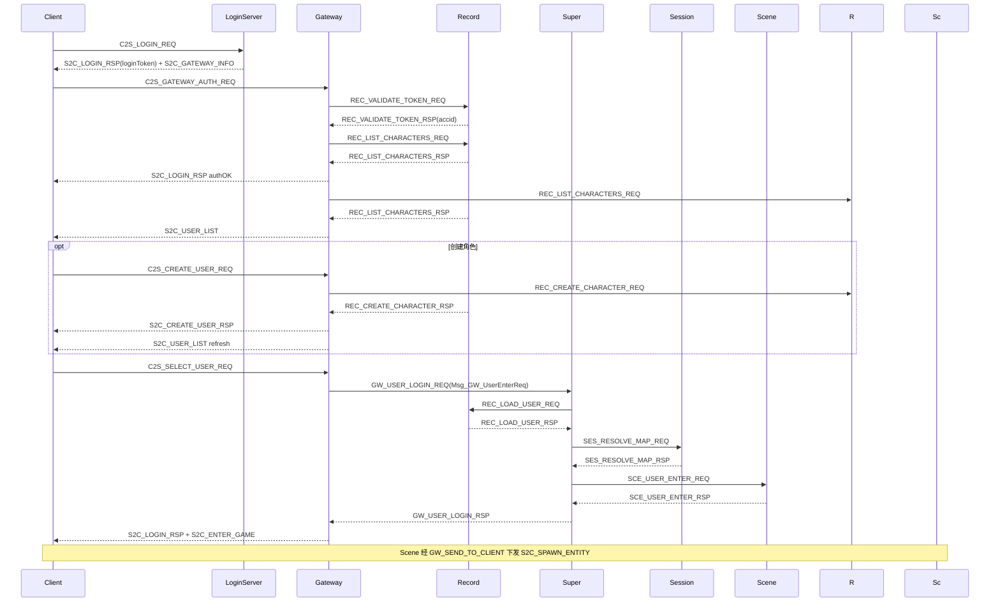

# 协议参考

客户端与服间 TCP **共用** 6 字节消息头，定义于 [`sdk/net/NetDefine.h`](../sdk/net/NetDefine.h)。  
权威源码：[`Common/ClientTypes.h`](../Common/ClientTypes.h) 与各域 `*Msg.h`、[`protocal/InternalMsg.h`](../protocal/InternalMsg.h)。共享层维护见 [COMMON.md](COMMON.md)。

---

## 1. 消息帧

```
| bodyLen (2B, LE) | module (1B) | sub (1B) | body (变长) |
```

**wire v2（破坏性变更）**：`body` 前两字节为 `module` + `sub`（与头部一致），其后为业务字段。完整单包 struct 在 `*Msg.h` 中首字段即这两字节；变长包仅在 header struct（如 `Msg_S2C_UserListHeader`）含前缀。

| 工具 | 说明 |
|------|------|
| `makeMsgId(module, sub)` | 扁平 ID = `(module << 8) \| sub`（日志/调试） |
| `msgModule(flatId)` / `msgSub(flatId)` | 从扁平 ID 拆 module/sub |
| `initClientMsg(msg)` | 写入 struct 默认 `module`/`sub` |
| `clientMsgBodyMatches(hdrMod, hdrSub, body, len)` | 校验头与 body 前缀一致 |

---

## 2. 客户端协议（ClientModule）

**字段与错误码的权威定义**在各域 `*Msg.h` / `*Common.h`（Doxygen：方向、module/sub、触发时机、变长布局、字段 `/**< */`）。本节消息表为索引；细节以头文件为准。

路由枚举定义于 [`Common/ClientTypes.h`](../Common/ClientTypes.h)；wire 结构体按域分布在 `*Msg.h`（见 [`Common/Common.txt`](../Common/Common.txt)）。

### 2.0 域头文件

| 域 | Common | Msg | module |
|----|--------|-----|--------|
| 登录 | LoginCommon.h | LoginMsg.h | 0x00 / 0x0F（心跳等） |
| 区服 | ZoneCommon.h | ZoneMsg.h | 0x00（区列表 sub） |
| 地图 | MapDataCommon.h | MapDataMsg.h | 0x01 / 0x08 |
| 聊天 | ChatCommon.h | ChatMsg.h | 0x05 / 0x0F（公告） |
| 属性 | PropertyCommon.h | PropertyMsg.h | 0x02 / 0x07 |
| 装备 | EquipCommon.h | EquipMsg.h | 0x03 |
| 技能 | SpellCommon.h | SpellMsg.h | 0x04 |
| 社交 | RelationCommon.h | RelationMsg.h | 0x06 |
| 充值 | GoldCommon.h | GoldMsg.h | 预留 |

### 2.1 模块枚举

| module | 名称 | Gateway 路由 |
|--------|------|--------------|
| 0x00 | LOGIN | LOCAL |
| 0x01 | SCENE | SCENE |
| 0x02 | BATTLE | SCENE |
| 0x03 | BAG | SCENE |
| 0x04 | SKILL | SCENE |
| 0x05 | CHAT | SCENE（sub=0x03 私聊 → SESSION） |
| 0x06 | SOCIAL | SESSION |
| 0x07 | QUEST | SESSION |
| 0x08 | NPC | SCENE |
| 0x0F | SYSTEM | LOCAL |

路由实现：[`GatewayServer/ClientMsgRouter.h`](../GatewayServer/ClientMsgRouter.h)  
校验规则：[`GatewayServer/ClientMsgValidator.h`](../GatewayServer/ClientMsgValidator.h)

### 2.2 消息编号表（module + sub）

子编号定义于各域 `XxxMsgSub`（`*Common.h`）；struct 内可见 `kModule`/`kSub` 与 wire 前缀字段。

**实现状态**：`已实现` = Gateway `ClientMsgValidator` 白名单且 Server 有 handler；`未实现` = Common 已登记子编号但 Gateway **拒收**（`S2C_ERROR` / `UNKNOWN_MSG`）。`C2S_LOGIN_REQ` / `C2S_REGISTER_REQ` 仅 **LoginServer** 处理，连 Gateway 发此包会被拒收。

| module | sub | 名称 | 方向 | 结构体 | 实现状态 | 说明 |
|--------|-----|------|------|--------|----------|------|
| 0x00 | 0x01 | C2S_LOGIN_REQ | C→S | `Msg_C2S_LoginReq` | LoginServer | 账号密码登录（非 Gateway） |
| 0x00 | 0x02 | S2C_LOGIN_RSP | S→C | `Msg_S2C_LoginRsp` | 已实现 | 登录结果（含 accid/loginToken/tokenExpireMs） |
| 0x00 | 0x03 | C2S_REGISTER_REQ | C→S | `Msg_C2S_RegisterReq` | LoginServer | 注册账号（非 Gateway） |
| 0x00 | 0x04 | S2C_REGISTER_RSP | S→C | `Msg_S2C_RegisterRsp` | 已实现 | 注册结果（含 accid） |
| 0x00 | 0x05 | C2S_SELECT_USER_REQ | C→S | `Msg_C2S_SelectUserReq` | 已实现 | 选角进世界（Gateway ACCOUNT_OK） |
| 0x00 | 0x06 | S2C_USER_LIST | S→C | `Msg_S2C_UserListHeader` + N×Entry | 已实现 | 角色列表（变长） |
| 0x00 | 0x07 | C2S_CREATE_USER_REQ | C→S | `Msg_C2S_CreateUserReq` | 已实现 | 创角 |
| 0x00 | 0x08 | S2C_CREATE_USER_RSP | S→C | `Msg_S2C_CreateUserRsp` | 已实现 | 创角响应 |
| 0x00 | 0x0D | C2S_GATEWAY_AUTH_REQ | C→S | `Msg_C2S_GatewayAuthReq` | 已实现 | Gateway 票据鉴权 |
| 0x00 | 0x09 | S2C_ENTER_GAME | S→C | `Msg_S2C_EnterGame` | 已实现 | 进入游戏世界 |
| 0x00 | 0x0A | S2C_GATEWAY_INFO | S→C | `Msg_S2C_GatewayInfo` | 已实现 | LoginServer 下发网关地址 |
| 0x00 | 0x0B | C2S_ZONE_LIST_REQ | C→S | `Msg_C2S_ZoneListReq` | 已实现 | 区列表请求（LoginServer） |
| 0x00 | 0x0C | S2C_ZONE_LIST_RSP | S→C | `Msg_S2C_ZoneListRspHeader` + N×Entry | 已实现 | 区列表（变长） |
| 0x01 | 0x01 | C2S_MOVE_REQ | C→S | `Msg_C2S_MoveReq` | 已实现 | 移动 |
| 0x01 | 0x02 | S2C_MOVE_NOTIFY | S→C | `Msg_S2C_MoveNotify` | 已实现 | Scene AOI 移动同步广播 |
| 0x01 | 0x03 | S2C_ENTER_MAP | S→C | — | 未实现 | 由 SpawnEntity 替代 |
| 0x01 | 0x04 | S2C_LEAVE_MAP | S→C | — | 未实现 | 由 DespawnEntity 替代 |
| 0x01 | 0x05 | S2C_SPAWN_ENTITY | S→C | `Msg_S2C_SpawnEntity` | 已实现 | 实体进视野 |
| 0x01 | 0x06 | S2C_DESPAWN_ENTITY | S→C | `Msg_S2C_DespawnEntity` | 已实现 | 实体出视野 |
| 0x01 | 0x07 | C2S_TELEPORT_REQ | C→S | — | 未实现 | Gateway 拒收 |
| 0x02 | 0x01 | C2S_ATTACK_REQ | C→S | — | 未实现 | Gateway 拒收 |
| 0x02 | 0x02 | S2C_ATTACK_NOTIFY | S→C | — | 未实现 | — |
| 0x02 | 0x03 | S2C_HP_CHANGE | S→C | — | 未实现 | — |
| 0x02 | 0x04 | S2C_ENTITY_DIE | S→C | — | 未实现 | — |
| 0x03 | 0x01 | C2S_BAG_INFO_REQ | C→S | — | 未实现 | Gateway 拒收 |
| 0x03 | 0x02 | S2C_BAG_INFO_RSP | S→C | — | 未实现 | — |
| 0x03 | 0x03 | C2S_USE_ITEM_REQ | C→S | — | 未实现 | Gateway 拒收 |
| 0x03 | 0x04 | S2C_USE_ITEM_RSP | S→C | — | 未实现 | — |
| 0x03 | 0x05 | C2S_DROP_ITEM_REQ | C→S | — | 未实现 | Gateway 拒收 |
| 0x04 | 0x01 | C2S_SKILL_REQ | C→S | — | 未实现 | Gateway 拒收 |
| 0x04 | 0x02 | S2C_SKILL_NOTIFY | S→C | — | 未实现 | — |
| 0x05 | 0x01 | C2S_CHAT_REQ | C→S | `Msg_C2S_Chat` | 已实现 | 聊天 |
| 0x05 | 0x02 | S2C_CHAT_NOTIFY | S→C | `Msg_S2C_Chat` | 已实现 | 聊天广播 |
| 0x05 | 0x03 | C2S_WHISPER_REQ | C→S | — | 未实现 | Gateway 拒收 |
| 0x05 | 0x04 | S2C_WHISPER_NOTIFY | S→C | — | 未实现 | — |
| 0x06 | 0x01 | C2S_ADD_FRIEND_REQ | C→S | — | 未实现 | Gateway 拒收 |
| 0x06 | 0x02 | S2C_ADD_FRIEND_RSP | S→C | — | 未实现 | — |
| 0x06 | 0x03 | S2C_FRIEND_LIST | S→C | — | 未实现 | — |
| 0x06 | 0x10 | C2S_CREATE_TEAM_REQ | C→S | — | 未实现 | Gateway 拒收 |
| 0x06 | 0x11 | S2C_TEAM_INFO | S→C | — | 未实现 | — |
| 0x07 | 0x01 | C2S_QUEST_ACCEPT_REQ | C→S | — | 未实现 | Gateway 拒收 |
| 0x07 | 0x02 | S2C_QUEST_INFO | S→C | — | 未实现 | — |
| 0x07 | 0x03 | C2S_QUEST_SUBMIT_REQ | C→S | — | 未实现 | Gateway 拒收 |
| 0x07 | 0x04 | S2C_QUEST_RESULT | S→C | — | 未实现 | — |
| 0x08 | 0x01 | C2S_NPC_TALK_REQ | C→S | `Msg_C2S_NpcTalkReq` | 已实现 | NPC 对话 |
| 0x08 | 0x02 | S2C_NPC_TALK_RSP | S→C | `Msg_S2C_NpcTalkRsp` | 已实现 | 对话内容与选项 |
| 0x0F | 0x01 | C2S_HEARTBEAT | C→S | `Msg_C2S_Heartbeat` | 已实现 | 心跳（Gateway 本地） |
| 0x0F | 0x02 | S2C_HEARTBEAT | S→C | `Msg_S2C_Heartbeat` | 已实现 | 心跳响应 |
| 0x0F | 0x03 | S2C_KICK | S→C | — | 无 wire | 踢线经服间 `GW_KICK_CLIENT`，无客户端包 |
| 0x0F | 0x04 | S2C_NOTICE | S→C | `Msg_S2C_Notice` | 未实现 | 系统公告（struct 已有，暂无发送点） |
| 0x0F | 0x05 | S2C_ERROR | S→C | `Msg_S2C_Error` | 已实现 | 网关校验失败 |

**说明**：标「—」的结构体在域 `XxxMsgSub` 中已登记子编号，wire struct 待实现；未实现上行消息勿加入 Validator，落地时同步补 `*Msg.h` + handler。服间 `REC_LOGIN_VERIFY_*`（0x1205/0x1206）已废弃。

### 2.3 登录进场景错误码

定义于 [`sdk/util/LoginEnterErrorCode.h`](../sdk/util/LoginEnterErrorCode.h)：

| 枚举 | 值 | 含义 |
|------|-----|------|
| `SuperEnterError::NO_RECORD` | -1 | 无存档服或 userID 非法 |
| `SuperEnterError::NO_SESSION` | -2 | 无会话服 |
| `SuperEnterError::MAP_NOT_REGISTERED` | -3 | 地图未注册 |
| `SuperEnterError::SCENE_OFFLINE` | -4 | 场景服离线 |
| `SuperEnterError::LOAD_USER_FAILED` | -5 | 加载角色失败 |
| `SuperEnterError::TXN_TIMEOUT` | -10 | 登录事务超时 |
| `SuperEnterError::TXN_IN_PROGRESS` | -11 | 同角色事务进行中 |

`C2S_SELECT_USER_REQ.loginTxnId` 与 `Msg_GW_UserEnterReq.loginTxnId` 为幂等键；Super 对相同 txn 的重复请求静默忽略。

`S2C_CREATE_USER_RSP.code` / `REC_CREATE_CHARACTER_RSP.code` 使用 `CreateCharacterError`：

| 值 | 名称 | 含义 |
|----|------|------|
| -1 | SYSTEM_ERROR | 系统失败（DB 异常等） |
| 0 | OK | 创角成功 |
| 1 | NAME_EXISTS | 角色名重复 |
| 2 | LIMIT_REACHED | 达每账号每区角色上限 |
| 3 | INVALID_NAME | 角色名非法 |
| 4 | INVALID_VOCATION | 职业或性别非法 |

### 2.4 Gateway 校验错误码

`Msg_S2C_Error.code` 使用 `GatewayValidateCode`：

| 值 | 名称 | 含义 |
|----|------|------|
| 0 | OK | 通过 |
| 1 | UNKNOWN_MSG | 未登记 module/sub |
| 2 | BAD_LENGTH | 包长不匹配 |
| 3 | BAD_STATE | 连接状态不允许 |
| 4 | BAD_PAYLOAD | 字段非法 |
| 5 | RATE_LIMITED | 频率限制 |

---

## 3. Gateway 转发结构

服间封装客户端包，避免 Scene/Session 直接面对客户端 TCP：

| 结构体 | 消息 ID | 方向 | 字段 |
|--------|---------|------|------|
| `Msg_GW_ClientMsg` | GW_CLIENT_MSG (0x1401) | Gateway → Scene/Session | `clientConnID`, `module`, `sub`, `body[]` |
| `Msg_GW_SendToClient` | GW_SEND_TO_CLIENT (0x1402) | Scene/Session → Gateway | 同上，Gateway 组 6 字节头发客户端 |

---

## 4. 服间协议（InternalMsgID）

定义于 [`protocal/InternalMsg.h`](../protocal/InternalMsg.h)。

### 4.1 分区总览

| 范围 | 归属 | 主要消息 |
|------|------|----------|
| 0x1F01–0x1F06 | 全区 | S2S_REGISTER、HEARTBEAT、SERVERLIST |
| 0x1F10–0x1F15 | Super 转发 | SS_EXTERN_FWD、EXT_GAMEZONE_FWD、SS_LOGIN_GATEWAY_WRAP |
| 0x1001–0x1003 | SuperServer | SS_KICK_USER、SS_QUERY_ONLINE |
| 0x1101–0x1113 | SessionServer | SES_LOAD/SAVE、SES_SCENE_*、SES_COPY_*、SES_RESOLVE_MAP_* |
| 0x1201–0x1212 | RecordServer | REC_LOAD/SAVE、REC_VALIDATE_TOKEN、REC_LIST/CREATE_CHARACTER、REC_RELATION_*（`REC_LOGIN_VERIFY_*` 已废弃） |
| 0x1301–0x1306 | SceneServer | SCE_USER_ENTER/LEAVE、SCE_FORWARD_TO_CLIENT |
| 0x1401–0x1405 | GatewayServer | GW_CLIENT_MSG、GW_SEND_TO_CLIENT、GW_USER_LOGIN_* |
| 0x1501–0x1506 | AOIServer | AOI_ENTER/LEAVE/MOVE、AOI_VIEW_NOTIFY、AOI_SCENE_* |
| 0x1601 | LoggerServer | LOG_WRITE_REQ |
| 0x1701–0x1702 | GlobalServer | GLB_DATA_SYNC、GLB_RANK_UPDATE |
| 0x1801–0x1803 | ZoneServer | ZONE_CROSS_REQ/RSP、ZONE_FORWARD |
| 0x1901–0x1906 | LoginServer | LOGIN_GATEWAY_*、LOGIN_RECHARGE、LOGIN_GM_CMD、LOGIN_ZONE_STATUS_REPORT |

### 4.2 登录链路（区内）



完整 UI 对照见 [LOGIN_CHAR_FLOW.md](LOGIN_CHAR_FLOW.md)。

### 4.3 场景/副本登记

| 消息 | 方向 | 说明 |
|------|------|------|
| SES_SCENE_REGISTER_REQ/RSP | Scene → Session | 普通/副本场景注册 |
| SES_SCENE_UNREGISTER | Scene → Session | 场景注销 |
| SES_COPY_CREATE_REQ | Scene → Session | 请求创建/分配副本 |
| SES_COPY_CREATE_RSP | Session → Scene | 分配结果（含 reused 标志） |
| SES_COPY_CREATE_CMD | Session → Scene | 指示目标 Scene 创建副本 |
| SES_RESOLVE_MAP_REQ | Super → Session | 登录时按 mapId 解析 sceneServerId |
| SES_RESOLVE_MAP_RSP | Session → Super | 解析结果（含 userId、sceneServerId） |
| AOI_SCENE_REGISTER/UNREGISTER | Scene → AOI | AOI 侧场景实例登记 |

### 4.4 外联转发信封

区内服不直连 Logger/Global/Zone/Login，经 Super 转发：

| 消息 | 方向 | 说明 |
|------|------|------|
| SS_EXTERN_FWD_REQ | 区内 → Super | 信封 + inner module/sub/body |
| SS_EXTERN_FWD_RSP | Super → 区内 | 响应信封 |
| EXT_GAMEZONE_FWD_REQ | Super → 外联 | 同上，外联服解包 |
| EXT_GAMEZONE_FWD_RSP | 外联 → Super | 响应 |

详见 [EXTERNAL.md](EXTERNAL.md)。

---

## 5. 新增消息 checklist

### 客户端消息

1. [`Common/XxxCommon.h`](../Common/) — 新增 `XxxMsgSub : uint8_t`（子编号 BYTE）
2. [`Common/XxxMsg.h`](../Common/) — wire struct 首字段 `module`/`sub` + `kModule`/`kSub`；发送前 `initClientMsg`
3. [`Common/ClientTypes.h`](../Common/ClientTypes.h) — 仅当新增 `ClientModule` 时修改
3. [`GatewayServer/ClientMsgValidator.h`](../GatewayServer/ClientMsgValidator.h) — 白名单、长度、状态
4. [`GatewayServer/ClientMsgRouter.h`](../GatewayServer/ClientMsgRouter.h) — LOCAL / SCENE / DROP（SESSION 预留，当前未路由）
5. Scene — `SceneClientMsgRegister` + `ClientMsgDispatcher`；或 Session（须同步 Router）

### S2S 消息

1. [`protocal/InternalMsg.h`](../protocal/InternalMsg.h) — `InternalMsgID` + struct
2. 发送方/接收方 `*InternMsgRegister` — `MsgHandlerBinder`（`registerInternal` / `registerInternalSized`）

### 定长字符串

使用 [`sdk/util/WireStringUtil.h`](../sdk/util/WireStringUtil.h)，禁止 `strncpy` 写 wire 字段。

更多扩展步骤见 [DEVELOPMENT.md](DEVELOPMENT.md)。
