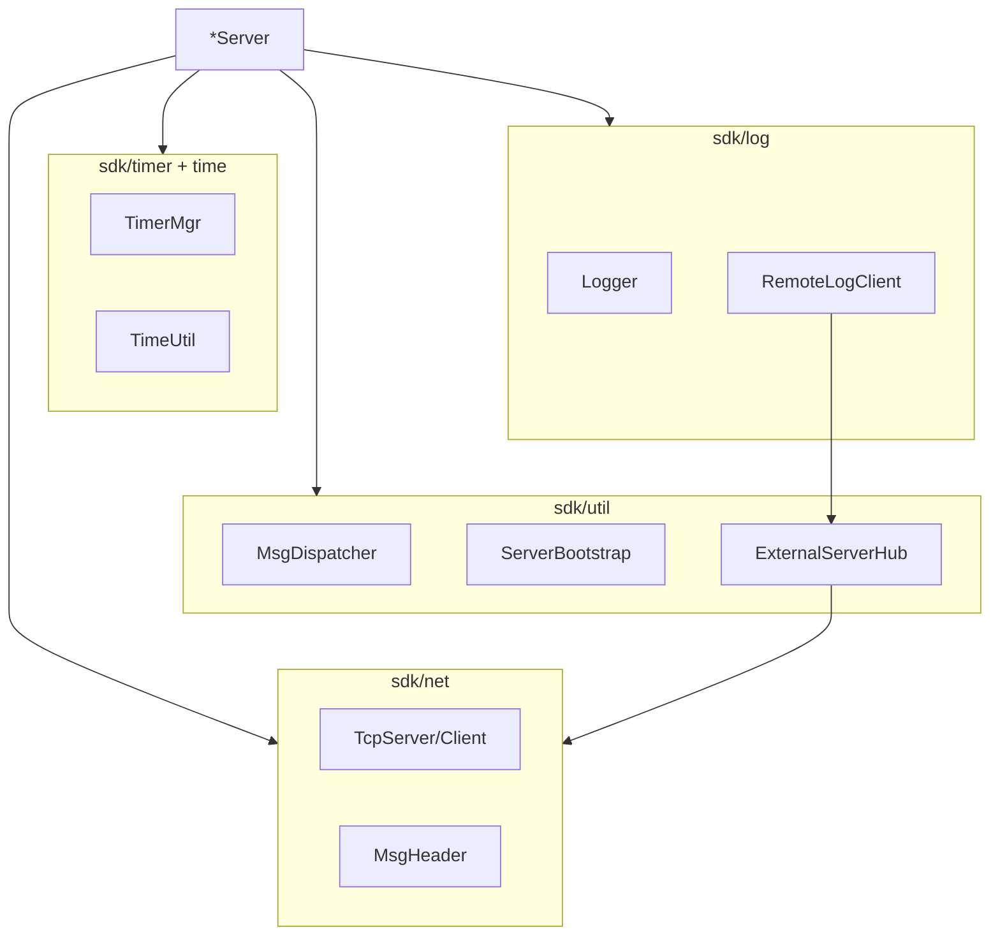

# SDK 参考

[`sdk/`](../sdk/) 为各 `*Server` 进程共享的底层库。短索引见 [sdk/README.md](../sdk/README.md)。

**构建说明**：以头文件为主；`CMakeLists.txt` 通过 `sdk/*.cpp` 编入以下实现：

| 模块 | `.cpp` 文件 |
|------|-------------|
| `util/` | `ServerList`, `LoginServerList`, `ExternalServerHub`, `ExternalServerConnector`, `GameZoneExternSender`, `GameZoneMsgDispatch` |
| `net/` | `TcpConnection`, `TlsContext` |
| `log/` | `RemoteLogClient`, `UserLog` |
| `math/` | `Vec`, `Random` |
| `http/` | `HttpParser` |

---

## 1. 设计模式

### 单线程事件循环

每个进程主循环：

```cpp
while (true) {
    server.Poll();              // epoll ET
    TimerMgr::Instance().Update();
    // 部分进程还调用 AlarmClock::Instance().Update()
}
```

**约束**：handler 内禁止阻塞 IO、长锁、跨线程写共享状态。

### 消息分发

```
TcpConnection 拆包 → OnMessage(connId, module, sub, data, len)
    → MsgDispatcher::Dispatch(module, sub) → handler
```

- 注册：`Register(module, sub, handler)` 或扁平 `Register(uint16_t flatMsgId)`
- 工具：[`sdk/net/MsgId.h`](../sdk/net/MsgId.h)

### 用户模型

```
UserBase（数据结构）
    └── IUser（OnTick / OnLogin / OnLogout）
            ├── SessionUser
            ├── RecordUser
            └── SceneUser
```

Wire 序列化：[`sdk/util/UserWireUtil.h`](../sdk/util/UserWireUtil.h)（`UserBase` ↔ `UserBaseWire`）

---

## 2. sdk/net/ — TCP / TLS 栈

| 文件 | 职责 |
|------|------|
| `NetDefine.h` | `MsgHeader`（6 字节）、`ConnID`、`MAX_PACKET_SIZE`、`INetCallback` |
| `MsgId.h` | `makeMsgId` / `msgModule` / `msgSub` / `makeMsgKey` |
| `TlsConfig.h` | `TlsConfig` 与 XML `<Tls>` 解析 |
| `TlsContext.h` | 进程级 `SSL_CTX`（mTLS） |
| `NetTls.h` | `initNetTls` / `wireTlsServer` / `wireTlsClient` |
| `RingBuffer.h` | SPSC 字节环形缓冲 |
| `TcpConnection.h` | 单连接收发、TLS 握手、MsgHeader 组帧/拆帧 |
| `TcpServer.h` | listen + accept + epoll ET `Poll()` |
| `TcpClient.h` | 单出站连接（服间） |

所有 TCP 流量（客户端与服间）共用同一帧格式；传输层为 TLS 1.2+（见 [TLS.md](TLS.md)）。

---

## 3. sdk/timer/ 与 sdk/time/

| 目录 | 时钟 | 典型用途 |
|------|------|----------|
| `timer/TimerMgr.h` | `steady_clock`（单调） | 心跳、autosave 间隔、N 毫秒后回调 |
| `time/TimeUtil.h` | `system_clock`（墙钟） | 日志时间戳、解析/格式化、日历分量 |
| `time/AlarmClock.h` | 墙钟 + TimerMgr | 指定时刻 / 每日 / 每周闹钟 |

示例见 [README.md](../README.md) § 时间库。

---

## 4. sdk/log/ — 日志

| 文件 | 职责 |
|------|------|
| `Logger.h` | 线程安全单例；`LOG_*` 宏；stdout + 文件 |
| `LogFileWriter.h` | 双文件：实时 `logs/*.log` + 按小时归档 |
| `RemoteLogClient.h` | 经 `GameZoneExternSender` 转发到 LoggerServer |
| `UserLog.h` | 带 userId/name/conn 前缀的上下文日志 |

路径配置：`config/config.xml` 的 `<LogPaths>`。

---

## 5. sdk/http/ — HTTP/1.1

供 **GlobalServer** 使用：

| 文件 | 职责 |
|------|------|
| `HttpMessage.h` | `HttpRequest` / `HttpResponse` |
| `HttpParser.h` | 增量解析（NEED_MORE / OK / ERROR） |
| `HttpCodec.h` | 编解码辅助 |

---

## 6. sdk/math/ — 游戏数学

| 文件 | 职责 |
|------|------|
| `Vec.h` | `Vec1`/`Vec2`/`Vec3`：距离、归一化、点积/叉积 |
| `Random.h` | 静态 RNG：范围、概率、shuffle、pick |

---

## 7. sdk/util/ — 配置、Bootstrap、外联

### 7.1 核心基础设施

| 文件 | 职责 |
|------|------|
| `Singleton.h` | `LazySingleton` / `EagerSingleton` |
| `MsgDispatcher.h` | `(module, sub) → handler` |
| `ConfigLoader.h` | 解析 `config/config.xml` → `ServerConfig` |
| `XmlConfigUtil.h` | tinyxml2 辅助、默认路径 |
| `WireStringUtil.h` | `copyToWire` / `copyWireField`（协议 `char[N]`） |
| `DaemonUtil.h` | `-d` 守护进程 |

### 7.2 集群拓扑

| 文件 | 职责 |
|------|------|
| `ServerList.h` | 内存集群拓扑；`ServerListClient::fetch` 从 Super 拉取 |
| `LoginServerList.h` | 解析根目录 `loginserverlist.xml`（外联四服地址） |
| `SceneInfoLoader.h` | 解析 `config/server_info.xml` → 地图列表 |
| `ServerBootstrap.h` | 内联启动：daemon、`RPG_SERVER_ID`、拉 ServerList、绑 RemoteLog |

### 7.3 外联连通（Super ↔ 外联四服）

| 文件 | 职责 |
|------|------|
| `ExternalServerConnector.h` | 单出站 TcpClient + 可选重连 |
| `ExternalServerHub.h` | Super 侧管理 Logger/Global/Zone/Login 四条出站 |
| `GameZoneExternSender.h` | 区内服 → Super `SS_EXTERN_FWD_REQ` |
| `GameZoneMsgDispatch.h` | 外联服解包 `EXT_GAMEZONE_FWD_REQ` 并 dispatch inner |
| `ExternServerConfig.h` | 解析各服 `extern_*.xml` |

### 7.4 数据编解码

| 文件 | 职责 |
|------|------|
| `UserBase.h` | `UserID`、`UserBase`、`UserState`、`IUser` |
| `UserWireUtil.h` | UserBase ↔ UserBaseWire |
| `RelationWireUtil.h` | Relation 行 encode/decode |

---

## 8. 启动 Bootstrap 典型流程

区内子服（以 Scene 为例）：

1. `DaemonUtil` 可选守护
2. `ConfigLoader` 读 `config/config.xml`
3. `ServerListClient::fetch` 连 Super 拉 `S2S_SERVERLIST_RSP`
4. 按 ServerList 建立 TcpClient（Super / Session / Record / AOI）
5. `S2S_REGISTER_REQ` → 等 `S2S_REGISTER_RSP`
6. `RemoteLogClient` 绑定 `GameZoneExternSender`
7. 进入 `Poll()` 循环

SuperServer 额外：

- 启动只读 MySQL 加载 `ServerList`
- `ExternalServerHub` 读 `loginserverlist.xml` 连外联四服

详见 [SERVERS.md](SERVERS.md)、[EXTERNAL.md](EXTERNAL.md)。

---

## 9. 依赖关系（简图）


