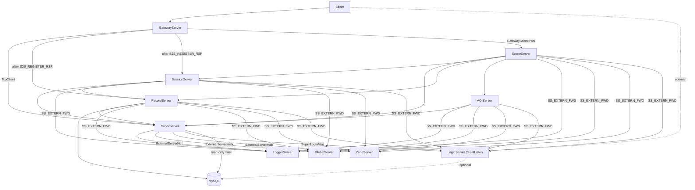

# 各服务器进程参考

本文档按**代码实现**描述 10 个可执行进程的连接、核心类、消息 handler 与定时器。  
架构概览见 [ARCHITECTURE.md](ARCHITECTURE.md)；外联四服见 [EXTERNAL.md](EXTERNAL.md)；传输层 TLS 见 [TLS.md](TLS.md)。

**启动依赖**：`config.xml` / `extern_*.xml` 中 `<Tls enabled="1">` 时，须先 `./scripts/gen_tls_certs.sh`（dev）或部署正式证书到 `config/tls/`。

---

## 连接拓扑（代码准确）



---

## 1. SuperServer（9000）— 区内

| 项 | 说明 |
|----|------|
| **类别** | 区内核心，必选 |
| **核心类** | `SuperServer`, `SubServerInfo`, `UserProxy`, `PendingLogin`, `SuperExternRouter`, `SuperLoginMsg`, `ExternalServerHub` |
| **入站** | Gateway / Session / Record / AOI / Scene（`S2S_REGISTER_REQ`） |
| **出站** | Logger / Global / Zone / Login（`loginserverlist.xml`，独占） |
| **MySQL** | 启动只读 `ServerList` |

### Handler

| 消息 | 处理 |
|------|------|
| S2S_REGISTER_REQ | 构建路由表 `m_servers` |
| S2S_HEARTBEAT | 刷新心跳 |
| S2S_SERVERLIST_REQ | 推送 ServerList 缓存 |
| GW_USER_LOGIN_REQ | 登录编排入口 |
| REC_LOAD_USER_RSP | → SCE_USER_ENTER_REQ |
| SCE_USER_ENTER_RSP | → GW_USER_LOGIN_RSP |
| SS_KICK_USER | → GW_KICK_CLIENT |
| SS_EXTERN_FWD_* | `SuperExternRouter` |
| SS_LOGIN_GATEWAY_WRAP_* | `SuperLoginMsg` |

### 定时器

- 30s：`checkHeartbeat()`（90s 超时踢子服）

### 登录选 Scene

Load 用户后 Super 向 Session 发 `SES_RESOLVE_MAP_REQ`（含 userId + mapId）；Session `SessionSceneManager.resolveSceneServerByMapId()` 返回承载该地图的 `sceneServerId`，Super 再向对应 Scene 发 `SCE_USER_ENTER_REQ`。

---

## 2. GatewayServer（9005）— 区内

| 项 | 说明 |
|----|------|
| **核心类** | `GatewayServer`, `GatewayUserManager`, `GatewayScenePool`, `SceneClient`, `ClientMsgValidator`, `ClientMsgRouter` |
| **入站** | 游戏客户端（clientPort，**TLS**） |
| **出站** | 启动连 Super；`S2S_REGISTER_RSP` 后连 Record / Session / 全部 Scene |

### Handler

| 消息 | 处理 |
|------|------|
| GW_SEND_TO_CLIENT | 组 4 字节头下发客户端 |
| GW_KICK_CLIENT | 强制断连 |
| REC_VALIDATE_TOKEN_RSP | 票据校验结果 → 角色列表流程 |
| GW_USER_LOGIN_RSP | S2C_ENTER_GAME，绑定 sceneServerId |
| S2S_REGISTER_RSP | 触发 `setupUpstreamClients()` |
| SS_LOGIN_GATEWAY_WRAP_RSP | 网关注册结果 |

### 本地客户端处理

Gateway 连接状态：`CONNECTED → AUTHING → ACCOUNT_OK → ENTERING → IN_WORLD`；主动退出经 `C2S_LOGOUT_REQ` 可回 `ACCOUNT_OK`（见 [LOGIN_CHAR_FLOW.md](LOGIN_CHAR_FLOW.md) §5）。

| 消息 | 状态 | 处理 |
|------|------|------|
| C2S_GATEWAY_AUTH_REQ | CONNECTED | Record 校验 token → `S2C_LOGIN_RSP` + 推送 `S2C_USER_LIST` |
| C2S_CREATE_USER_REQ | ACCOUNT_OK | Record 创角 → `S2C_CREATE_USER_RSP` + 刷新列表 |
| C2S_SELECT_USER_REQ | ACCOUNT_OK | Super 进世界 → `S2C_ENTER_GAME`；列表未就绪时凭 `ownedRoleIds`（创角后）亦可选角 |
| C2S_LOGOUT_REQ | ENTERING / IN_WORLD | 离世界清理 → `S2C_LOGOUT_RSP`；`RETURN_CHAR_SELECT` 时刷新 `S2C_USER_LIST` 并回 `ACCOUNT_OK` |
| C2S_HEARTBEAT | 多状态 | `S2C_HEARTBEAT` |
| 其它 | IN_WORLD 等 | Validator + Router 转发 Scene/Session |

- C2S_GATEWAY_AUTH_REQ → Record 校验 loginToken → 角色列表/创角/选角
- C2S_HEARTBEAT → S2C_HEARTBEAT
- 其它经 Validator + Router 转发 Scene（MOVE/CHAT/NPC）；未实现 sub 拒收

### 定时器

- 500ms：RegisterToSuper（直至成功）
- 10s：Super 心跳
- 30s：客户端 60s 心跳超时检查
- 10s：`LOGIN_GATEWAY_HEARTBEAT` 经 Super 代理

---

## 3. RecordServer（9002）— 区内

| 项 | 说明 |
|----|------|
| **核心类** | `RecordServer`, `RecordUserManager`, `RelationStore`, `GameZoneExternSender` |
| **入站** | Gateway / Scene / Session / Super（经 Super 连接发 REC_LOAD） |
| **出站** | Super |
| **MySQL** | **唯一写库**进程（游戏数据） |

### Handler

| 消息 | 处理 |
|------|------|
| REC_VALIDATE_TOKEN_REQ | loginToken 校验（转发 LoginServer） |
| REC_LOAD_USER_REQ | 缓存或 DB 加载 |
| REC_SAVE_USER_REQ | 落库 |
| REC_RELATION_PRELOAD/LOAD/SAVE | Relation CRUD |

### 定时器

- 60s：`AutoSaveAll()`

---

## 4. SessionServer（9001）— 区内

| 项 | 说明 |
|----|------|
| **核心类** | `SessionServer`, `SessionUserManager`, `SessionSceneManager`, `SessionScene`, `SessionCopyScene` |
| **入站** | Scene（场景/副本）；**无客户端上行**（Gateway Router 不转发 SESSION） |
| **出站** | Super、Record |
| **MySQL** | 直连 **rpg_game**（本区玩法预留；Relation 仍经 Record） |

### Handler

| 消息 | 处理 |
|------|------|
| REC_RELATION_PRELOAD/LOAD_RSP | Relation 同步 |
| SES_LOAD/SAVE_USER | Session 用户数据 |
| SES_SCENE_REGISTER/UNREGISTER | `SessionSceneManager` |
| SES_RESOLVE_MAP_REQ | `resolveSceneServerByMapId()` → RSP |
| SES_COPY_CREATE_REQ | 副本复用或 SES_COPY_CREATE_CMD |

**客户端上行**：`SessionClientMsgRegister` 当前为空；`ClientMsgRouter` 不返回 `SESSION`。经 Gateway 的 SOCIAL/QUEST 等须在玩法立项后同步扩展 Validator、Router 与 Session handler。

### 启动约束

阻塞直到 Record 连接 + Relation 全表预载完成。

### 定时器

- 60s：`AutoSaveAll()`（dirty SessionUser）

### 副本负载均衡

`pickSceneServerId()` 按场景数与玩家数加权选 Scene（**仅副本创建**）。

---

## 5. SceneServer（9004）— 区内，可水平扩展

| 项 | 说明 |
|----|------|
| **核心类** | `SceneServer`, `SessionClient`, `AOIClient`, `RecordClient`, `SceneManager`, `Scene`/`CopyScene`, `LuaManager` 等 |
| **入站** | Gateway（GW_CLIENT_MSG）、Session（副本指令） |
| **出站** | Super、SessionClient、RecordClient、AOIClient |

### Handler

| 消息 | 处理 |
|------|------|
| SCE_USER_ENTER_REQ | 创建 SceneUser、AOI enter、Lua OnUserEnter |
| SCE_USER_LEAVE | 下线、Record save、AOI leave |
| GW_CLIENT_MSG | move/chat/NPC（`SceneClientMsgRegister`）；经 `registerGwClientUnwrapHandler` → `MsgIngress::dispatchClient` |
| AOI_VIEW_NOTIFY | 移动同步或 spawn/despawn |
| SES_COPY_CREATE_RSP/CMD | 副本生命周期 |
| SES_SCENE_REGISTER_RSP | SessionClient 注册应答 |

### 定时器

- 1s：`OnTick()`（用户/NPC + Lua OnTick）

### 地图启动

`server_info.xml` → 创建 Scene → `onSceneStarted()` → AOI + Session 注册。

---

## 6. AOIServer（9003）— 区内

| 项 | 说明 |
|----|------|
| **核心类** | `AOIServer`, `AOIEntity`, `Grid`（9 宫格，GRID_SIZE=200，X-Z 平面） |
| **入站** | Scene only |
| **出站** | Super（注册） |

### Handler

| 消息 | 处理 |
|------|------|
| AOI_ENTER/LEAVE/MOVE | 空间索引与视野通知 |
| AOI_SCENE_REGISTER/UNREGISTER | 场景实例登记 |
| AOI_VIEW_NOTIFY | 推送给 originating Scene |

---

## 7. LoginServer（9010 / 19010）— 外联

| 项 | 说明 |
|----|------|
| **核心类** | `LoginAuthService`, `LoginGatewayRegistry`, `ZoneInfoStore` |
| **入站** | ClientListen（9010，**TLS**）、RegisterListen（19010，**mTLS**，Super 代理 Gateway） |
| **出站** | 无 |
| **配置** | `LoginServer/extern_login.xml`（Database → **rpg_login**） |

### Handler

| 端口 | 消息 | 处理 |
|------|------|------|
| Client | C2S_LOGIN_REQ | auth → S2C_LOGIN_RSP + S2C_GATEWAY_INFO |
| Register | LOGIN_GATEWAY_REGISTER/HEARTBEAT | 网关表 upsert |
| Register | EXT_GAMEZONE_FWD | 解包 inner（充值/GM 骨架） |

### 定时器

- 10s：网关表 stale 清理
- 60s：ZoneInfo reload（serverlist.xml；`loadFromDb` 读 rpg_login 仅工具路径）

详见 [EXTERNAL.md](EXTERNAL.md)。

---

## 8. LoggerServer（9006）— 外联

| 项 | 说明 |
|----|------|
| **核心类** | `LoggerServer`, `LogFileWriter` |
| **入站** | Super 的 ExternalServerHub 连接 |
| **出站** | 无 |

### Handler

| 消息 | 处理 |
|------|------|
| LOG_WRITE_REQ | 按 SubServerType 写 `{logDir}/{type}.log` |
| EXT_GAMEZONE_FWD | 解包 → LOG_WRITE_REQ |

---

## 9. GlobalServer（9007）— 外联

| 项 | 说明 |
|----|------|
| **核心类** | `GlobalServer`, `GlobalHttpServer`, `GlobalHttpApi`, rank 内存表（top 100） |
| **入站** | Super extern TcpClient；HTTP API 端口 |
| **出站** | 可选 `GlobalHttpClient` |
| **配置** | `GlobalServer/extern_global.xml`（Database → **rpg_global**） |

### Handler

| 消息 | 处理 |
|------|------|
| GLB_RANK_UPDATE | 插入排序 cap 100 |
| GLB_DATA_SYNC | fan-out 到 `m_innerConns` |
| EXT_GAMEZONE_FWD | 解包 inner |

### 定时器

- 60s：`SyncGlobalData()`（**当前仅日志，未向 Scene 广播 rank**）

**注意**：生产路径为 Super `ExternalServerHub` + `SS_EXTERN_FWD`，非 Scene 直连。

---

## 10. ZoneServer（9008）— 外联

| 项 | 说明 |
|----|------|
| **核心类** | `ZoneServer`, `ZoneRoute` |
| **入站** | Super + 其它 zone peer |
| **出站** | 无 |

### Handler

| 消息 | 处理 |
|------|------|
| ZONE_CROSS_REQ | 查 dstZone → ZONE_FORWARD |
| ZONE_FORWARD | **log-only 骨架** |
| EXT_GAMEZONE_FWD | 解包 inner |

---

## 启动顺序

`RunServer.sh` 默认区内顺序：

```
Super → Record / AOI → Session → Scene → Gateway
```

外联：`logger` / `global` / `zone` / `login` 子命令独立启动。

---

## 远程日志

Record / Session / Scene / AOI 通过 `GameZoneExternSender` 经 Super 转发 `LOG_WRITE_REQ` 到 LoggerServer。
